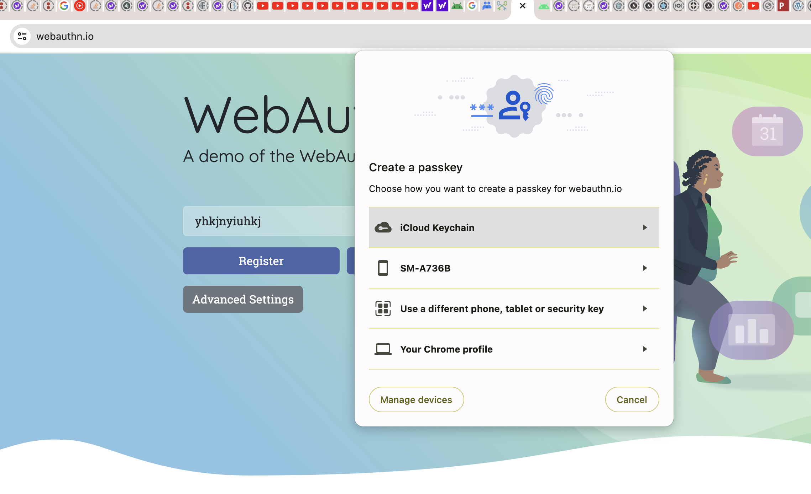
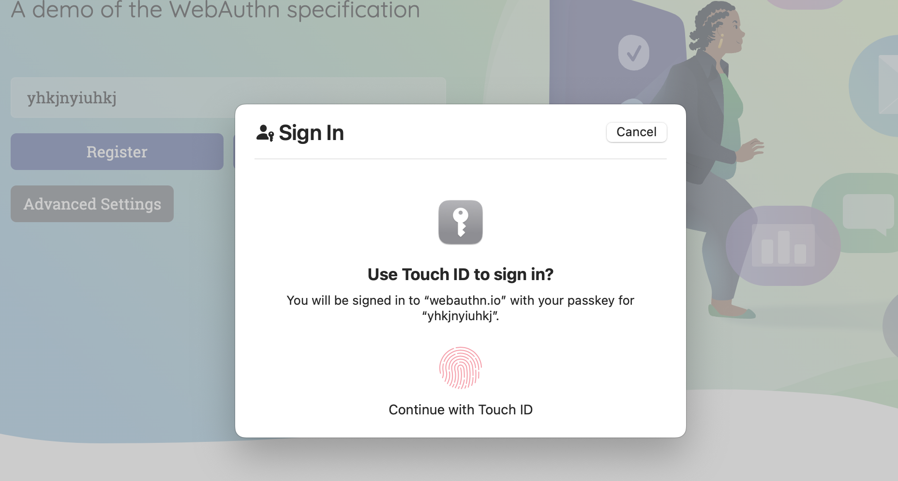

An alternative to passwords.

**Relying in Public key cryptography instead of passwords**. Private keys are supported through - passkeys - also called as security keys (can be a fingerprint or a face id or a yubikey).`

## Passwords are bad

Because they are repeated.
Without 2FA, they are not secure.

## Instead of password, we use public key cryptography

We use a private key stored in secure platform module. Many chips these days provide a secure platform module.
Usually this could be a fingerprint or a face id (treated as a secret key), instead of a password

## Use cases

Apps and websites can use WebAuthn to abstract Keystore and biometric APIs on a device.

### Create & Register a new credential/passkey

The private key is stored securely on the user’s device; a public key and randomly generated credential ID is sent to the server for storage. The server can then use that public key to prove the user’s identity. 

Private key/passkey is stored in a secure platform module and never leaves the device.

### Verify/Sign a challenge (using your passkey/private key)

During authentication an assertion is created, which is proof that the user has possession of the private key. This assertion contains a signature created using the private key. The server uses the public key retrieved during registration to verify this signature.

## If passkey never leaves the device, what happens if I lose my device?

Google and Apple support synced credentials/passkeys.

### Passkey creation using iCloud keychain

