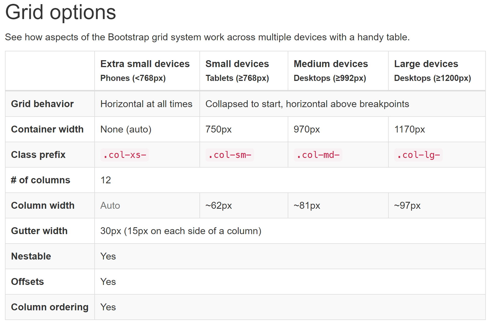

### Grid system

The default Bootstrap grid system utilizes 12 columns, making for a 940px wide container.

Rules:


`fluid` grid:

The fluid grid system uses percents instead of pixels for column widths. It has the same responsive capabilities as our fixed grid system, ensuring proper proportions for key screen resolutions and devices

Turn any fixed-width grid layout into a full-width layout by changing your outermost `.container` to `.container-fluid`.

```html
<div class="container-fluid">
  <div class="row">
    ...
  </div>
</div>
```

Use rows to create horizontal groups of columns.
Content should be placed within columns, and only columns may be immediate children of rows.

Grid classes apply to devices with screen widths greater than or equal to the breakpoint sizes, and override grid classes targeted at smaller devices. Therefore, e.g. applying any `.col-md-*` class to an element will not only affect its styling on medium devices but also on large devices if a `.col-lg-*` class is not present

That is `col-md-*` applies on `md` screens.
Also `col-md-*` applies on `lg` screens if no `col-lg-*` is there.

### Negative margin on `.row`

Columns create gutters (gaps between column content) via padding. That padding is offset in rows for the first and last column via negative margin on `.row`s.

The negative margin is why the examples below are outdented. It's so that content within grid columns is lined up with non-grid content.


