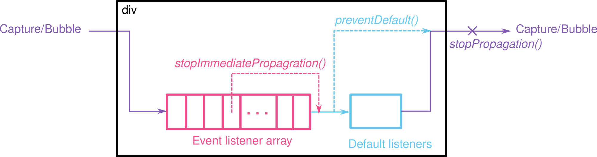
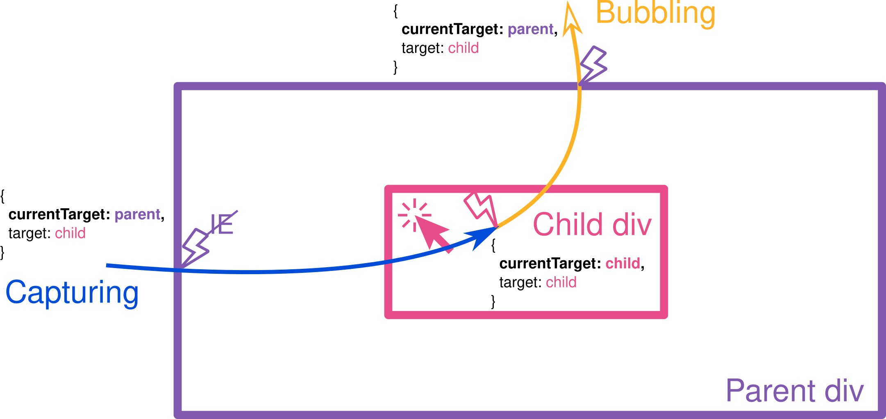

### Getting reference to domnodes

use `document.querySelector('#somdid')`

### Dom nodes are mutable

### DOM node interface

https://developer.mozilla.org/en-US/docs/Web/API/Node

Node.nodeType can have one of the following values that represents the type of the node:

1. Node.ELEMENT_NODE - `1`
2. Node.ATTRIBUTE_NODE - deprecated
3. Node.TEXT_NODE - `3`
4. Node.CDATA_SECTION_NODE - deprecated
5. Node.PROCESSING_INSTRUCTION_NODE
6. Node.COMMENT_NODE - `8`
7. Node.DOCUMENT_NODE - `9`
8. Node.DOCUMENT_TYPE_NODE - `10`
9. Node.DOCUMENT_FRAGMENT_NODE- `11`
10. Node.NOTATION_NODE


#### HOw to get the node type?

The `nodeType` is present on all the nodes in the DOM tree.

```js
const paragraph = document.querySelector('p');
paragraph.nodeType === Node.ELEMENT_NODE; // => true
```
```js
const paragraph = document.querySelector('p');
const firstChild = paragraph.childNodes[0];
firstChild.nodeType === Node.TEXT_NODE; // => true
```

#### DOM Element

 an element is a node that’s written using a tag in the HTML document. `<html>`, `<head>`, `<title>`, `<body>`, `<h2>`, `<p>` are all elements because they are represented by tags.

 an element is a node of a specific type — element (Node.ELEMENT_NODE).

`Node` is constructor of a node, and `HTMLElement` is a constructor of an element in JavaScript DOM. A `paragraph`, being a node and also an element, is an instance of both `Node` and `HTMLElement`:
```js
const paragraph = document.querySelector('p');
paragraph instanceof Node;        // => true
paragraph instanceof HTMLElement; // => true
```

`Node` is more fundamental than an `Element`, as `Element` is a type of `Node`, where as we can have
other types of nodes like `comment node` or `text node`.
i.e. `Element extends Node`.

### Creating elements

`document.createElement()` method creates the HTML element specified by tagName, or an HTMLUnknownElement if tagName isn't recognized.

```js
// let element = document.createElement(tagName[, options]);
document.body.onload = addElement;

function addElement () {
  // create a new div element
  const newDiv = document.createElement("div");

  // and give it some content
  const newContent = document.createTextNode("Hi there and greetings!");

  // add the text node to the newly created div
  newDiv.appendChild(newContent);

  // add the newly created element and its content into the DOM
  const currentDiv = document.getElementById("div1");
  document.body.insertBefore(newDiv, currentDiv);
}
```

### Ways of selecting elements

1. `document.getElementById` - Returns an `Element` reference matching id.
2. `document.getElementByClassName` - Returns an `Element` reference matching class.
3. `querySelector` - all in one selector e.g. `h1`, `#red`, `.myclass`. In case of multiple matches, will return the first match. Returns instance of `Element`.
4. `document.getElementsByTagName` - return value not an array but array like object, extending protolink over `HTMLCollection`.


5. `element.getElementsByClassName`: gets matching elements by class in the subtree of the element on which the method is being run.
6. `element.getElementsByTagName`: similar to above.

7. `querySelectorAll`: similar to queryselector, but returns a `NodeList` of `Element`s.


#### HTMLCollection vs NodeList

`HTMLCollection` is a live list, i.e. even after selection, it can change, if someone updates
the DOM.
where as `NOdeList` is a static list.
Also HTMLCollection will only contain elements, where as `NOdeLIst` will contain all types of nodes.

### Printing selected element properties

Use `console.dir`, e.g. `console.dir($0)`, where `$0` stands for selected element from devtools.
or `console.dir(document)`


### Manipulating the DOM

#### innerText

The `innerText` property of the `HTMLElement` interface represents the `rendered text content` of a node and its descendants.

#### textContent

`textContent` differs from `innerText` as `textContent` means the text content before the rendering, which is present in source.

e.g. 
```html
<p>
    Hey hi how are
    <script>console.log('Hey hi');</script>
</p>
```

For above `p` element,
`innerText` is:
`Hey hi how are`
where as `textContent` is:
```txt
Hey hi how are
console.log('Hey hi');
```

#### innerHTML

`innerHTML` differs from `innerText`, because `innerHTML` also understands `HTML`
elements and its parsing, objects etc.
e.g. setting `innerHTML` will parse HTML and setup corresponding `HTMLElement` objects
in the dom.
Similarly getting `innerHTML` property will return the html including the element tags.


### Attributes

`key=value` pairs present on `HTMLElement`s in order to configure elements.

`Global attributes` are attributes common to all HTML elements; they can be used on all elements, though they may have no effect on some elements. e.g `id` attribute, `class` attribute, `data-*` attribute, `style` attribute.

`Element level attributes` are specific to cetain elements:
e.g.
1. `href` attribute on `a`
2. `disabled` on `button`, `input`, `option`, `select`.
3. `crossorigin` on `img`, `video/audio`, `script`, `link`.
4. `checked` on `input type checkbox`
5. `method` on `form`.
6. `name` on `button`, `form`, `iframe`, `input`, `select`, `meta`.
7. `novalidate` on `form`.
8. `size` on `input`, `select`.
9. `src` on `audio`, `iframe`, `img`, `input`, `script`, `source`, `track`, `video`.
10. `target` on `a`, `form`.
11. `type` on `button`, `input`, `embed`, `script`, `source`, `style`, `link`.
12. `value` on `button`, `data`, `input`, `li`, `option`, `progress`, `param`.
13. `height/width`: on `canvas`, `embed`, `iframe`, `img`, `input`, `object`, `video`.
14 `form`: indicates the form that is owner of the element, this attribute is present on `button`, `input`, `label`, `object`, `select`.

Some times sub-attributes of an element will depend on a main attribute ee.g. 
`<input type="radio">` vs `<input type="range">` will decide what kind of sub attributes e.g. `min`, `max` apply to `<input type="range">` element.

Getting an attribute:
`element.getAttribute(attrName)`
**Note** : Some attributes will have shortcuts, e.g. instead of doing `inputEl.getAttribute('value')`, one can directly do `inputEl.value`. But not all properties will have shortcuts.

`Setting attribute`:
One can set attribute via:
`el.setAttribute(attrName, valueToSet)`


### DOM traversal methods

1. `children` - returns `HTMLCollection`.
2. `sibling` - `nextSibling` and `previousSibling` return NOdes, for corresponding element methods use `nextElementSibling` and `previousElementSibling`.
3. `parentElement` - property on the `Node` interface, `node.parentElement` is the parent element of the current node. This is always a DOM `Element` object, or null. **NOte** - only `Element Nodes` can be parent,no other type of node can be parent.


#### parentNode vs parentElement

In most cases, `parentElement` it is the same as `parentNode`. The only difference comes when a node's `parentNode` is not an element. If so, `parentElement` is null.

```js
document.body.parentNode; // the <html> element
document.body.parentElement; // the <html> element

document.documentElement.parentNode; // the document node
document.documentElement.parentElement; // null

(document.documentElement.parentNode === document);  // true
(document.documentElement.parentElement === document);  // false
```


#### `children` vs `childNodes`

`children` only contains `Element`s via `HTMLCollection` where as `childNodes` returns `NodeList` which will also contain both element and non-element nodes like comments etc.

### style modification with inline styles

`el.style` refers to inline style applied to the element, it does not contain all the computed style

property names are camel cased i.e `el.style.backroundColor = 'red'`

#### getting actual computed style

Use `window.getComputedStyle(el)` to get actual computed style for an element: The `Window.getComputedStyle()` method returns an object containing the values of all CSS properties of an element, after applying active stylesheets and resolving any basic computation those values may contain.

Returns instance of `CSSStyleDeclaration`.

`Preferred way of updating styles`: add or remove classes to an element. Remember, an element can have many classes applied to it.

So use `el.classList`: Recommended way to style elements from code.
The  `Element.classList` is a read-only property that returns a live `DOMTokenList` collection of the class attributes of the element. This can then be used to manipulate the class list. It is a more convinient alternative over raw manipulation via `El.getAttribute('class')` and manipulating raw strings.

Using classList is a convenient alternative to accessing an element's list of classes as a space-delimited string via `element.className`.
`DOMTokenList` has methods like `add`, `remove`, and array based methods, although it is an arrayLike object, not an array.
`toggle`: 
e.g. `todoEl.classList.toggle('done')`

### Creating elements and adding them to DOM

#### Create elements with `document.createElement`

`createElement` takes a `tagName` and
returns an instance of `Element`.

```js
const newH2 = document.createElement('h2');
// newH2 still not added to dom tree, exists independently.
```

Adding created elements/nodes to DOM with
`Node.appendChild`:

The `Node.appendChild()` method adds a `node` to the end of the list of children of a specified parent node. 

If the given child is a reference to an existing node in the document, `appendChild()` moves it from its current position to the new position (there is no requirement to remove the node from its parent node before appending it to some other node).

**This means that a node can't be in two points of the document simultaneously**. So if the node already has a parent, the node is first removed, then appended at the new position.

#### insertAdjacentElement

```html
<!-- beforebegin -->
<p>
  <!-- afterbegin -->
  foo
  <!-- beforeend -->
</p>
<!-- afterend -->
```
```js
// <div id="one">one</div>
var d1 = document.getElementById('one');
d1.insertAdjacentHTML('afterend', '<div id="two">two</div>');

// At this point, the new structure is:
// <div id="one">one</div><div id="two">two</div>
```

### `Element.remove` and `Node.removeChild`

Case 1:
`var oldChild = node.removeChild(child);`

`child` is the child node to be removed from the DOM.
`node` is the parent node of child.
`oldChild` holds a reference to the removed child node, i.e., oldChild === child.

The removed child node still exists in memory, but is no longer part of the DOM. With the first syntax form shown, you may reuse the removed node later in your code, via the oldChild object reference.


Case 2:
`node.removeChild(child);`
no oldChild reference kept, so assuming your code has not kept any other reference to the node elsewhere, it will immediately become unusable and irretrievable, and will usually be automatically deleted from memory after a short time.

`node.remove()` automatically removes itself from DOM tree.


### window.innerHeight and window.innerWidth

size of open document that is visible to the end user, e.g. if i open devtools
to the right, then innerwidth will be decreased.


### DOM events

ways to not add listeners:
1. All elements will 
have a `onEventName`
attribute and you can set it in markup/html
2. same as above but directly setting it in js. e.g `el.onEventName= fnToRun`
an instance of it is `el.onclick = fnToRun`.

Problem with above approach: you cannot have multiple listeners on an element.

#### EventTarget

The `EventTarget` interface is implemented by objects that can receive events and may have listeners for them. In other words, any target of events implements the three methods associated with this interface.

Methods are:
```js
EventTarget.addEventListener()
EventTarget.removeEventListener()
EventTarget.dispatchEvent() // Dispatches an event to this EventTarget
```

Common targets are `Element`, or `its children`, `Document`, and `Window`, but the target may be any object that supports events (such as `XMLHttpRequest`).

#### addEventListener

The `addEventListener()` method of the `EventTarget` interface sets up a function that will be called whenever the specified event is delivered to the target.

**Eventlistener internals**:
* Event listener callback gets argument `evt` that is event object.
* also `this` is also bound to element `el`, which also same as `evt.currentTarget`.
In case of an arrow function, `this` is bound to outer context.
e.g.
```js
el.addEventListener(evt => { // evt is event object
  console.log(this); // this is bound to el, i.e. element where the eventlistener was added.
})
```

`evt.path` is interesting property listing a collection of all the elements that were clicked along in the hierarchy of the element.

**Event listeners execution order on the same element**:
in queue/insertion order i.e. listener inserted first will be executed first.
e.g. 
```js
$0.addEventListener('click', () => console.log('clicked 1'))
$0.addEventListener('click', () => console.log('clicked 2'))
$0.addEventListener('click', () => console.log('clicked 3'))
// click on $0 results in following log
// clicked 1
// clicked 2
// clicked 3
```

#### Click event listeners behavior for nested elements.

clicking on a child:
child listener fires first and then parent listeners, i.e. event is bubbled up 
from target and respective listeners called.

Default mode is bubbling, i.e event target listener is fired first then it bubbles 
up through parents and fires respective listeners. so think "innermost listeners first" for default registering of listeners.

Non default addEventListenr example:
```js
el.addEventListener('click', fn, true); // true stands for capture, default is false
```

e.g. log
```txt
document capture listener
parent capture listener
chld capture listener
child bubble listener // default setting for listener
parent bubble listener // default setting for listener
document bubble listener // default setting for listener
```

### stopping propogation of an event

use `e.stoppropogation` to stop normal flow mentioned above

### events that do not bubble

Which events do not bubble?
Most events do bubble. There are several exception events that do not bubble. Some of them are:

* `focus` (`focusin` is the equivalent bubbling version).
* `blur` (`focusout` is the equivalent bubbling version).
* `load`, `unload`, `abort`, `error`, `beforeunload`.
* `mouseenter` (`mouseover` is similar but do bubble).
* `mouseleave` (`mouseout` is similar but do bubble).
* `DOMNodeInsertedIntoDocument`, `DOMNodeRemovedFromDocument` (both events are deprecated).
* In IE prior to version 9: `change`, `submit` and `reset`.

**Note** - non-bubble events are captured.

### Event cancellation

Canceling an event
There are three types of event canceling.
courtesy: https://transang.me/everything-about-event-bubbling/

`preventDefault()`:
- has no effect on non-cancelable events.
- prevents the default handler of the event, such as form submission, text input, ...
`stopPropagation()`: prevents the event to continue the capture/bubble chain.
`stopImmediatePropagation()`: prevents the event listeners attached to the same target from being fired.




### event.target vs event.currentTarget

`Event.target`: the element that triggers the event.
`Event.currentTarget`: the element where the event listener is attached to.


### event.relatedTarget

For mousenter, mouseleave, mouseout, mouseover, dragenter, dragexit, blur, focus, focusin, focusout events, the event has one more property named relatedTarget which points to the secondary target, where target is the primary target. Use the following structure for your convenience to infer them.

Event do <action> the <primary target> from/to the <secondary target>
For example:

`mouseenter`: mouse `enters/overs/dragenter` `event.target` from `event.relatedTarget`
`mouseleave`: mouse `leaves/outs/dragexit` `event.target` to `event.relatedTarget`

### focus/blur events

There are 4 types of focus/blur events: blur/focus (non-bubble), focusin/focusout (bubble).

### Object handlers

We can assign not just a function, but an object as an event handler using `addEventListener`. When an event occurs, the object's `handleEvent` method is called.


```html
<button id="elem">Click me</button>

<script>
  let obj = {
    handleEvent(event) {
      alert(event.type + " at " + event.currentTarget);
    }
  };

  elem.addEventListener('click', obj);
</script>
```

### adding event listener from another event listener

If an event listener is added to an EventTarget from inside another listener, that is during the processing of the event, that event will not trigger the new listener. However, the new listener may be triggered during a later stage of event flow, such as during the bubbling phase.

### default behaviors

1. checked update on checkbox click event
2. input value update on keypresses
3. Pressing a mouse button over a text and moving it – selects the text
4. A click on a link – initiates navigation to its URL.
5. A click on a form submit button – initiates its submission to the server.

### passive handler
The “passive” handler option
The optional passive: true option of addEventListener signals the browser that the handler is not going to call preventDefault().

Why that may be needed?

There are some events like touchmove on mobile devices (when the user moves their finger across the screen), that cause scrolling by default, but that scrolling can be prevented using preventDefault() in the handler.

So when the browser detects such event, it has first to process all handlers, and then if preventDefault is not called anywhere, it can proceed with scrolling. That may cause unnecessary delays and “jitters” in the UI.

The passive: true options tells the browser that the handler is not going to cancel scrolling. Then browser scrolls immediately providing a maximally fluent experience, and the event is handled by the way.

For some browsers (Firefox, Chrome), passive is true by default for touchstart and touchmove events.

### returning false from handlers
Returning `false` from a handler is an exception
The value returned by an event handler is usually ignored.

The only exception is return false from a handler assigned using `on<event>`.

In all other cases, return value is ignored. In particular, there’s no sense in returning true.

### Dispatching custom events

We can generate not only completely new events, that we invent for our own purposes, but also built-in ones, such as click, mousedown etc. That may be helpful for automated testing.

Built-in event classes form a hierarchy, similar to DOM element classes. The root is the built-in Event class.

```js
let event = new Event(type[, options]);
```
Arguments:

`type` – event type, a string like "click" or our own like "my-event".

`options` – the object with two optional properties:

`bubbles`: true/false – if true, then the event bubbles.
cancelable: true/false – if true, then the “default action” may be prevented. Later we’ll see what it means for custom events.
By default both are false: `{bubbles: false, cancelable: false}`.

### dispatching events from code

After an event object is created, we should “run” it on an element using the call `elem.dispatchEvent(event)`.
`dispatchEvent` execution is synchronous.

Then handlers react on it as if it were a regular browser event. If the event was created with the bubbles flag, then it bubbles.

In the example below the click event is initiated in JavaScript. The handler works same way as if the button was clicked:

```html
<button id="elem" onclick="alert('Click!');">Autoclick</button>

<script>
  let event = new Event("click");
  elem.dispatchEvent(event);
</script>
```

#### event.isTrusted
There is a way to tell a “real” user event from a script-generated one.

The property event.isTrusted is true for events that come from real user actions and false for script-generated events.

### Creating and firing custom events

We can leverage browser's existing event pub/sub system to our advantage rather
than inventing our own.

For our own, completely new events types like `"hello"` we should use `new CustomEvent`. Technically `CustomEvent` is the same as `Event`, with one exception.

In the second argument (object) we can add an additional property `detail` for any custom information that we want to pass with the event.

```html
<h1 id="elem">Hello for John!</h1>

<script>
  // additional details come with the event to the handler
  elem.addEventListener("hello", function(event) {
    alert(event.detail.name);
  });

  elem.dispatchEvent(new CustomEvent("hello", {
    detail: { name: "John" }
  }));
</script>
```


