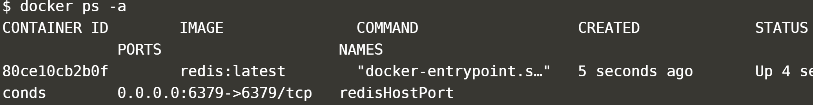

Docker images are compiled version of a filesystem.

Docker containers are live/process version of a docker image.

Best practices: https://runnable.com/blog/9-common-dockerfile-mistakes

Using docker on windows: use docker toolbox. (it wraps a linux vm inside it)

**Note** - Older versions of Docker were called docker, docker.io, or docker-engine.
Latest correct community package is now known as `docker-ce`.

Use docker inspect to get more info on a container
```sh
docker inspect container-id
```

Use `docker logs` to get logs for given container
```sh
docker logs container-id
```

### Docker usage by non-root users

The Docker daemon binds to a Unix socket instead of a TCP port. By default that Unix socket is owned by the user `root` and other users can only access it using `sudo`. The Docker daemon always runs as the `root` user.

If you don’t want to preface the docker command with `sudo`, create a Unix group called `docker` and add users to it. When the Docker daemon starts, it creates a Unix socket accessible by members of the `docker` group.
do:
```sh
sudo groupadd docker
sudo usermod -aG docker $USER
# Log out and log back in so that your group membership is re-evaluated
newgrp docker
```

### Seeing all processes being run by docker

```sh
pstree -c -p -A $(pgrep dockerd)
```

### Volumes vs bind mounts

Bind mounts have been around since the early days of Docker. Bind mounts have limited functionality compared to volumes. 

When you use a bind mount, a file or directory on the host machine is mounted into a container. The file or directory is referenced by its full or relative path on the host machine. 

By contrast, when you use a volume, a new directory is created within Docker’s storage directory on the host machine, and Docker manages that directory’s contents.

#### Why volumes

* Volumes are easier to back up or migrate than bind mounts.
* You can manage volumes using Docker CLI commands or the Docker API.
* Volumes work on both Linux and Windows containers.
* Volumes can be more safely shared among multiple containers.
* Volume drivers let you store volumes on remote hosts or cloud providers, to encrypt the contents of volumes, or to add other functionality.
* New volumes can have their content pre-populated by a container.

`-v` or `--volume`: Consists of three fields, separated by colon characters (:). The fields must be in the correct order, and the meaning of each field is not immediately obvious.

e.g.
```sh
docker run -d \
  --name devtest \
  -v myvol2:/app \
  nginx:latest
```

* In the case of named volumes, the first field is the name of the volume, and is unique on a given host machine. For anonymous volumes, the first field is omitted.
* The second field is the path where the file or directory are mounted in the container.
* The third field is optional, and is a comma-separated list of options, such as ro. These options are discussed below.

### tmpfs mounts

A tmpfs mount is not persisted on disk, either on the Docker host or within a container. It can be used by a container during the lifetime of the container, to store non-persistent state or sensitive information

### Exposing port

If a service needs to be accessible by a process not running in a container, then port needs to be exposed via the Host.

Once exposed, it is possible to access process as if it were running on the host OS itself.

Running containers with ports exposed via `-p`
: `docker run -d --name redisExposed -p <host-port>:<container-port> redis`

i.e.
```sh
docker run -d --name redisExposed -p 6379:6379 redis:latest
```

After exposing ports, `docker ps` will show the exposing using `->` e.g.




**NOTE**
By default, the port on the host is mapped to 0.0.0.0, which means all IP addresses. You can specify a particular IP address when you define the port mapping, for example, -p 127.0.0.1:6379:6379

### Running command in a docker container using `docker exec`

```sh
docker exec -it CONTAINER COMMAND
# e.g.
docker exec -it mycontainer env

# PATH=/user/local/bin:/usr/sbin:/bin
# TERM=xterm
```


### Getting hold of a shell within the container
```sh
# to get a bash shell in the container
docker exec -it <container name> /bin/bash
```

### access to docker commands/daemon within a docker container 
Thecontainer should be started with docker.sock volume mounted
e.g.
```sh
docker run -p 8080:8080 -p 50000:50000 -v /var/run/docker.sock:/var/run/docker.sock --name jenkins -d jenkins-docker
```

#### docker exec interactive


### Managing docker networks

The type of network a container uses, whether it is a bridge, an overlay, a macvlan network, or a custom network plugin, is transparent from within the container. From the container’s point of view, it has a network interface with an IP address, a gateway, a routing table, DNS services, and other networking details.


`docker -p` : `-p` stands for `--publish`, which publishes a rule to map docker host port to docker container port.
`docker -p 8080:80`

By default, the container is assigned an IP address for every Docker network it connects to. The IP address is assigned from the pool assigned to the network, so the Docker daemon effectively acts as a DHCP server for each container. Each network also has a default subnet mask and gateway.


Create network
```
docker network create abc-net
```

List networks

```
docker network ls
```

### types of namespaces

The available namespaces are:

Mount (mnt)
Process ID (pid)
Network (net)
Interprocess Communication (ipc)
UTS (hostnames)
User ID (user)
Control group (cgroup)

### unshared tool

Run a program with some namespaces unshared from parent

By unsharing the Pid namespace from the host, it looks like the bash prompt is the only process running on the machine.
```sh
sudo unshare --fork --pid --mount-proc bash
ps aux
exit
```

### DockerHub

#### Repositories
Repositories can have docker images


### nsenter tool

NSEnter is used to attach processes to existing Namespaces. Useful for debugging purposes.

### chroot

An important part of a container process is the ability to have different files that are independent of the host. This is how we can have different Docker Images based on different operating systems running on our system.

Chroot provides the ability for a process to start with a different root directory to the parent OS. This allows different files to appear in the root.

### cgroups

`CGroups` limit the amount of resources a process can consume. These cgroups are values defined in particular files within the `/proc` directory.

Seeing cgroup mappings of a pid:
`cat /proc/$PID/cgroup`

### Container image

A container image is a tar file containing tar files. Each of the tar file is a layer. Once all tar files have been extract into the same location then you have the container's filesystem.

Other important files are `repositories` and `manifest.json` that are present in the image.

e.g.
```sh
docker pull redis:3.2.11-alpine # brings down image
docker save redis:3.2.11-alpine > redis.tar # save the image as tar file
tar -xvg redis.tar # extract the tar file
#output is below
46a2fed8167f5d523f9a9c07f17a7cd151412fed437272b517ee4e46587e5557/
46a2fed8167f5d523f9a9c07f17a7cd151412fed437272b517ee4e46587e5557/VERSION
46a2fed8167f5d523f9a9c07f17a7cd151412fed437272b517ee4e46587e5557/json
46a2fed8167f5d523f9a9c07f17a7cd151412fed437272b517ee4e46587e5557/layer.tar
498654318d0999ce36c7b90901ed8bd8cb63d86837cb101ea1ec9bb092f44e59/
498654318d0999ce36c7b90901ed8bd8cb63d86837cb101ea1ec9bb092f44e59/VERSION
498654318d0999ce36c7b90901ed8bd8cb63d86837cb101ea1ec9bb092f44e59/json
498654318d0999ce36c7b90901ed8bd8cb63d86837cb101ea1ec9bb092f44e59/layer.tar
ad01e7adb4e23f63a0a1a1d258c165d852768fb2e4cc2d9d5e71698e9672093c/
ad01e7adb4e23f63a0a1a1d258c165d852768fb2e4cc2d9d5e71698e9672093c/VERSION
ad01e7adb4e23f63a0a1a1d258c165d852768fb2e4cc2d9d5e71698e9672093c/json
ad01e7adb4e23f63a0a1a1d258c165d852768fb2e4cc2d9d5e71698e9672093c/layer.tar
ca0b6709748d024a67c502558ea88dc8a1f8a858d380f5ddafa1504126a3b018.json
da2a73e79c2ccb87834d7ce3e43d274a750177fe6527ea3f8492d08d3bb0123c/
da2a73e79c2ccb87834d7ce3e43d274a750177fe6527ea3f8492d08d3bb0123c/VERSION
da2a73e79c2ccb87834d7ce3e43d274a750177fe6527ea3f8492d08d3bb0123c/json
da2a73e79c2ccb87834d7ce3e43d274a750177fe6527ea3f8492d08d3bb0123c/layer.tar
db1a23fc1daa8135a1c6c695f7b416a0ac0eb1d8ca873928385a3edaba6ac9a3/
db1a23fc1daa8135a1c6c695f7b416a0ac0eb1d8ca873928385a3edaba6ac9a3/VERSION
db1a23fc1daa8135a1c6c695f7b416a0ac0eb1d8ca873928385a3edaba6ac9a3/json
db1a23fc1daa8135a1c6c695f7b416a0ac0eb1d8ca873928385a3edaba6ac9a3/layer.tar
f07352aa34c241692cae1ce60ade187857d0bffa3a31390867038d46b1e7739c/
f07352aa34c241692cae1ce60ade187857d0bffa3a31390867038d46b1e7739c/VERSION
f07352aa34c241692cae1ce60ade187857d0bffa3a31390867038d46b1e7739c/json
f07352aa34c241692cae1ce60ade187857d0bffa3a31390867038d46b1e7739c/layer.tar
manifest.json
repositories

## meta data files are repositories and manifest.json
$ cat repositories
{"redis":{"3.2.11-alpine":"46a2fed8167f5d523f9a9c07f17a7cd151412fed437272b517ee4e46587e5557"}}
$ cat manifest.json
[{"Config":"ca0b6709748d024a67c502558ea88dc8a1f8a858d380f5ddafa1504126a3b018.json","RepoTags":["redis:3.2.11-alpine"],"Layers":["498654318d0999ce36c7b90901ed8bd8cb63d86837cb101ea1ec9bb092f44e59/layer.tar","ad01e7adb4e23f63a0a1a1d258c165d852768fb2e4cc2d9d5e71698e9672093c/layer.tar","da2a73e79c2ccb87834d7ce3e43d274a750177fe6527ea3f8492d08d3bb0123c/layer.tar","db1a23fc1daa8135a1c6c695f7b416a0ac0eb1d8ca873928385a3edaba6ac9a3/layer.tar","f07352aa34c241692cae1ce60ade187857d0bffa3a31390867038d46b1e7739c/layer.tar","46a2fed8167f5d523f9a9c07f17a7cd151412fed437272b517ee4e46587e5557/layer.tar"]}]

## extracting a layer shows the files inside
$ tar -xvf da2a73e79c2ccb87834d7ce3e43d274a750177fe6527ea3f8492d08d3bb0123c/layer.tar
etc/
etc/apk/
etc/apk/world
lib/
lib/apk/
lib/apk/db/
lib/apk/db/installed
lib/apk/db/lock
lib/apk/db/scripts.tar
lib/apk/db/triggers
sbin/
sbin/su-exec
var/
var/cache/
var/cache/misc/
```

#### image history
Show the history of an image

```sh
docker image history [OPTIONS] IMAGE
```

### Creating image without dockerfile

### Important docker commands

```Dockerfile
# set env variable
ENV JAVA_HOME=/usr/java/openjdk-13


```
