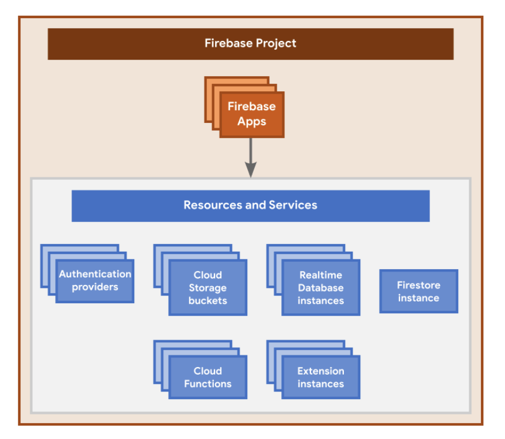

When you create a new `Firebase` project in the Firebase console, you're actually creating a `Google Cloud Platform (GCP)` project behind the scenes. You can think of a GCP project as a virtual container for data, code, configuration, and services. A Firebase project is a GCP project that has additional Firebase-specific configurations and services. You can even create a GCP project first, then add Firebase to the project later.

Since a Firebase project is a GCP project:

* Projects that appear in the Firebase console also appear in the GCP console and Google APIs console.

* Billing and permissions for projects are shared across Firebase and GCP.

* Unique identifiers for a project (like project ID) are shared across Firebase and GCP.

* You can use products and APIs from both Firebase and GCP in your project.

* Deleting a project deletes it across Firebase and GCP.

### Firebase Project

A firebase project can have multiple apps.
All these apps use same cloud firestore and cloud storage.
Good use case is Android, ios, web app would fall under same firebase project.

**A Firebase project is the top-level entity for Firebase.** In a project, you can register your Apple, Android, or web apps.

If apps are going to use same data/configuration, it is good idea to put them under single project.

**All Firebase Apps registered to the same Firebase project share and have access to all the same resources and services provisioned for the project**.

All the Firebase Apps registered to the same Firebase project share the same backends, like Firebase Hosting, Authentication, Realtime Database, Cloud Firestore, Cloud Storage, and Cloud Functions.

## Some naming conventions

Default Hosting subdomain — `PROJECT_ID.web.app` and `PROJECT_ID.firebaseapp.com`
Default Realtime Database URL — `PROJECT_ID-default-rtdb.firebaseio.com` or `PROJECT_ID-default-rtdb.REGION_CODE.firebasedatabase.app`
Default Cloud Storage bucket name — `PROJECT_ID.appspot.com`

## Configuration with apps

When you register an app with a Firebase project, the Firebase console provides a Firebase configuration file (Apple/Android apps) or a configuration object (web apps) that you add directly to your local app directory.

For Apple apps, you add a `GoogleService-Info.plist` configuration file.
For Android apps, you add a `google-services.json` configuration file.
For web apps, you add a Firebase configuration object.

## Where to find app specific configuration?

## Service account

Service accounts can be user created or autocreated by system.

* Have an auto generated email - `yourprojectid@someservices.gserviceaccount.com`
* Can only be authenticated using RSA keypair (instead of password)
* Cannot be logged in via browser, but can be attached to apps/instances
* Can have IAM roles that determine capabilities like access to certain actions and resources.

