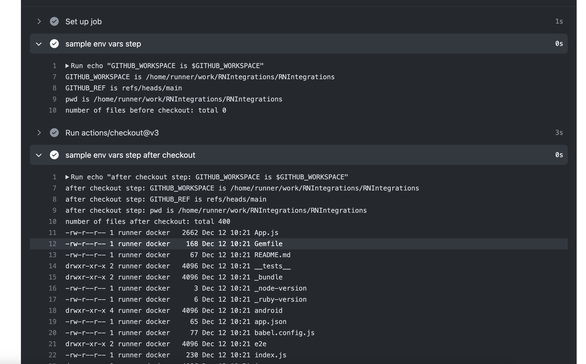

## Outputs

### Step level outputs
Steps can have outputs, which can be conveyed using `GITHUB_OUTPUT` file.


### Job level outputs

Job level outputs are set using `outputs` property on `job_id` block:
```yaml
jobs:
  job1:
    runs-on: ubuntu-latest
    # Map a step output to a job output
    outputs:
      output1: ${{ steps.step1.outputs.test }}
      output2: ${{ steps.step2.outputs.test }}
    steps:
      - id: step1
        run: echo "test=hello" >> $GITHUB_OUTPUT  # set step level output, accessible via steps.step_id.outputs.var_name
      - id: step2
        run: echo "test=world" >> $GITHUB_OUTPUT
  job2:
    runs-on: ubuntu-latest
    needs: job1
    steps:
      - run: echo ${{needs.job1.outputs.output1}} ${{needs.job1.outputs.output2}} ## referring to other jobs using needs.other_job_id.outputs.var_name

```

Job outputs are used in dependent jobs using `needs` context.

## By default no source code is present at GITHUB_WORKSPACE

to actually pull-in your source code, one must use `@actions/checkout@v2` 
here is an e.g. of system contents before and after checkout action



## 
