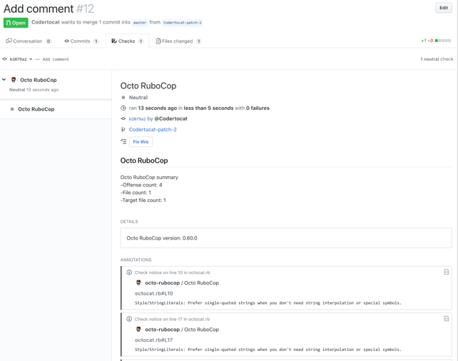

Checks are different from statuses in that they provide line annotations, more detailed messaging, and are only available for use with GitHub Apps.

When checks are set up in a repository, pull requests have a Checks tab where you can view detailed build output from status checks and rerun failed checks.

The Check Runs API enables you to build GitHub Apps that run powerful checks against code changes in a repository. You can create apps that perform continuous integration, code linting, or code scanning services and provide detailed feedback on commits.

Rather than binary pass/fail build statuses, GitHub Apps can report rich statuses, annotate lines of code with detailed information, and re-run tests.

## Check suite

check suite is a collection of the check runs created by a single GitHub App for a specific commit.

