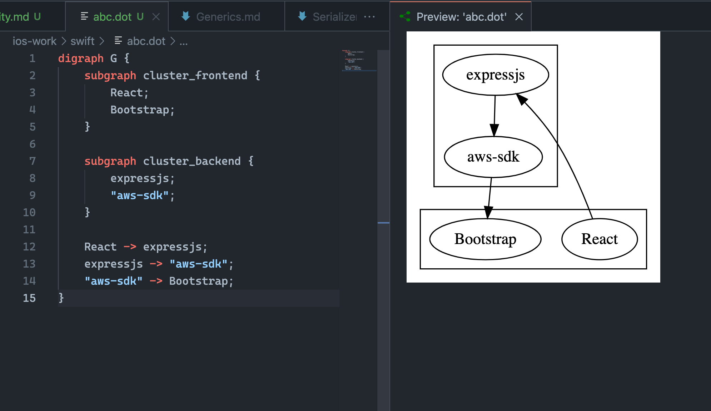
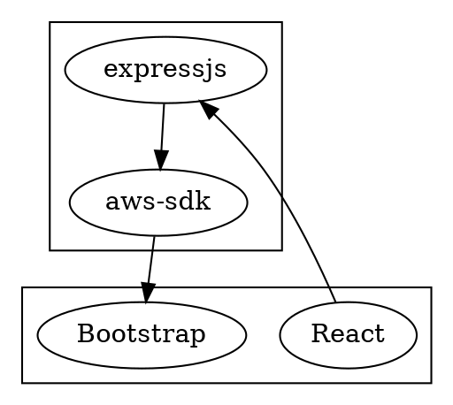

## Graphviz

```dot
digraph G {
    subgraph cluster_frontend {
        React;
        Bootstrap;
    }
    
    subgraph cluster_backend {
        expressjs;
        "aws-sdk";
    }
    
    React -> expressjs;
    expressjs -> "aws-sdk";
    "aws-sdk" -> Bootstrap;
}
```

### Rankdir

default direction of arrows

Defines main axis, the default rankdir is top to bottom i.e. vertical.

