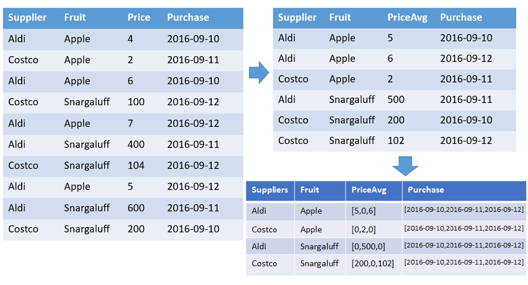

## Pre-requisites
Every event needs to have a timestamp, and the data should be structured in a way that allows for grouping by time intervals. The `make-series` operator is typically used with a time column and one or more value columns to aggregate.

## Group by time intervals and aggregate values
The `make-series` operator in Kusto Query Language (KQL) is used to create a time series by grouping data into specified time intervals and aggregating values within those intervals. This operator is particularly useful for analyzing trends over time.
```
// Group by Supplier, fruit and 1d - aggregation is avg(Price).
T | make-series PriceAvg=avg(Price) default=0
on Purchase from datetime(2016-09-10) to datetime(2016-09-13) step 1d by Supplier, Fruit
```

## Visual explaination



