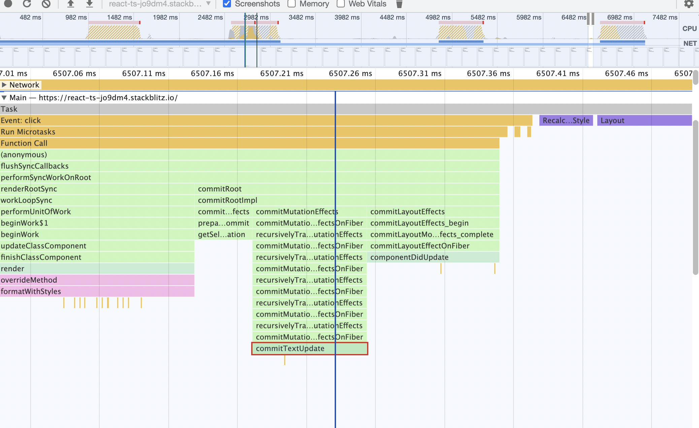

https://www.youtube.com/watch?v=OcB3rTln-fI

### Fiber objects

these "fiber" objects store the real component props and state values.
They are facade over component instances, also used in comparision etc during diffing phase.
When you use props and state in your components, React is actually giving you access to the values that were stored on the fiber objects


Infact react copies props from fiber object to class Instance object before calling render on the class:
https://github.com/facebook/react/blob/v17.0.0/packages/react-reconciler/src/ReactFiberClassComponent.new.js#L1038-L1042

Similarly for function components, hook info of a component is stored in corresponding fiber object as a linked list. 
React hooks work because React stores all of the hooks for a component as a linked list attached to that component's fiber object.


### Why do react elemnts have `$$typeof` property?

https://overreacted.io/why-do-react-elements-have-typeof-property/

```jsx
<marquee bgcolor="#ffa7c4">hi</marquee>
```

gets converted to:
React elements are plain objects by design, with `element.$$typeof` also
```js
{
  type: 'marquee',
  props: {
    bgcolor: '#ffa7c4',
    children: 'hi',
  },
  key: null,
  ref: null,
  $$typeof: Symbol.for('react.element'), // 🧐 Who dis
}
```

It is used by library to verify if a given object is a valid react element:
```js
export function isValidElement(object) {
  return (
    typeof object === 'object' &&
    object !== null &&
    object.$$typeof === REACT_ELEMENT_TYPE
  );
}
```

### React internals code flow

A `fiber` is a JavaScript object that contains information about a component, its input, and its output.

A `fiber` corresponds to a stack frame, but it also corresponds to an instance of a component.

The `type` and `key` of a fiber serve the same purpose as they do for React elements. (In fact, when a fiber is created from an element, these two fields are copied over directly.)

Unlike React elements which are re-created on every render, `fibers aren’t re-created on every render`.These are mutable data structures that hold components state and DOM.

Scheduling - updates like set state are queued and run on browser idle callback e.g. requestIdleCallback., which is a callback with a deadline duration. Two things important to scheduling (i.e. work loop ): `nextUnitOfWork` and `timeRemaining`.


child and sibling
Note there is no children reference, only child and sibling references to recurse
These fields point to other fibers, describing the recursive tree structure of a fiber.
The sibling field accounts for the case where render returns multiple children (a new feature in Fiber!):
```jsx
function Parent() {
  return [<Child1 />, <Child2 />]
}
```
The child fibers form a singly-linked list whose head is the first child. So in this example, the child of Parent is Child1 and the sibling of Child1 is Child2.

`return`: 
The return fiber is the fiber to which the program should return after processing the current one. It is conceptually the same as the return address of a stack frame. It can also be thought of as the parent fiber.

If a fiber has multiple child fibers, each child fiber's return fiber is the parent. So in our example in the previous section, the return fiber of Child1 and Child2 is Parent.

`pendingProps` and `memoizedProps`
Conceptually, props are the arguments of a function. A fiber's pendingProps are set at the beginning of its execution, and memoizedProps are set at the end.
When the incoming pendingProps are equal to memoizedProps, it signals that the fiber's previous output can be reused, preventing unnecessary work.


`effectList`:
List of changes needed that were recorded during fiber processing


`output`: 
Conceptually, the output of a fiber is the return value of a function.
Every fiber eventually has output, but output is created only at the leaf nodes by host components. The output is then transferred up the tree.
The output is what is eventually given to the renderer so that it can flush the changes to the rendering environment.

`memoizedState`:
For functional component, renderer stores hook info in fiber as memoizedstate property
Fiber keep reference to the first hook, and rest hooks follow in linked list chain via next

`Commit phase` : run all pending effects, updates, assignpendingprops to memoizedProps. Once done, switch pointers between current and WIP tree

In following order:

1. `Fiberbeginwork.js`
2. `Fibercompletework.js`
3. `Fibercommitwork.js` - commitWork and commitMount, appendChildren

Current fiber is what is on screen and `wipfiber` is draft version

Good place to put logs is begin work and complete work methods of firs two files

When logging filers, log fiber.type

`Renderwithhooks` is an export of `ReactFiberHooks`

Important function in begin work: 
```
export function reconcileChildren(current: Fiber | null,
  workInProgress: Fiber,
  nextChildren: any,
  renderExpirationTime: ExpirationTime)
——> if current is null, workInProgress.child = mountChildFibers
——> if current is non-null, workInProgress.child = reconcileChildFibers
```
Append children connects host nodes

Hostcomponent are platform primitives like ‘div’, ‘p’ etc.

`Fiber.statenode` is reference to **host views/constructs**

`React native host ops done in ReactNativeHostConfig.js` - calls into UIManager API

For custom components, react element.type is function itself , also part of fiber.type

Flushing to external world happens in commitmutationeffects 

Creation of filers - createFiberFromTypeAndProps, createFiberFromElement
 in ReactFiber.js 

```
Where does Function component rendering happen?Inside ReactFiberHooks.js —> renderWithHooks(){..  let children = Component(props, secondArg); }
```

Link between React and ReactDOM -> ReactSharedInternals, important things include ReactCurrentOwner, ReactCurrentDispatcher


`ReactCurrentOwner` is singleton link between React library and the renderer.


RN/DOM renderer links current processing fiber to ReactCurrentOwner.current

Renderer owns the actual hooks implementation, renderer attaches hooks as dispatcher to `ReactCurrentDispatcher.current` while processing a fiber, dispatcher forwards calls to renderer for hooks 
```jsx
Let { classcomponentupdater } = renderer; // e.g. ReactDOM
Let { reconciler, platformrenderer} = renderer;
```
The root component is host root

### React.createElement
This is what jsx transpiles into.

`React.Createlement` creates its own brand new props object, inside which it will assign the passed props key/values

###

Rendering steps —————————>
  setIsRendering(true);
    ReactCurrentOwner.current = workInProgress;
    value = renderWithHooks(
      null,
      workInProgress,
      Component,
      props,
      context,
      renderLanes,
    );
    setIsRendering(false);

## Effect type/shape

An `Effect` is a reference to a linkedlist of effects, where each node has its own `create` fn, `deps` arr and `destroy` fn, as well as flags.

```ts
export type Effect = {|
  tag: HookFlags,
  create: () => (() => void) | void,
  destroy: (() => void) | void,
  deps: Array<mixed> | null,
  next: Effect,
|};
```

## Hook structure is actually a reference node containing linkedlist of hooks

```js
export type Hook = {|
  memoizedState: any,
  baseState: any,
  baseQueue: Update<any, any> | null,
  queue: UpdateQueue<any, any> | null,
  next: Hook | null,
|};
```

Where are hooks stored?

**Hooks are stored as a linked list on the fiber's memoizedState field.**

Here is a proof of how it is constructed for the first time for a function component:
```js
function mountWorkInProgressHook(): Hook {
  const hook: Hook = {
    memoizedState: null,
    baseState: null,
    baseQueue: null,
    queue: null,
    next: null,
  };

  if (workInProgressHook === null) {
    // This is the first hook in the list
    currentlyRenderingFiber.memoizedState = workInProgressHook = hook;
  } else {
    // Append to the end of the list
    workInProgressHook = workInProgressHook.next = hook;
  }
  return workInProgressHook;
}
```

## Function component update q

```ts
export type FunctionComponentUpdateQueue = {|lastEffect: Effect | null|};
```

## Where are the DOM mutation code functions located?

In `ReactDOMHostConfig.js` for web, and `ReactNativeHostConfig.js` for mobile.

An example function is `commitTextUpdate()` which update text in native text view.

All These functions are considered mutation effects and usually run as a part of `commitMutationEffects()`.

Note how layout effects, effects and componentDidUpdate all are run after these DOM mutations.



## Scheduling for concurrent mode

https://www.telerik.com/react-wednesdays/making-sense-of-concurrent-mode-and-the-react-scheduler-with-matan-borenkraout

https://philippspiess.com/scheduling-in-react/

https://github.com/facebook/react/tree/main/packages/scheduler

https://dev.to/nielsen-tlv/the-hidden-magic-of-main-thread-scheduling-16i9


## Class component construction

https://github.com/facebook/react/blob/v17.0.0/packages/react-reconciler/src/ReactFiberClassComponent.new.js#L653

Happens inside:

```js
function constructClassInstance(
  workInProgress: Fiber,
  ctor: any,
  props: any,
): any {
  ///
  // ...
    const instance = new ctor(props, context);
  const state = (workInProgress.memoizedState =
    instance.state !== null && instance.state !== undefined
      ? instance.state
      : null);
  adoptClassInstance(workInProgress, instance);
}

function adoptClassInstance(workInProgress: Fiber, instance: any): void {
  instance.updater = classComponentUpdater;
  workInProgress.stateNode = instance;
  // The instance needs access to the fiber so that it can schedule updates
  setInstance(instance, workInProgress);
}
```