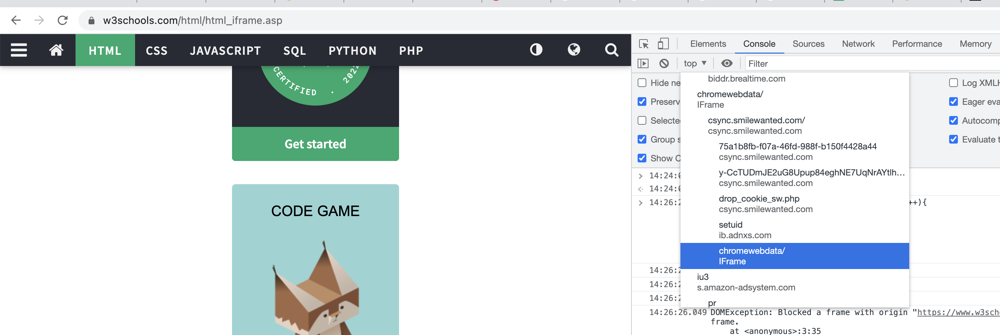

https://web.dev/same-origin-policy/

https://www.youtube.com/watch?v=zul8TtVS-64

##

The same-origin policy prevents this from happening by **blocking read access to resources loaded from a different origin**. 

"But wait," you say, "I load images and scripts from other origins all the time." Browsers allow a few tags to embed resources from a different origin

`Generally, embedding a cross-origin resource is permitted, while reading a cross-origin resource is blocked.`

## How origin affects localstorage, service workers, iframes, resource loading?

## How to know a windows/document's origin?

`window.origin` or `self.origin`

## How to access child frames?

`window.frames[0]`

```js
for(var i = 0; i< window.frames.length; i++){
    try {
     console.log(window.frames[i].origin);
    } catch(err){
        // cross domain iframes will not allow to see thier origin
        console.log(err);
    }
}
```

Viewing child frames from devtools:


## Window does not mean full access to its contents(JS/DOM etc) (in case of cross origin window).

e.g. 
```
window.frame[0].origin // throws DOM exception if current context origin is differen than frame[0].origin
```

## Getting access to parent frame window

`window.parent`

## Can you embed a cross origin iframe?

e.g. can you 

A webpage on the `web.dev` domain includes this iframe:

```html
<iframe src="https://example.com/some-page.html" alt="Sample iframe"></iframe>
```

Cross-origin iframe embeds are allowed as long as the origin owner hasn't set the `X-Frame-Options` HTTP header to `deny` or `sameorigin`.

## Cross origin iframe

A webpage on the web.dev domain includes this iframe:

```html
<iframe id="iframe" src="https://example.com/some-page.html" alt="Sample iframe"></iframe>
```
The webpage's JavaScript includes this code to get the text content from an element in the embedded page:

```js
const iframe = document.getElementById('iframe');
const message = iframe.contentDocument.getElementById('message').innerText;
```

Is this allowed?

No. Since the iframe is not on the same origin as the host webpage, the browser doesn't allow reading of the embedded page. Only iframe with same origins are allowed to read embedding page document.

## Cross origin form action

On `web.dev` domain:
```html
<form action="https://example.com/results.json">
  <label for="email">Enter your email: </label>
  <input type="email" name="email" id="email" required>
  <button type="submit">Subscribe</button>
</form>
```
Yes. Form data can be written to a cross-origin URL specified in the action attribute of the `<form>` element.

## How does same origin policy apply to anchor tags?

Any site can hyperlink to any other site with `href` attribute:
e.g. 
`<a href="www.google.com">Google</a>`.
The href is loaded in the new context so original site is replaced by accessed site.

originating site cannot read response for accessed/new site.

## Same origin policy applied to forms

FORMS can post to any site.

`<form action="siteb.com" method="POST">` -> on form submission navigation to the action attribute will happen.
Response is loaded in new context, so original site is replaced by the new site.

## How does same origin policy apply to images/audio video

Any site can display images from any other site, however cannot read their internal data.

e.g. in siteA
```html

```

## How does same origin policy apply to CSS?

Any site can load CSS from any other sites, however cannot read their internal data e.g. `window.styleSheets[0]` will have restricted view e.g. `window.styleSheets[0].rules will be null`.

e.g. in siteA
```html
<!-- loads successfully but no access from js or site a code -->
<link rel="https://siteb.com/styles.css">
```

## How does same origin policy apply to JS script includes?

Any site can load JS from any other site.
The **loaded js runs in the context of original site.**

```html
<script src="https://siteb.com/some.js">
```

## How does same origin policy apply to web storage?

WEb storage includes:
1. local storage

**Localstorage is shared between windows of same origin.You can’t read or write from localstorage that’s on different domain, even if that’s subdomain.**

Session storage is limited to window/tab lifetime.

## How does same origin policy apply to cookies?

Cookies are validated differently:
e.g. cookies are validated by `(name, domain, path)`, where as origins are identified by `(scheme, domain, port)`.

**Cookies can be broadaned to parent domain, and get sent to all the subdomains.**

## SOP applied to window/frames

Frames can only access content of frames with the same origin.

If the host and embedded iframe do not have the same origin, access to the data is restricted.

## SOP applied to XHR 

you can do xhr request to any site.
The response is successfully delivered to JS based on CORS headers:
```
access-control-allow-credentials: true
access-control-allow-origin: requester-domain-name
```

## Why host user content on separate origin/domain?
Because it might have malicious content, and serving in same domain/origin opens up full access to our domain/origin stuff.

So sites like google/fb use:
1. scontent-syd2-1.xx.fbcdn.net
2. drive-thirdparty.googleusercontent.com

