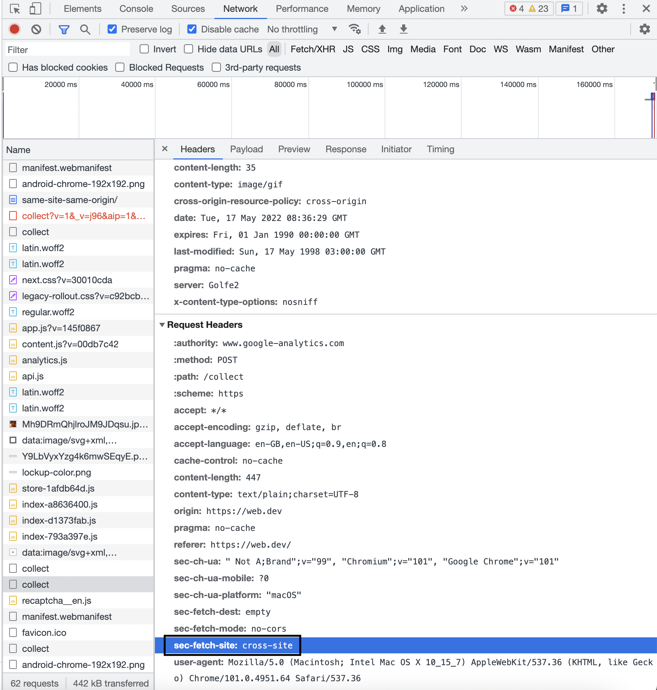

## Origin

"Origin" is a combination of a scheme (also known as the protocol, for example HTTP or HTTPS), hostname, and port (if specified).
   
For example, given a URL of `https://www.example.com:443/foo` , the "origin" is `https://www.example.com:443`

**Note** - path does not matter, ports, domain name, scheme matters.

Two actors in the web platform that share an origin are assumed to trust each other and to have the same authority. Actors with differing origins are considered potentially hostile versus each other, and are isolated from each other to varying degrees.

| Origin A | Origin B | Explanation of whether Origin A and B are "same-origin" or "cross-origin"
| --- | --- | --- |
| https://www.example.com:443 |	https://www.evil.com:443 | cross-origin: different domains
| | https://example.com:443 | cross-origin: different subdomains
| | https://login.example.com:443	| cross-origin: different subdomains
| | http://www.example.com:443 | cross-origin: different schemes
| | https://www.example.com:80 | cross-origin: different ports
| | https://www.example.com:443 | same-origin: exact match
| | https://www.example.com | same-origin: implicit port number (443) matches

## Site

`site` is the combination of the TLD and the part of the domain just before it. For example, given a URL of `https://www.example.com:443/foo` , the "site" is `example.com`.

**In essence site is effective TLD + 1**
For example, given a URL of `https://my-project.github.io` , the eTLD is .github.io and the eTLD+1 is `my-project.github.io`, which is considered a "site"

In essence, subdomains, ports and schemes do not matter in case of site, only effictive tld matters.

| Origin A | Origin B | Explanation of whether Origin A and B are "same-site" or "cross-site" |
| --- | --- | --- |
| https://www.example.com:443 | https://www.evil.com:443 | cross-site: different domains
| | https://login.example.com:443 | same-site: different subdomains don't matter
| | http://www.example.com:443 | same-site: different schemes don't matter
| | https://www.example.com:80 | same-site: different ports don't matter
| | https://www.example.com:443 | same-site: exact match
| | https://www.example.com | same-site: ports don't matter

## How to know if request is cross-site or same-origin

Look at the `sec-fetch-site` header in chrome devtools of a given request.

