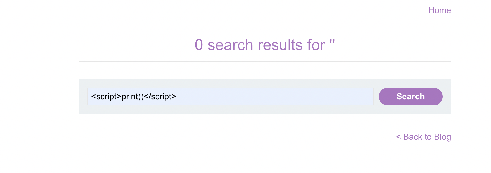
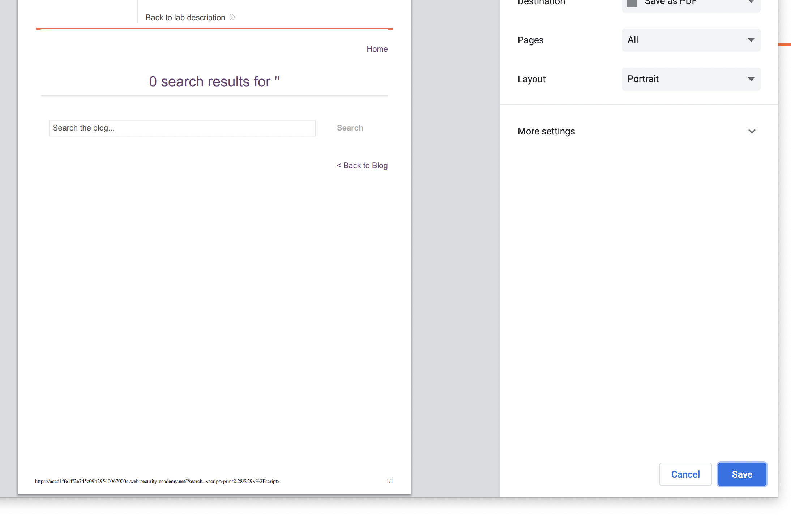

XSS stands for cross site scripting

## Description

It allows an attacker to circumvent the same origin policy, which is designed to segregate different websites from each other.

works by manipulating a vulnerable web site so that it **returns malicious JavaScript to users**.

## XSS POC convention - alert(1)

You can confirm most kinds of XSS vulnerability by injecting a payload that causes your own browser to execute some arbitrary JavaScript. 

It's long been common practice to use the `alert()` function for this purpose because it's short, harmless, and pretty hard to miss when it's successfully called.

`alert(document.domain)` This is a way of making it explicit which domain the JavaScript is executing on

**From version 92 onward (July 20th, 2021), cross-origin iframes are prevented from calling alert(). https://chromestatus.com/feature/5148698084376576**

As an alternate : use `print()` which will open print dialog.

## Reflected XSS

Reflected cross-site scripting (or XSS) arises when an application receives data in an HTTP request and includes that data within the immediate response in an unsafe way.

Reflected XSS example:
application returns data user input data as html without any pre/post processing:

Suppose a website has a search function which receives the user-supplied search term in a URL parameter:

`https://insecure-website.com/search?term=gift`
The application echoes the supplied search term in the response to this URL:

`<p>You searched for: gift</p>`


Assuming the application doesn't perform any other processing of the data, an attacker can construct an attack like this:

`https://insecure-website.com/search?term=<script>/*+Bad+stuff+here...+*/</script>`
This URL results in the following response:

`<p>You searched for: <script>/* Bad stuff here... */</script></p>` 

**Note** - how search is a common target for returning data without processing.

Here is a demo in pictures:



### Impact of reflected xss

Impact of reflected XSS attacks
If an attacker can control a script that is executed in the victim's browser, then they can typically fully compromise that user. Amongst other things, the attacker can:

* Perform any action within the application that the user can perform.
* View any information that the user is able to view.
* Modify any information that the user is able to modify.
* Initiate interactions with other application users, including malicious attacks, that will appear to originate from the initial victim user.

## XSS context

When testing for reflected and stored XSS, a key task is to identify the XSS context:

* The location within the response where attacker-controllable data appears.
* Any input validation or other processing that is being performed on that data by the application


## Stored XSS

the malicious script comes from the website's database.

The `data in question might be submitted to the application via HTTP requests; for example, comments on a blog post, user nicknames in a chat room, or contact details on a customer order`. In other cases, the data might arrive from other untrusted sources; 

Common example is unsanitized chat comments saved in DB.

e.g.

A message board application lets users submit messages, which are displayed to other users:
```
<p>Hello, this is my message!</p>
```
The application doesn't perform any other processing of the data, so an attacker can easily send a message that attacks other users:
```
<p><script>/* Bad stuff here... */</script></p>
```

## DOM based Xss

where the vulnerability exists in client-side code rather than server-side code.

