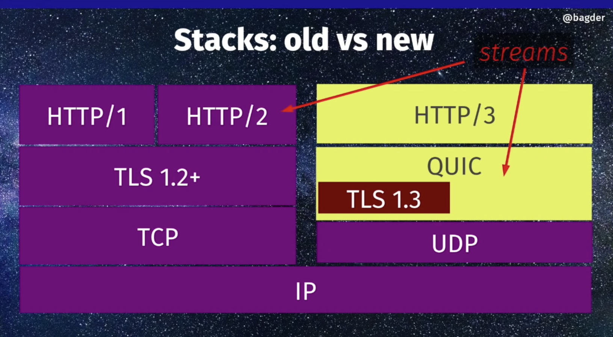

### URL encoding

When putting user-input data as a part of url, it should be url-encoded first.
e.g. in google whatever you type in searchbar is appended to url as `?q=some%20search`.
Also other charachters that have special meaning e.g. `&`, `#` etc need to be escaped
before becoming part of the url components.
Also note that url encoding is NOT idempotent.

### Mixed-content blocking

Most modern browsers block HTTP requests on secure HTTPS pages. Blocked content can include images, JavaScript, CSS, or other content that affects how the page looks or behaves.


#### Mixed active content

content that has access to all or parts of the Document Object Model of the HTTPS page.
This section lists some types of HTTP requests which are considered active content:

1. `<script>` (src attribute)
2. `<link>` (href attribute) (this includes CSS stylesheets)
3. `<iframe>` (src attribute)
4. `XMLHttpRequest` requests
5. `fetch()` requests
6. All cases in CSS where a `<url>` value is used (`@font-face`, `cursor`, `background-image`, and so forth).
7. `<object>` (data attribute)


#### Mixed passive content

This section lists all types of HTTP requests which are considered passive content:

1. `` (src attribute)
2. `<audio>` (src attribute)
3. `<video>` (src attribute)
4. `<object>` subresources (when an `<object>` performs HTTP requests)


### Http keep-alive/persistent connection

HTTP keep-alive, a.k.a., HTTP persistent connection, is an instruction that allows a single TCP connection to remain open for multiple HTTP requests/responses.

HTTP persistent connection, also called HTTP keep-alive, or HTTP connection reuse, is the idea of using a single TCP connection to send and receive multiple HTTP requests/responses, as opposed to opening a new connection for every single request/response pair. The newer HTTP/2 protocol uses the same idea and takes it further to allow multiple concurrent requests/responses to be multiplexed over a single connection.


HTTP polling:
 With polling, the browser sends HTTP requests at regular intervals and immediately receives a response. This technique was the first attempt for the browser to deliver real-time information. Obviously, this is a good solution if the exact interval of message delivery is known, because you can synchronize the client request to occur only when information is available on the server. However, real-time data is often not that predictable, making unnecessary requests inevitable and as a result, many connections are opened and closed needlessly in low-message-rate situations.

HTTP long polling:

With long-polling, the browser sends a request to the server and the server keeps the request open for a set period. If a notification is received within that period, a response containing the message is sent to the client. If a notification is not received within the set time period, the server sends a response to terminate the open request. It is important to understand, however, that when you have a high message volume, long-polling does not provide any substantial performance improvements over traditional polling.

### HTTP Head Of Line Blocking

Means requests that are waiting in queue inside a connection. Since server can only handle so many connections. Meaning previous request on a same connection has to complete before client can make a new request.

HTTP/1.1 introduced a feature called `Pipelining` which allowed a client sending several HTTP requests over the same TCP connection. However HTTP/1.1 still required the responses to arrive in order so it didn't really solved the HOL issue and as of today it is not widely adopted.

HTTP/2 (h2) solves the HOL issue by means of multiplexing requests over the same TCP connection, so a client can make multiple requests to a server without having to wait for the previous ones to complete as the responses can arrive in any order.

Put simply, multiplexing allows your Browser to fire off multiple requests at once on the same connection and receive the requests back in any order.

browsers usually open multiple connections to the web server (typically 6).

Example :

To put it as a real world example: assume you have to order 10 items from a shop for home delivery:

HTTP/1.1 with one connection means you have to order them one at a time and you cannot order the next item until the last arrives. You can understand it would take weeks to get through everything.

HTTP/1.1 with multiple connections means you can have a (limited) number of independent orders on the go at the same time.

HTTP/1.1 with pipelining means you can ask for all 10 items one after the other without waiting, but then they all arrive in the specific order you asked for them. And if one item is out of stock then you have to wait for that before you get the items you ordered after that - even if those later items are actually in stock! This is a bit better but is still subject to delays, and let's say most shops don't support this way of ordering anyway.

HTTP/2 means you can order your items in any particular order - without any delays (similar to above). The shop will dispatch them as they are ready, so they may arrive in a different order than you asked for them, and they may even split items so some parts of that order arrive first (so better than above). Ultimately this should mean you 1) get everything quicker overall and 2) can start working on each item as it arrives ("oh that's not as nice as I thought it would be, so I might want to order something else as well or instead").


### chunked transfer encoding

Each chunk is preceded by its size in bytes. The transmission ends when a zero-length chunk is received. The chunked keyword in the Transfer-Encoding header is used to indicate chunked transfer.

Chunked transfer encoding is not supported in HTTP/2, which provides its own mechanisms for data streaming

### URI Design

Cool Uri's shouldn't change.
in theory the URI space under your domain name is totally under your control, so you can make it as stable as you like. Pretty much the only good reason for a document to disappear from the Web is that the company which owned the domain name went out of business or can no longer afford to keep the server running.

When you change a URI on your server, you can never completely tell who will have links to the old URI. They might have made links from regular web pages. They might have bookmarked your page. They might have scrawled the URI in the margin of a letter to a friend.

When someone follows a link and it breaks, they generally lose confidence in the owner of the server.

### CORS

#### Access-Control-Request-Method
The `Access-Control-Request-Method` request header is used when issuing a preflight request to let the server know which HTTP method will be used when the actual request is made. This header is necessary as the preflight request is always an OPTIONS and doesn't use the same method as the actual request.

#### Access-Control-Request-Headers
The `Access-Control-Request-Headers` request header is used when issuing a preflight (OPTIONS) request to let the server know which HTTP headers the client might send when the actual request is made.

### Access-Control-Allow-Headers
The `Access-Control-Allow-Headers` response header is used in response to a preflight request which includes the Access-Control-Request-Headers to indicate which HTTP headers can be used during the actual request.
This header is required if the request has an `Access-Control-Request-Headers` header.

An e.g. CORS pre flight request-response
```
OPTIONS /resource/foo
Access-Control-Request-Method: DELETE
Access-Control-Request-Headers: origin, x-requested-with
Origin: https://foo.bar.org
```

Response:
If the server allows CORS requests to use the DELETE method, it responds with an Access-Control-Allow-Methods response header, which lists DELETE along with the other methods it supports:
```
HTTP/1.1 200 OK
Content-Length: 0
Connection: keep-alive
Access-Control-Allow-Origin: https://foo.bar.org
Access-Control-Allow-Methods: POST, GET, OPTIONS, DELETE
Access-Control-Allow-Headers: origin, x-requested-with
Access-Control-Max-Age: 86400
```


### Websocket basics on the browser

Standard api (on the browser/client) is following:
``` js
var connection = new WebSocket('ws://html5rocks.websocket.org/echo', ['soap', 'xmpp']);

// When the connection is open, send some data to the server
connection.onopen = function () {
  connection.send('Ping'); // Send the message 'Ping' to the server
};

// Log errors
connection.onerror = function (error) {
  console.log('WebSocket Error ' + error);
};

// Log messages from the server
connection.onmessage = function (e) {
  console.log('Server: ' + e.data);
};
```

Find more at: https://www.html5rocks.com/en/tutorials/websockets/basics/


## Referer header

contains the url of the page that made the request.

## Http and connection closing

When using HTTP/2, browsers typically open only one connection per domain. (requests are multiplexed over this single connection)

In your example, `index2.html` will be sent on the same TCP connection that was used for `index.html`, `a.css` and `a.js`.

In HTTP/2 requests are multiplexed on the same TCP connection, so that the browser can send them concurrently, without waiting for a previous request to be responded to.

Both browsers and servers have an idle timeout for TCP connections. If the connection is idle for long enough, it will be closed by either party - the one that has the shorter idle timeout, to save resources. For example, you may open a connection to a wikipedia.org, perform a few requests, and then leave that tab and work on something else. After a while (typically 30 seconds) the browser will close the TCP connection to wikipedia.org.

On the server side, the server will keep the connections from various clients open, until they are either closed by the client or until the server-side idle timeout fires, at which point it's the server that initiated the close of the TCP connection.

With HTTP/2, the number of connections that a server has to maintain is vastly less than it was with HTTP/1.1. With HTTP/2, a server has to maintain just 1 TCP connection per client; with HTTP/1.1, the server had to maintain typically 2-8 TCP connections per client.

## TCP connections

TCP connections by default never close themselves, the protocols on top can decide when/how to close
connection.

## http2 vs 3

**http2 does not close connection on request/response.**
Instead there is a configured timeout on the server, e.g. nginx has 3 mins by default.


