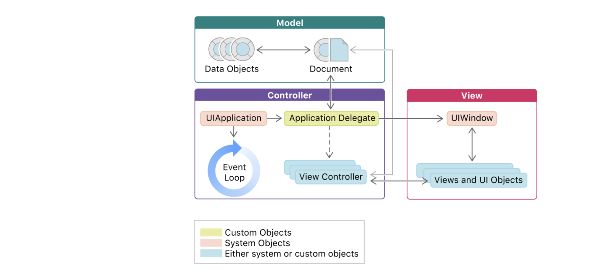
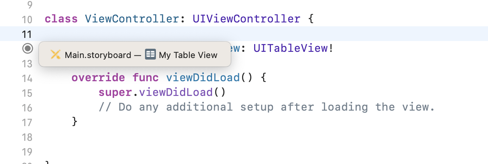
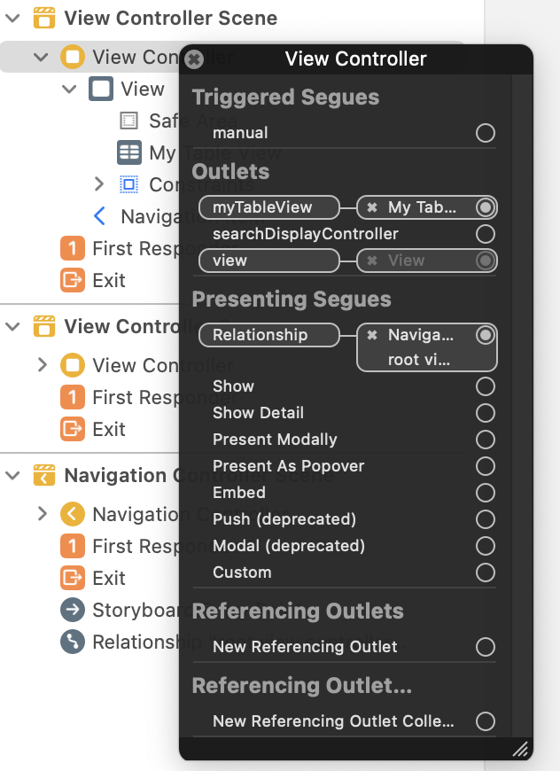

## Overview



## View controllers (typicallys sit between model and view)

https://developer.apple.com/library/archive/featuredarticles/ViewControllerPGforiPhoneOS/index.html#//apple_ref/doc/uid/TP40007457-CH2-SW1

https://developer.apple.com/documentation/uikit/view_controllers

https://developer.apple.com/documentation/uikit/view_controllers/managing_content_in_your_app_s_windows

https://developer.apple.com/documentation/uikit/view_controllers/displaying_and_managing_views_with_a_view_controller

1. Your view controllers will always subclass from `UIViewController`. 
2. Each view controller usually manages one "screen" within your app. 
```
                                             update view
     -- state change -->                 -- with new state -->
Model                     View Controller                     View
     <-- handle event --                 <-- interpret and ---
      by updating model                     propagate event
```

**View controllers are responsible for creating views and notifying views when they need to refresh themselves with the latest data from the model.**

Each window has a root view controller, which you use to specify the window’s initial set of views. When you want to change that set of views, you tell UIKit to present or dismiss additional view controllers.

UIKit handles the transition from one set of views to another, and manages your app’s entire interface through your view controller objects.

**ViewControllers are screens** - Define view controllers for each unique page of content.

Viewcontroller's view can be accessed by `viewController.view` property or `self.view` inside viewcontroller, e.g. in `viewDidLoad` method.

### Two types of viewcontollers

`Content view controllers` manage a discrete piece of your app’s content and are the main type of view controller that you create. e.g. screens with content

`Container view controllers` collect information from other view controllers (known as child view controllers) and present it in a way that facilitates navigation or presents the content of those view controllers differently. e.g. `UINavigationViewController` - which hosts a stack of ViewCOntroller, which is one ViewController for each screen. Another example is `UISplitViewController` which is for tablet two pane layout. Or `BottomBarViewController` for tab based layout.

### Presented view controllers

Presenting a view controller replaces the current view controller’s contents with those of a new one, usually hiding the previous view controller’s contents. (kind of like pushing an activity)

Presentations are most often used for displaying new content modally. For example, you might present a view controller to gather input from the user. You can also use them as a general building block for your app’s interface

## View objects

https://developer.apple.com/library/archive/documentation/WindowsViews/Conceptual/ViewPG_iPhoneOS/Introduction/Introduction.html#//apple_ref/doc/uid/TP40009503-CH1-SW2

The most important role of a view controller is to manage a hierarchy of views. Every view controller has a single root view that encloses all of the view controller’s content. To that root view, you add the views you need to display your content.


Views are responsible for displaying data (literally drawing themselves on the screen) and responding to user actions. Every view in an iOS application will be a subclass of `UIView`

UIKit comes with a selection of predefined views that are fairly comprehensive and, used creatively, can implement many UI designs.

**views are responsible for responding to user actions and propagating events to view controllers so that they can handle them appropriately.**

Often views will translate a low level event into a semantic event. For example a table cell view responsible for displaying a Tweet might translate the low level of the event button tap on the "star button" into the semantic event of "user favorited Tweet". The view would then pass this high level message to the view controller who might then have the model layer make an API call to complete the "favoriting".

### UIView

A view can also act as a parent for other views and coordinate the placement and sizing of those views.

Views work in conjunction with Core Animation layers to handle the rendering and animating of a view’s content. Every view in UIKit is backed by a layer object (usually an instance of the CALayer class), which manages the backing store for the view and handles view-related animations.

**Every view has a corresponding layer object that can be accessed from that view’s `layer` property**


## Models

Model objects encapsulate a logical unit of domain specific data in your application. In a photo-sharing social network, they might include entities like "Users" and "Photos". Models may have relationships with other models. For example, a "Photo" might have been "posted by" a "User". The model layer will generally contain any domain specific logic for manipulating your data and relationships. For example if a User has a field keeping track of the number of Photos she has posted, this field will have to updated once she posts a new Photo.

If not using models,
When you subclass `UIViewController`, you add any variables you need to manage your data in your subclass. Adding custom variables creates a relationship like the one in Figure 1-3, where the view controller has references to your data and to the views used to present that data

## Root View Controller

The `UIApplicationDelegate` also provides a reference to the application's main `window` object. 
Of particular importance is the ability to set the main window's root view controller. This is the first view controller that will load and present its view to the user.

### root view controller in storyboard apps

you can avoid working with the UIApplicationDelegate and simply set the root view controller directly in your `Main.storyboard`.

By default Xcode will generate an initial view controller for you and set it to be the root view controller.


## Programmatically setting root view controller (in appdelegate.didfinishlaunchingwithoptions)

```swift
import UIKit

@UIApplicationMain
class AppDelegate: UIResponder, UIApplicationDelegate {

    var window: UIWindow?

     func application(application: UIApplication,
          didFinishLaunchingWithOptions launchOptions:[NSObject: AnyObject]?) -> Bool {
      
      self.window = UIWindow(frame: UIScreen.mainScreen().bounds)
      self.rootViewController = ViewController()
      self.window?.rootViewController = self.rootViewController
      self.window?.makeKeyAndVisible()
      
      return true
    }
    ...
}
```

## UIWindow, view and ViewController

https://developer.apple.com/library/archive/featuredarticles/ViewControllerPGforiPhoneOS/TheViewControllerHierarchy.html#//apple_ref/doc/uid/TP40007457-CH33-SW1

The root view controller is accessible from the `rootViewController` property of the `UIWindow object`

**UIWindow extends UIView** i.e. `@MainActor class UIWindow : UIView`.

## Scenes

https://developer.apple.com/documentation/uikit/app_and_environment/scenes


## Segues

Segues let you navigate between view controllers in your interface.

## Two ways to use NavigationViewController


1. `Push`/`Pop` viewcontrollers - stack like hierarchy
2. `present`/`dismiss` as modal.

## UIViewController lifecycle

https://developer.apple.com/library/archive/featuredarticles/ViewControllerPGforiPhoneOS/DefiningYourSubclass.html#//apple_ref/doc/uid/TP40007457-CH7-SW1

1. `viewDidLoad` - content view created in memory, (might not be displayed on screen).
2. `viewWillAppear/viewDidAppear`: before and after being shown in screen (e.g. coming back to a given screen/vc)
3. `viewWillDisappear/viewDidDisappear`: similar to above but for disappearing
4. `viewWillLayoutSubviews/viewDidLayoutSubviews`: when bounds change


## Handling user interactions

https://developer.apple.com/documentation/uikit/touches_presses_and_gestures/using_responders_and_the_responder_chain_to_handle_events

### Types of events

* touch events, 
* motion events, 
* remote-control events, and 
* press events. 

### UIResponder

Responder objects — instances of `UIResponder` — constitute the event-handling backbone of a `UIKit` app. 
Many key objects are also responders, including the 
* **UIApplication** object, 
* **UIViewController** objects, and 
* all **UIView** objects (which includes UIWindow). 
  
As events occur, UIKit dispatches them to your app’s responder objects for handling.

**It is a common practice to have `AppDelegate` implement UIResponder protocol, so that `UIApplication` can forward `UIResponder` messages to `AppDelegate`.**

### Touch handling

the `touchesBegan(_:with:)`, `touchesMoved(_:with:)`, `touchesEnded(_:with:)`, and `touchesCancelled(_:with:)` methods.

### Responder Chain

If a given responder doesn’t handle an event, it forwards that event to the next event in the responder chain. UIKit manages the responder chain dynamically, using predefined rules to determine which object should be next to receive an event. 

For example, a view forwards events to its superview, and the root view of a hierarchy forwards events to its view controller.

UIKit automatically directs that event to the most appropriate responder object, known as the first responder. (Usually the deepest nested object at the event location)

Detailed rules for first responder:

* `Touch events`: The view in which the touch occurred.
* `Press events`: The object that has focus.
* `Shake-motion events`: The object that you (or UIKit) designate.
* `Remote-control events`: The object that you (or UIKit) designate.
* `Editing menu messages`: The object that you (or UIKit) designate.


#### Altering the responder chain

You can alter the responder chain by overriding the `next` property of your responder objects. **When you do this, the next responder is the object that you return.**


## IBOutlet

Think of this as view-binding/butterknife which is done on android.

An outlet is an object instance variable.

With outlets, the reference is configured and archived through Interface Builder. The connections between the containing object and its outlets are reestablished every time the containing object is unarchived from its nib file.


You need to use IBOutlet and IBAction if you are using interface builder (hence the IB prefix) for your GUI components. IBOutlet is needed to associate properties in your application with components in Interface Builder.


The connection between an object and its outlets is archived in a nib file; when the nib file is loaded, each connection is unarchived and reestablished, and is thus always available whenever it becomes necessary to send messages to the other object.

Through an outlet, an object in your code can obtain a reference to an object defined in a nib file or storyboard and then loaded from that file. 
* The object containing an outlet is often a custom controller object such as a view controller. 
* You frequently define outlets so that you can send messages to view objects of the UIKit framework (in iOS) and the AppKit framework (in OS X).

An example view controller making use of IBOutlet::
```swift
import UIKit

class ViewController: UIViewController {
    @IBOutlet var myTableView: UITableView!
    
    override func viewDidLoad() {
        super.viewDidLoad()
        // Do any additional setup after loading the view.
    }
}
```

### Checking the outlet setup

You can check the outlet setup by right clicking on the view controller in the storyboard and see the outlets in the popup.

In code:



In storyboard:

