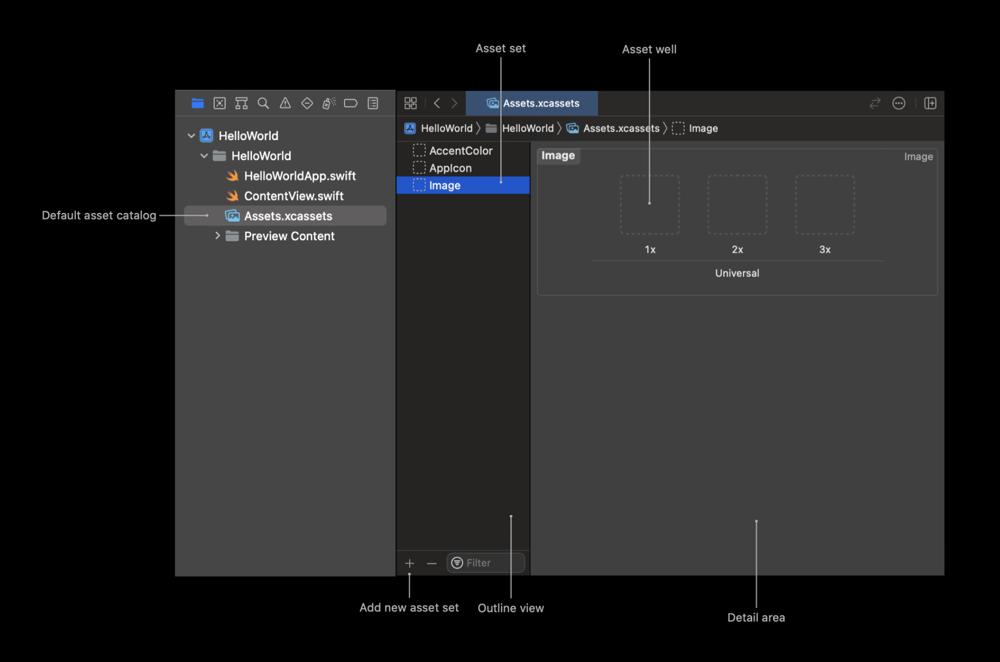

https://developer.apple.com/library/archive/documentation/Xcode/Reference/xcode_ref-Asset_Catalog_Format/index.html#//apple_ref/doc/uid/TP40015170-CH18-SW1

https://help.apple.com/xcode/mac/current/#/dev10510b1f7

##

In an asset catalog, each asset set represents one resource — like an image, color, or data file — that your app loads at runtime.

## Asset catalog

When you create your project from a template, it automatically includes an asset catalog with the name `Assets.xcassets`.

