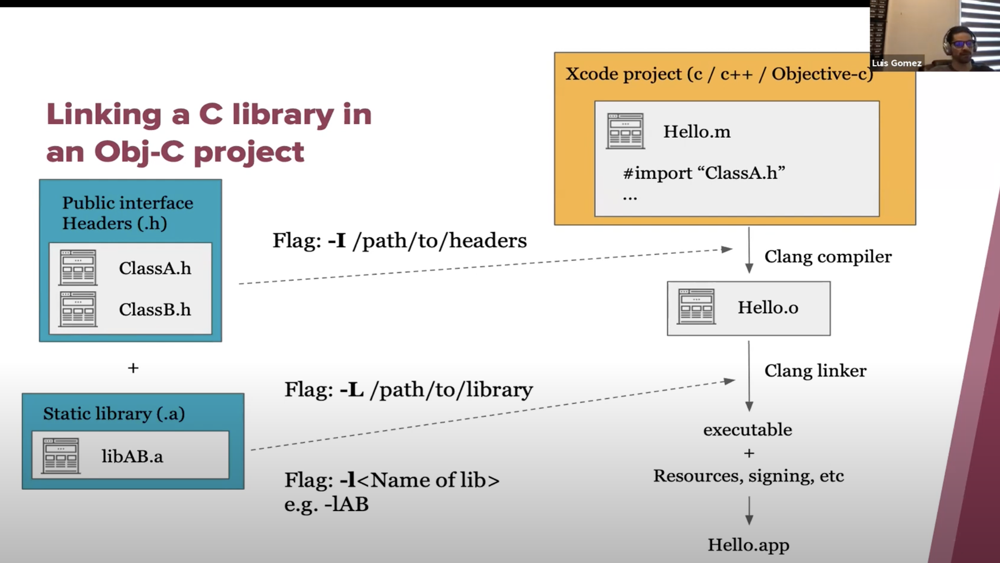
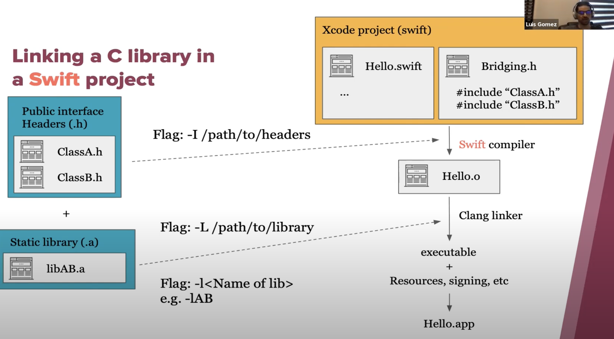
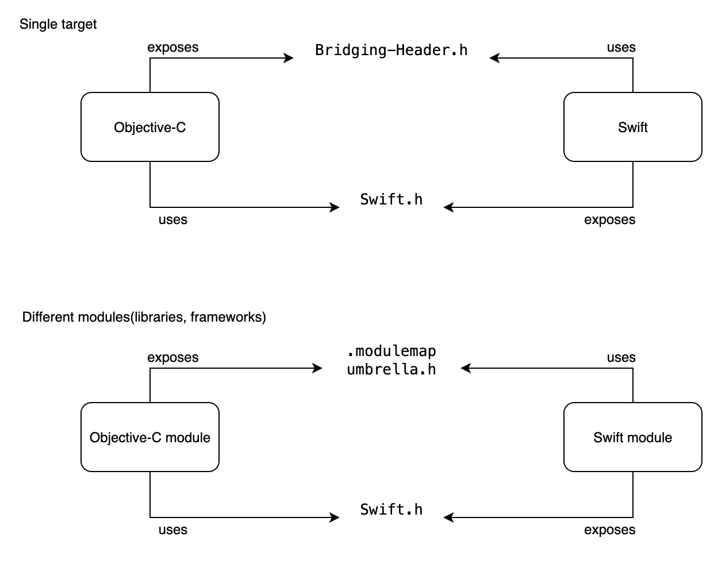

https://www.youtube.com/watch?v=lGG0UPdvc54

## Why do we need header files?

They expose public interface of any static library or dynamic library. So consumers can know the API.

## Mach-O type

This is basically executable type (.dylib/.so for shared libs, .a/.o for static libs)

## Creating a (objc) static library with Xcode

New project > Static library (select language obective C) > Done.

It will contain `.h` and `.m` files for interface and implementation respectively.

In this project's build settings, you can verify `mach-o` type is `static`.

### Generating static library target

Go to products menu > Archive.
This generates and exports a `samplestaticlib.a` file.

### Work with archive files using `ar` command

ar command is used to create, modify and extract the files from the archives

## Linking a static library in a different (objc) project.

Important parts is having both
1. headers(`.h`) - as interface
2. archive(`.a`) - as implementation

## Linking a static library in a Swift project

An extra bridging header is needed.

## Mixing obj and swift

https://developer.apple.com/documentation/swift/importing-swift-into-objective-c

Same Target

//Objective-C exposes API for Swift thought `<target_name>-Bridging-Header.h`
.swift uses .h.m = Swift consumer, Objective-C producer = `<target_name>-Bridging-Header.h`

//Swift exposes API for Objective-C thought `<target_name>-Swift.h`
.h.m uses .swift = Objective-C consumer, Swift producer = `<target_name>-Swift.h`
Swift consumer, Objective-C producer

Add a new header .h and Implementation .m files - Cocoa class file(Objective-C)
For example `<MyFileName>.h` and `<MyFileName>.m`

configure bridging header
When you see Would you like to configure an Objective-C bridging header click - Yes

`<target_name>-Bridging-Header.h` will be generated automatically
Build Settings -> Objective-C Bridging Header(SWIFT_OBJC_BRIDGING_HEADER)
Add Class to Bridging-Header
In `<target_name>-Bridging-Header.h` add a line #import `"<MyFileName>.h"`

After that you can use from Swift Objective-C's `MyFileName.h`,`MyFileName.m`

P.S. If you should add an existing Objective-C file into Swift project add Bridging-Header.h beforehand and import it

Objective-C consumer, Swift producer

Add a `<MyFileName>.swift and extends NSObject`

Import Swift Files to ObjC Class
Add `#import "<target_name>-Swift.h"` into your Objective-C file

Expose public Swift code by `@objc`

After that you are able to use from Objective-C Swift's `<MyFileName>.swift`

Different Targets `[.modulemap]` and `[umbrella.h]` are used for exposing Objective-C for Swift. 

And `Swift.h` for exposing Swift code for Objective-C

