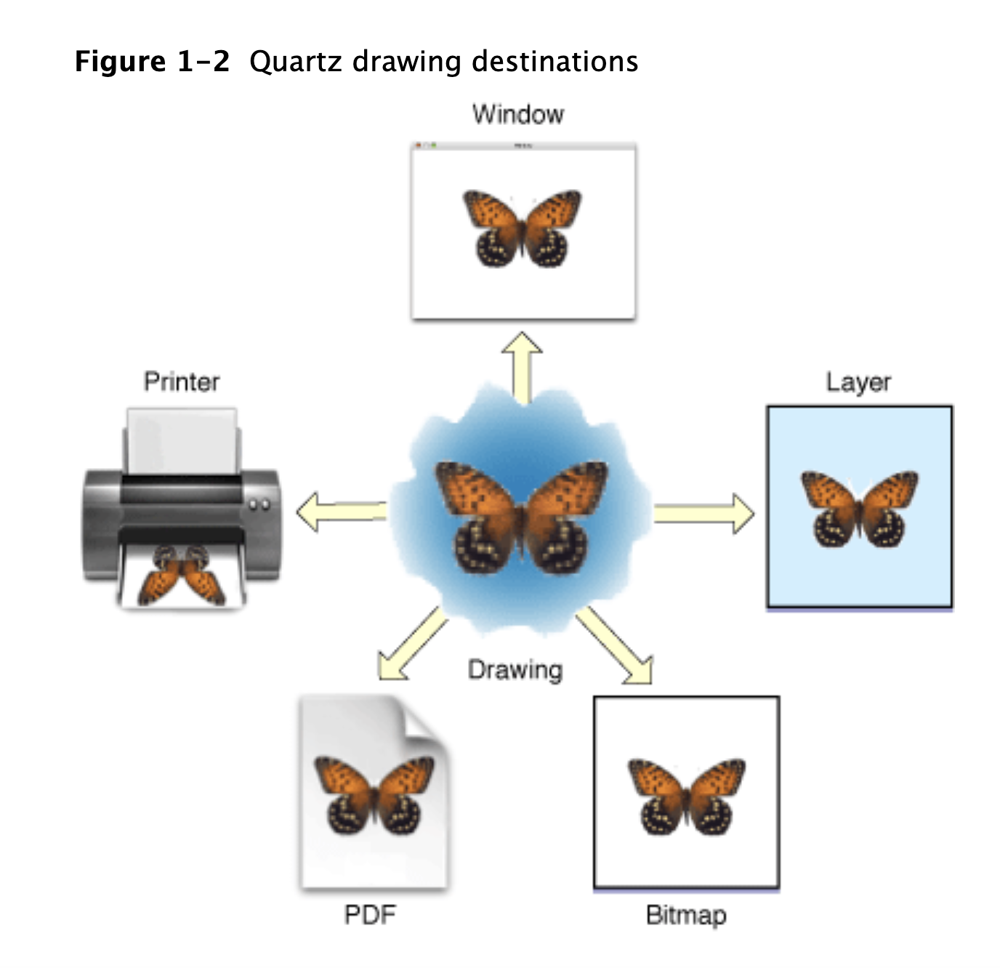

## Painter's model

each successive drawing operation applies a layer of “paint” to an output “canvas,” often called a page.

An object drawn on the page cannot be modified except by overlaying more paint.

The page may be a real sheet of paper (if the output device is a printer); it may be a virtual sheet of paper (if the output device is a PDF file); it may even be a bitmap image. The exact nature of the page depends on the particular graphics context you use.

## CALayer vs CGLAyer

Totally different and unrelated.

CALayers are just the things "in" views. In contrast CGLayers are Apple's cool "offscreen, high performance, calculation machinery."

To be clear, CGLayers have utterly no connection to views, and no association with views.

## Drawing Destinations: The Graphics Context

The graphics context provides an abstraction of the destination, freeing you from the details of the destination, such as its resolution.

A graphics context is an opaque data type (`CGContextRef`) that encapsulates the information Quartz uses to draw images to an output device, such as 
1. a PDF file, 
2. a bitmap, or 
3. a window on a display

### Types

1. `bitmap graphics context` allows you to paint RGB colors, CMYK colors, or grayscale into a bitmap. A bitmap is a rectangular array (or raster) of pixels, each pixel representing a point in an image. Bitmap images are also called sampled images.
2. `A PDF graphics context`: allows you to create a PDF file
3. `A window graphics context` is a graphics context that you can use to draw into a window. Note that because Quartz 2D is a graphics engine and not a window management system, you use one of the application frameworks to obtain a graphics context for a window
4. `A layer context (CGLayerRef)` is an offscreen drawing destination associated with another graphics context. It is designed for optimal performance when drawing the layer to the graphics context that created it. A layer context can be a much better choice for offscreen drawing than a bitmap graphics context. 

## CGLayer

Meant for offscreen rendering.

When you use a CGLayer object for drawing, you also draw to a graphics context. Quartz creates a layer so that it has all the characteristics of the graphics context—its resolution, color space, and graphics state settings.

1. `CGLayerCreateWithContext` - All layer drawing starts with a graphics context from which you create a CGLayer object using the function CGLayerCreateWithContext. 
`CGLayerRef CGLayerCreateWithContext(CGContextRef context, CGSize size, CFDictionaryRef auxiliaryInfo);` - Creates a layer object that is associated with a graphics context.
The graphics context used to create a CGLayer object is typically a window graphics context. 

2. Before you can draw to the layer, you must obtain the graphics context that’s associated with the layer by calling the function CGLayerGetContext- `CGContextRef CGLayerGetContext(CGLayerRef layer)` - return graphics context associated with the layer.

3. `CGContextDrawLayerInRect(CGContextRef context, CGRect rect, CGLayerRef layer)` - Draw layer contents into context.

