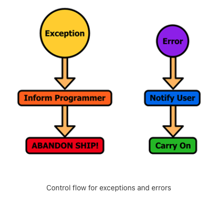

in iOS land, Errors are normal, Exceptions are not



## Return codes

simplest and most primitive, caller's responsibility for handling. usually one of the return value (passed as ref or function return value).

seeing procedures that return an int return code to indicate different kinds of errors is very common.

## (NS)Error

https://developer.apple.com/library/archive/documentation/Cocoa/Conceptual/ErrorHandlingCocoa/ErrorHandling/ErrorHandling.html#//apple_ref/doc/uid/TP40001806

If you’re trying to handle a problem that’s supposed to occur, you should be using an error object, not an exception.

Errors are an unavoidable part of any app’s lifecycle. If you need to request data from a remote web service, for example, there are a variety of potential problems that may arise, including:

1. No network connectivity
2. The remote web service may be inaccessible
3. The remote web service may not be able to serve the information you request
4. The data you receive may not match what you were expecting


**Errors must be inspected explicitly by the programmer, they are convention in callbacks, does not have any effect on program execution order** - Many Foundation APIs follow this convention. Think of it like error codes. You are also encouraged to create your own and handle on your own.

`Note` - the ones that fall between extremely minor and extremely serious — the NSError mechanism is probably the right choice. It communicates easily the fact that a call failed up the stack to the caller, but at the same time puts the responsibility for deciding how serious the error is where it belongs, in the hands of that very same caller.

Recover if Possible or Display the Error to the User.

Errors represent a failed operation in an iOS or OS X application. It’s a standardized way to record the relevant information at the point of detection and pass it off to the handling code.

The NSError class encapsulates the details surrounding a failed operation. Its main properties are similar to NSException.

Property	Description
1. `domain`	An NSString containing the error’s domain. This is used to organize errors into a hierarchy and ensure that error codes don’t conflict.
2. `code`	An NSInteger representing the ID of the error. Each error in the same domain must have a unique value.
3. `userInfo`	An NSDictionary whose key-value pairs contain extra information about the error. This varies based on the type of error.

## NSException

https://developer.apple.com/library/archive/documentation/Cocoa/Conceptual/Exceptions/Exceptions.html#//apple_ref/doc/uid/10000012i

Imagine that these errors are so important, that if you do not do something about them, you would rather let application crash than continue running in order to avoid causing more damage than has been already done.

Following properties:
1. `name`	An NSString that uniquely identifies the exception.

2. `reason`	An NSString that contains a human-readable description of the exception.

3. `userInfo`	An NSDictionary whose key-value pairs contain extra information about the exception. This varies based on the type of exception.

**Handled using try/catch** - exception-handling capabilities are not the most efficient, so you should only use `@try/@catch()` blocks to test for truly exceptional circumstances.

### Wellknown exceptions

`NSRangeException`	Occurs when you try to access an element that’s outside the bounds of a collection.
`NSInvalidArgumentException`	Occurs when you pass an invalid argument to a method.
`NSInternalInconsistencyException`	Occurs when an unexpected condition arises internally.
`NSGenericException`	Occurs when you don’t know what else to call the exception

### Syntax

```objc
    @try {
        // do something that might throw an exception
    }
    @catch (NSException *exception) {
        // deal with the exception
    }
    @finally {
        // optional block of clean-up code
        // executed whether or not an exception occurred
    }

    // generate exceptions using @throw
    int generateRandomInteger(int minimum, int maximum) {
        if (minimum >= maximum) {
            // Create the exception. 
            NSException *exception = [NSException
                exceptionWithName:@"RandomNumberIntervalException"
                reason:@"*** generateRandomInteger(): "
                        "maximum parameter not greater than minimum parameter"
                userInfo:nil];
            // Throw the exception. 
            @throw exception;
        }
        // Return a random integer. 
        return arc4random_uniform((maximum - minimum) + 1) + minimum;
    }
```

### Uncaught exception behavior

If an exception is thrown and not caught, **the default uncaught exception handler logs a message to the console and terminates the application.**
