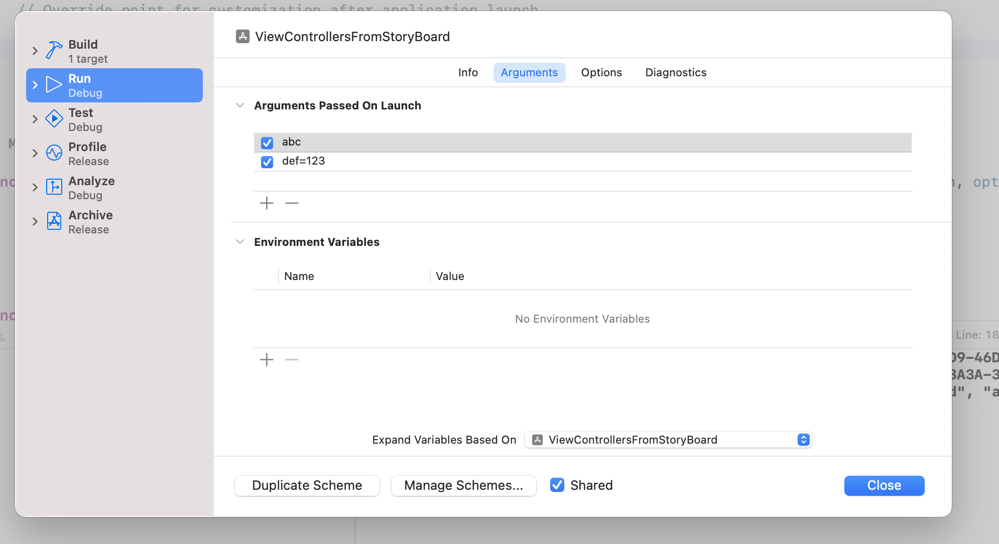

## Setting process launch arguments from edit scheme

launch arguments should begin with a dash (-) and don’t have a separate field for argument values.

**Any argument passed on launch will override the current value in NSUserDefaults for the duration of execution**



## NSProcessInfo (objc) and ProcessInfo in swift

```swift
func application(_ application: UIApplication, didFinishLaunchingWithOptions launchOptions: [UIApplication.LaunchOptionsKey: Any]?) -> Bool {
    // Override point for customization after application launch.
    
    print(ProcessInfo.processInfo.arguments);

    return true
}
```

## Useful for testing

We can launch `XCUIApplication` with different launch params for different test behaviors.

It allows for per-test parametrization mocking by making app react to external launchargs, treating them as custom config/environment.

```swift
enum LaunchArgument {
    static let isUITesting = "-isUITesting";
    static let resetApp = "-resetApp";
}

func launchApp(extraLaunchArgs: [String] = []) {
    let app = XCUIApplication();
    let defaultArgs =  [LaunchArgument.isUITesting, LaunchArgument.resetApp];
    app.launchArguments += defaultArgs;
    app.launchArguments += extraLaunchArgs;
    app.launch();
}
```
Now app can be launched wit extra args

```swift
launchApp(extraLaunchArgs: [LaunchArgument.extraArg]);
```