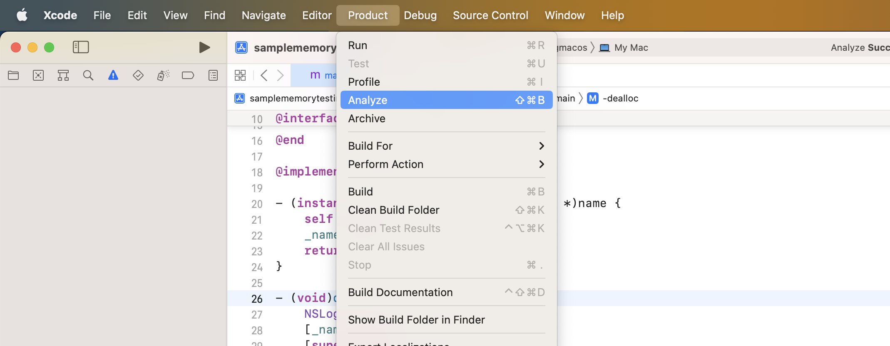
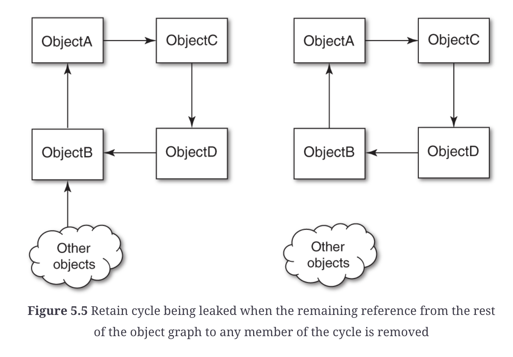

ARC = automatic reference counting

ARC continues the reference counting tradition and simply eliminates the need for the programmer to manually insert appropriate calls to `-retain`, `-release`, and `-autorelease`. 

Under ARC the compiler inserts these calls for you, but the reference counting mechanism remains the same as it has always been. It does not provide a cycle collector; users must explicitly manage the lifetime of their objects, breaking cycles manually or with weak or unsafe references.

**If you send a message to an object after it has been deallocated, your application will crash.**


ARC in detail - https://clang.llvm.org/docs/AutomaticReferenceCounting.html

## how to check if app is running in ARC mode?

In Build settings


## Debugging EXC_BAD_ACCESS

Turn on Zombie object setting in Product > Scheme > Edit Scheme > Run settings > Diagnostics


Another way is to run Analyze to find potential issues:



## When you have retain cycles

* None of the objects in cycle can be referenced/accessed, but they cannot be deallocated either since they have non-zero retain count.
* When last remaining reference to any member of retaining cycle is removed, entire cycle is leaked.



In a garbage-collected environment, this situation would usually be picked up as a so-called island of isolation. In such a scenario, the collector would deallocate all three objects. In obj-c this is not the case

## Rules

### Core rules

The ownership policy is implemented through reference counting—typically called “retain count” after the retain method. Each object has a `retain count`.

When you create an object, **it has a retain count of 1**.
When you send an object a `retain` message, its retain count is incremented by 1.
When you send an object a `release` message, its retain count is decremented by 1.
When you send an object a `autorelease` message, its retain count is decremented by 1 at the end of the current autorelease pool block.

**If an object’s retain count is reduced to zero, it is deallocated.**


### You own any object you create

**You create and own any object** using a method whose name begins with:
1. `alloc`
2. `new`
3. `copy`
4. `mutableCopy`

It is your responsibility to `release` them to decrement ref count and release them.

### You take ownership of an (non-owned) object using **retain** or `init/copy`


```objc
- NSString* quote() {
    return [[[NSString alloc] initWithString:@"Hi"] autorelease]; // return auto releasable object
} 

- void othermethod() {
    NSString* qt = quote(); // return autoreleasable, use retain if you want qt to stay around.
    [qt retain];
}
```

### Use autorelease to Send a Deferred release

Any objects retunrned from methods not having `init` or `copy` must return `autorelease*` objects which mean they will auto released when pool is drained, and there is no need to explicitly call release.

```objc
- (NSString *)fullName {
    NSString *string = [[[NSString alloc] initWithFormat:@"%@ %@",
                                          self.firstName, self.lastName] autorelease];
    return string;
}
```

To abide by the memory management rules, you must relinquish ownership of the string before you lose the reference to it. If you use release, however, the string will be deallocated before it is returned (and the method would return an invalid object). Using autorelease, you signify that you want to relinquish ownership, but you allow the caller of the method to use the returned string before it is deallocated.


**Another valid implementation**
Following the basic rules, you don’t own the string returned by stringWithFormat:, so you can safely return the string from the method.


```objc
- (NSString *)fullName {
    NSString *string = [NSString stringWithFormat:@"%@ %@",
                                 self.firstName, self.lastName];
    return string;
}
```

**A bad implementation - missing init/copy keyword in method constructing object**

there is nothing to denote that the caller of the fullName method owns the returned string. The caller therefore has no reason to release the returned string, and it will thus be leaked

```objc
// name should be initFullName to denote caller it owns this memory
- (NSString *)fullName {// BAD! rename to indicate it returns new object that shall not be auto cleaned-up by this method
    NSString *string = [[NSString alloc] initWithFormat:@"%@ %@",
                                         self.firstName, self.lastName];
    return string;
}
```


### Give up ownership of object (you own) using `release`

`[obj release]` will deallocate obj.
Accessing/sending message to a released obj after release will result in `EXC_BAD_ACCESS`.

With zombile objects enabled, we will get error:
```
2023-02-17 18:04:01.927161+0530 samplememorytestingmacos[52909:10404152] *** -[Person isProxy]: message sent to deallocated instance 0x60000000c000
```

### properties can be retained via attribute instead of writing your own `retain` calls in setters/getters

If we retain via property attribute marker, it is our responsibility to release it in `dealloc` method.

```objc
@interface Person : NSObject
@property (retain) NSString* name; // only affects accessors i.e. getters/setters, not init
- (instancetype)initWithName:(NSString*) name;
@end

@implementation Person
- (instancetype) initWithName:(NSString *)name {
    self = [super init];
    _name = name;
    return self;
}

- (void)dealloc {
    NSLog(@"person being deallocated");
    [_name release];
    [super dealloc];
}
@end
```

Here is what a generated/synthesized `retain` property setter will look like:
```objc
- (void)setCount:(NSNumber *)newCount {
    [newCount retain]; // claim ownership of passed in arg
    [_count release]; // free the currently held reference
    // Make the new assignment.
    _count = newCount; // make the reference connection to incoming arg
}
```


### You don't own objects returned by reference

Some methods in Cocoa specify that an object is returned by reference (that is, they take an argument of type `ClassName **` or `id *`). A common pattern is to use an NSError object that contains information about an error if one occurs, e.g. `NSError **`.

you do not create the NSError object, so you do not own it. There is therefore no need to release it.

```objc
NSString *fileName = <#Get a file name#>;
NSError *error; // we never create error instance, only pass address for temp usage, owner methods will populate at the address of this obj.
NSString *string = [[NSString alloc] initWithContentsOfFile:fileName
                        encoding:NSUTF8StringEncoding error:&error];
if (string == nil) {
    // Deal with error...
    // no need to release error because we never created it
}
// ...
[string release];// releasing string since we owned/created it
```


## what `release` does?

`release` decreases `refCount`, e..g `[person release]` = `person.refCount--`

## What `retain` does?

`retain` increases `refCount` i.e. `[person retain]` = `person.refCount++`.

## Implementing dealloc

Similar to a destructor.
Never invoke another object’s `dealloc` method directly, instead use `release`.
`dealloc` method must be implemented in a class to clean up resources of the class.
**Last line of `dealloc` method must be call to super dealloc i.e. `[super dealloc]`**
The role of the dealloc method is to free the object's own memory, and to dispose of any resources it holds, including ownership of any object instance variables. (It is usally recursive).

e.g.
```objc
@interface Person : NSObject
@property (retain) NSString *firstName;
@property (retain) NSString *lastName;
@property (assign, readonly) NSString *fullName;
@end
 
@implementation Person
// ...
- (void)dealloc
    [_firstName release];
    [_lastName release];
    [super dealloc];
}
@end
```

Some common things to do in dealloc:
1. When the object is deallocated, you need to unregister it with the notification center to prevent the notification center from sending any further messages to the object, which no longer exists. 
2. Likewise, when a delegate object is deallocated, you need to remove the delegate link by sending a setDelegate: message with a nil argument to the other object. These messages are normally sent from the object’s dealloc method

## `release` is not available in ARC mode

**ARC forbids explicit message send of 'release'**

```objc
    NSString* str = [[NSString alloc] initWithString:@"hi"];
    NSLog(@"I made a str = %@", str);
    // [str release]; // 'release' is unavailable: not available in automatic reference counting mode
```

## Methods unavailable in ARC

`retain`, `release`, `autorelease` and `retainCount` are not available in ARC mode.

```objc
- (instancetype)retain OBJC_ARC_UNAVAILABLE;
- (oneway void)release OBJC_ARC_UNAVAILABLE;
- (instancetype)autorelease OBJC_ARC_UNAVAILABLE;
- (NSUInteger)retainCount OBJC_ARC_UNAVAILABLE;
```

## Why is @autoreleasepool needed after ARC?

https://stackoverflow.com/questions/9086913/why-is-autoreleasepool-still-needed-with-arc

## Why NSString has very large retain count?

**Strings are retained in a constant pool forever like Java**

It sees @"Hello world" and thinks "Aha! A constant string!"

It then sees `[[NSString alloc] initWithString:@"Hello world!"]` and thinks "Aha! An immutable object created with a constant string!"

It then collapses both of them down into a single `NSConstantString`, which has a retainCount of UINT_MAX, so that it can never be released.

## Do not use accessor methods in initializer/dealloc

to set an instance var in a initializer, use simile `_ivarname = value`.

e.g.
```objc
- init {
    self = [super init];
    if (self) {
        _count = [[NSNumber alloc] initWithInteger:0];
    }
    return self;
}
```

## Collections own the objects they contain

When you add an object to a collection (such as an array, dictionary, or set), the collection takes ownership of it. 

The collection will relinquish ownership when the object is removed from the collection or when the collection is itself released.

Gotcha - **When you add objects you created to a collection, u must release them after adding to collection**
e.g.
```objc
int main(int argc, const char * argv[]) {
    NSMutableArray *array = [[NSMutableArray alloc] init];
    NSUInteger i;
    for (i = 0; i < 10; i++) {
        Car *cari = [[Car alloc] init];
        [array addObject:cari];
        [cari release]; // This is necessary to add ! else the retain count will be 2 for car instance added to collection
        NSLog(@"car age is %d", [cari age]);
    }

    [array release];
    return 0;
}
```

### COllection object removal gotcha, object removal causes release of that object

```objc
heisenObject = [array objectAtIndex:n];
[array removeObjectAtIndex:n];
// heisenObject could now be invalid.
```

**After removal, release is called on heisenObject**

If the collection was the only owner of the removed object, the removed object (heisenObject in the example ) is then immediately deallocated.

To protect against this situation: you retain heisenObject upon receiving it and you release it when you have finished with it

### Reference to child object unless retained, might be deallocated


```objc
id parent = <#create a parent object#>;
// ...
heisenObject = [parent child] ;
[parent release]; // Or, for example: self.parent = nil;
// heisenObject could now be invalid.
```

In some situations you retrieve an object from another object, and then directly or indirectly release the parent object. If releasing the parent causes it to be deallocated, and the parent was the only owner of the child, then the child (heisenObject in the example) will be deallocated at the same time (assuming that it is sent a release rather than an autorelease message in the parent’s dealloc method).

To protect against this situation: you retain heisenObject upon receiving it and you release it when you have finished with it