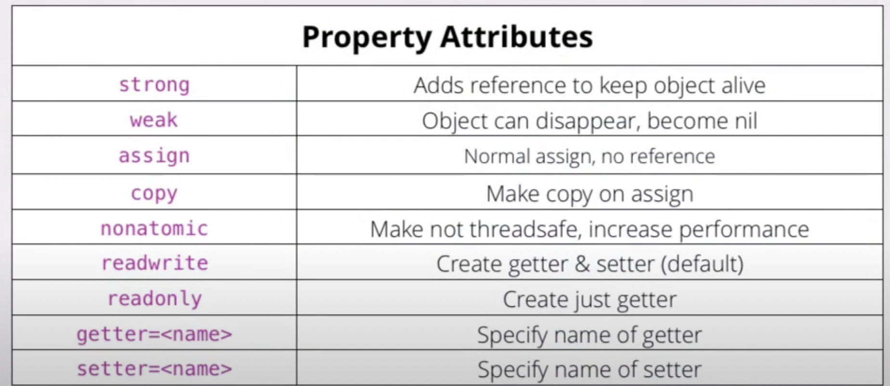

**Properties Control Access to an Object’s Values**

Syntax: `@property (attribute-list) property-type property-name;`

## Implementation of properties

By default, a readwrite property will be backed by an instance variable, which will again be synthesized automatically by the compiler.

An instance variable is a variable that exists and holds its value for the life of the object. The memory used for instance variables is allocated when the object is first created (through alloc), and freed when the object is deallocated.

Unless you specify otherwise, **the synthesized instance variable has the same name as the property, but with an underscore prefix.** For a property called `firstName`, for example, the **synthesized instance variable** will be called `_firstName`.


## List of property attributes



* By default, **properties are atomic** - i.e thread safe, you can specify `nonatomic` to make it faster.

* By default, **properties are readwrite** - i.e. getters and setters are generated.

* By default, **properties are strongly held, also known as retain**, if you want weak references use `weak` attribute.

`assign` - use for primitives.

If you do not have an object, you cannot use strong, because strong tells the compiler how to work with pointers. But if you have a primitive (i.e. int, float, bool, or something without the little asterisk after the type), then you use `assign`, and that makes it work with primitives.

`copy` - mostly used for strings.

Lastly, there’s a keyword called copy. Copy I have seen most commonly with strings. It works really well with all kinds of mutable objects. If you set a copy property, instead of just setting both references to the same object, what it actually does is it makes a copy of the object you are setting and then sets the property to that copy. If I write in a string, it just copies that string so there are now two copies of that string. It leaves mine with me at the variable I passed in and just saves the copy. That way I can keep going with my string and I can modify it, and the one that I set remains the way that it was when I set it.

* `nonnull` or `nullable` - specify as an attribute for good interop with swift side types. https://developer.apple.com/documentation/swift/designating-nullability-in-objective-c-apis

e.g. 
```objc
@interface MyList : NSObject
- (nullable MyListItem *)itemWithName:(nonnull NSString *)name;
- (nullable NSString *)nameForItem:(nonnull MyListItem *)item;
@property (copy, nonnull) NSArray<MyListItem *> *allItems;
@end
```
converts to
```swift
class MyList: NSObject {
    func item(withName name: String) -> MyListItem?
    func name(for item: MyListItem) -> String?
    var allItems: [MyListItem]
}
```