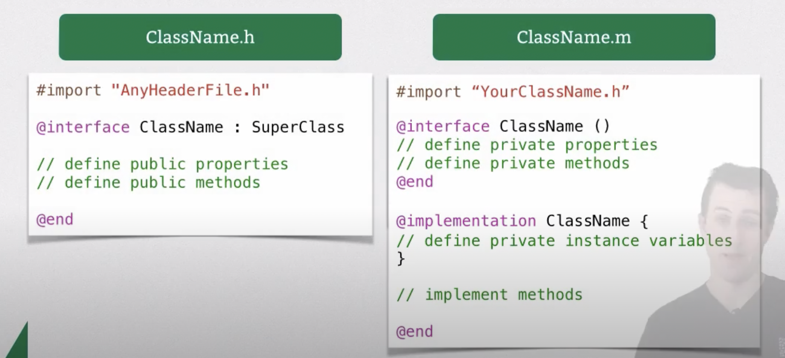

##

An app is built as a large ecosystem of interconnected objects that communicate with each other to solve specific problems, such as displaying a visual interface, responding to user input, or storing information.

##

The app development process involves deciding how best to customize and combine the objects provided by the underlying frameworks with your own objects to give your app its unique set of features and functionality.

##

an object is an instance of a class.
A class describes the behavior and properties common to any particular type of object.

**that the name of each class must be unique within an app, even across included libraries or frameworks**.
it’s advisable to prefix the names of any classes you define, using three or more letters.

* Core objects like `NSString` and `NSObject` are part of `#import <Foundation/Foundation.h>`

## Interfaces

This **interface includes the list of messages that the class can receive**, so you also need to provide the class implementation, which contains the code to be executed in response to each message.

**interface specifies exactly how a given type of object is intended to be used by other objects. In other words, it defines the public interface between instances of the class and the outside world**

## Designing your own classes

When you’re defining your own class, you need to start by figuring out these public attributes and behaviors. What attributes do you want to be accessible publicly? Should you allow those attributes to be changed? How do other objects communicate with instances of your class?

Public information goes into the interface for your class—it defines the way you intend other objects to interact with instances of your class. The public interface is described separately from the internal behavior of your class, which makes up the class implementation. 

In Objective-C, the interface and implementation are usually placed in separate files so that you only need to make the interface public.




Here is an example DateCalculator class implementation:

```objc
// DateCalculator.h
#ifndef DateCalculator_h
#define DateCalculator_h

@interface DateCalculator : NSObject

- (void)setHisAge:(float)hisAge;
- (float)hisAge;
- (BOOL)shouldHeDateIfHerAgeIs:(float)herAge;

@end

#endif /* DateCalculator_h */
```
DateCalculator.m file:
```objc
/* DateCalculator.m */
#import <Foundation/Foundation.h>
#import "DateCalculator.h"

@implementation DateCalculator {
    // private instance variables go here
    float _hisAge;
}

- (void)setHisAge:(float)hisAge {
    _hisAge = hisAge;
}
- (float)hisAge {
    return _hisAge;
}

- (BOOL)shouldHeDateIfHerAgeIs:(float)herAge {
    return YES;
}
@end
```

### Properties (specified in interface) control access to an object values

### Method declarations (specified in interface) indicate the Messages an Object Can Receive

Methods have a named arguments system:
You can think of `:` as the part of the function-name;
**Note that types go inside parantheses**.

**Note** - caller side use argument names, receiver/implementation side uses param names which come later.**

```objc
- (return_type) function_name:(argumentType1) paramName1 
joiningArgument2:(argumentType2)paramName2 ... 
joiningArgumentn:(argumentTypeN)paramNameN
{
   //body of the function
   // use paramName1, paramName2, paramNameN
}
```

**Note how argument1 name does not exist, only param name, a good way to make it easier is to use argname as part of func_name**
e.g. single param function looks like this:
```objc
- (return_type) func_name_with_argname:(firstArgType) paramName1 {
    // body
}

// multi-param method
- (return_type) func_name_with_argname:(firstArgType) paramName1 arg2Name: (arg2Type) paramName2 {
    // body
}
```
an example:
```objc
- (void) sayString:(NSString*) str {
    NSLog(@"saying str: %@", str);
}
```

In general it follows the pattern: **argumentName:(argType) paramName**, except for first argument, where function name is used instead of firstArgumentName.

If there are no arguments, then no parentheses, e.g.
```objc
- (void) sayName;
```

**Note** - Objective-C function arguments are indeed positional, not named, so the label is optional.

### Method calls (message sending)

`[someObject doSomething];`

### class implementation

1. first import the interface to implement (by importing header file).
2. Specify implementation members between `@implementation ClassName` and `@end`

InterfacE:
```objc
// XYZPerson.h
@interface XYZPerson : NSObject
- (void)sayHello;
@end
```

Implementation:
```objc
// XYZPerson.m
#import "XYZPerson.h" // note: import, not include
@implementation XYZPerson
// members go here
- (void) sayHello {
    NSLog(@"Hello, World!");
}
@end
```

### Allocating new instances with alloc and init

The NSObject root class provides a class method, `alloc`, which handles this process for you:


```objc
    SampleClass* sc = [[SampleClass alloc] init];
    [sc sayName];
    [sc sayString:@"hola"];
```

## id typed object

`+ (id)alloc;`

Notice that the return type of this method is `id`. 

This is a special keyword used in Objective-C to mean “some kind of object.” 

It is a pointer to an object, like `(NSObject *)`, 
but is special in that it doesn’t use an asterisk..

The alloc method has one other important task, which is to **clear out the memory allocated for the object’s properties by setting them to zero**. This avoids the usual problem of memory containing garbage from whatever was stored before, but is not enough to initialize an object completely.

`init` usage with alloc:

You need to combine a call to alloc with a call to init, another NSObject method:
`- (id)init;`

`NSObject *newObject = [[NSObject alloc] init];`
1. first `alloc` happens, return object pointer (also known  as id).
2. Then `init` happens, returning object pointer (also known as id).

## Using `new` keyword is same as `alloc + init`
```objc
XYZObject *object = [XYZObject new];
    // is effectively the same as:
    XYZObject *object = [[XYZObject alloc] init];
```


## Importance of `self` in a method (equivalent to this in java/self in python)

Objects Can Send Messages to Themselves.

Whenever you’re writing a method implementation, **you have access to an important hidden value, self.**

* Conceptually, `self` is a way to refer to **the object that’s received this message.**
 
`It’s a pointer`.


Usage:
```objc
@implementation XYZPerson
- (void)sayHello { 
    [self saySomething:@"Hello, world!"];    // invoke a different method on self object
}
- (void)saySomething:(NSString *)greeting {
    NSLog(@"%@", greeting);
}
@end
```

### Calling super class members using `super`

Sending a message to super is a way to call through to a method implementation defined by a superclass further up the inheritance chain. The most common use of super is when overriding a method.

e.g.
```objc
@interface XYZShoutingPerson : XYZPerson
@end
@implementation XYZShoutingPerson
- (void)saySomething:(NSString *)greeting {
    NSString *uppercaseGreeting = [greeting uppercaseString];
    NSLog(@"%@", uppercaseGreeting);
}
@end
@implementation XYZShoutingPerson
- (void)saySomething:(NSString *)greeting {
    NSString *uppercaseGreeting = [greeting uppercaseString];
    [super saySomething:uppercaseGreeting];
}
@end
```

## Obj-C classes are also objects

https://developer.apple.com/library/archive/documentation/Cocoa/Conceptual/ProgrammingWithObjectiveC/DefiningClasses/DefiningClasses.html#//apple_ref/doc/uid/TP40011210-CH3-SW18


## Mutability

Immutable - means that the internal contents must be set when an object is created, and cannot subsequently be changed by other objects. `NSString` and `NSNumber` objects are immutable.

Mutable - If you specifically need to change the contents of a string at runtime, for example by appending characters as they are received over a network connection, you can use an instance of the `NSMutableString` class.

## Class inheritance

When one class inherits from another, the child inherits all the behavior and properties defined by the parent. It also has the opportunity either to define its own additional behavior and properties, or override the behavior of the parent.

In the case of Objective-C string classes, the class description for `NSMutableString` specifies that the class inherits from `NSString`.

It’s important to keep the inheritance chain in mind for any class you need to use, in order to work out exactly what it can do.

## initializers

`initWithX` methods can be present on instance instead of class, because first `alloc` is called. 

What it should look like?

```objc
- (instancetype)initWithA:(atype) aparam barg:(btype) bparam {
    if((self = [super init])) {
        _a = aparam; // populating backing private instance variables
        _b = bparam;
    }
    return self;// return instance itself
}
```

### Designated initializer

object initialization is based on the notion of a **designated initializer**, an initializer method that is responsible for calling one of its superclass’s initializers and then initializing its own instance variables. 

Initializers that are not designated initializers are known as `convenience initializers`. `Convenience initializers` typically delegate to another initializer—eventually terminating the chain at a designated initializer.

### instancetype vs id

`instancetype` is a contextual keyword that can be used as a result type to signal that a method returns a related result type.
Using instancetype instead of id in appropriate places improves type safety in your Objective-C code.

This is typically the case for init methods and class factory methods.
e.g.
```objc
@interface Person
+ (instancetype)personWithName:(NSString *)name;
@end
```

### Calling of custom intitializers

```objc
TemperatureConverter* tc = [[TemperatureConverter alloc] initWithLocation:@"Delhi"];

```


## Properties

Properties are awesome because getters and setters are created automatically based on specifications.

Use `@property property-attributes property-name`

