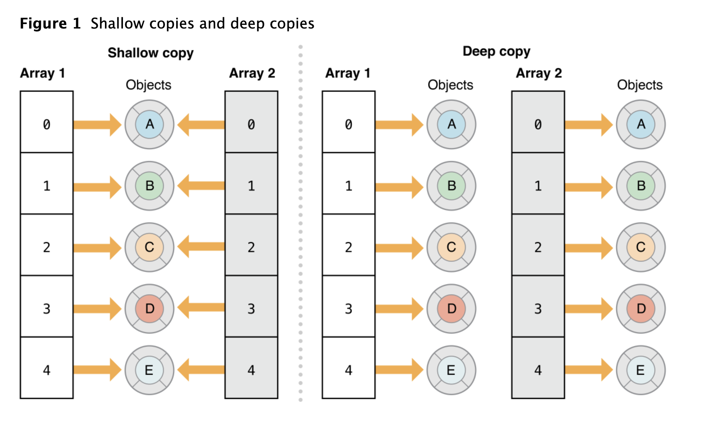

https://developer.apple.com/library/archive/documentation/Cocoa/Conceptual/Collections/Collections.html#//apple_ref/doc/uid/10000034-BBCFIHFH

**By default collections are untyped**

So following is possible:
```objc
NSArray* arr = @[@1, @2, @[@3, @4]];
```

**Note - `@` literals will create immutable collections**


## Immutability

Using an immutable collection conserves memory and improves perf because it never needs to be copied.
In fact, `copy` method of an immutable collection, quietly returns itself.

**Immutable collections cannot be sorted in-place, mutables one can be sorted in place**

Methods on immutable collections typically will return new immutable collections.
Methods on mutable collections will modify the collection in-place.

e.g. `NSArray` has method  `- (NSArray *)filteredArrayUsingPredicate:(NSPredicate *)predicate;` where as `NSMutableArray` has method `- (void)filterUsingPredicate:(NSPredicate *)predicate;`

## Lightweight generics (checks at compile time)

```objc
@property (nonatomic,strong) NSArray<NSDate *> *dueDates;
@property (nonatomic,strong) NSDictionary<NSNumber *, NSString *> *dataDictionary;
@property (nonatomic,strong) NSSet<NSString *> *filter;
```

This also helps with swift-interop.


## Collections and ownership

When you add an object to a mutable collection, the collection claims ownership of it.
When you remove the object from the collection, the collection gives oup ownershipt. (This is true for mutable collections)

For immutable collections, the pointers to objects are frozen on creation itself so it means all objects in collection are owned when collection is created, and disowned when collection is deallocated.


## Collections and (adding nil to it)
e.g. 
```objc
NSMutableArray *arr = [[NSMutableArray alloc] init];
[arr addObject: nil]; // Error!
[arr addObject:[NSNull null]];// This is correct/ok
```

## Copy behavior

**The normal copy is a shallow copy that produces a new collection that shares ownership of the objects with the original**.

If collection contains scalars, scalar values are copied over to other array, and there would be no link between the old and new collection.

When you create a shallow copy, the objects in the original collection are sent a retain message and the pointers are copied to the new collection. Which means all array items see increased retain counts, i.e. shared by multiple collecti
ons.



### NSArray copy behavior

* you can depend on the result of `mutableCopy` to be mutable, regardless of the original type. In the case of arrays, the result should be an `NSMutableArray`.
* you cannot depend on the result of `copy` to be mutable! , when an `NSMutableArray` is sent `-copy`, it returns an `NSArray` containing the same objects.

https://stackoverflow.com/questions/14856681/why-does-a-copy-nonatomic-nsmutablearray-property-create-nsarrays

```objc
    NSMutableArray* nsArray = [[NSMutableArray allocWithZone:nil] init];
    [nsArray addObject:@1];
    [nsArray addObject:@"hi"];
    
    NSMutableArray* ns3 = [nsArray copy];
    [ns3 addObject:@"9999"];// CRASH
```


## NSSet/NSMutableSet

No sense of order and only appears once.

### NSSet Useful methods 

Membership test - `- (BOOL)containsObject:(id)x;`


## NSDictionary/NSMutableDictionary

A dictionary is a collection of key-value pairs. The key is typically a string, and the value can be any
sort of object. Dictionaries are indexed by key: you provide a key and get back the value (an object)
associated with that particular key. Keys in a dictionary are unique and a **dictionary’s key-value pairs are not kept in any particular order.**


Creating a dictionary with `@{}` literals, similarly to how array literals are created with `@[]`

```objc
NSDictionary<NSString* , NSNumber*> *dict = @{
    @"hi": @2,
    @"Hey": @4,
    @"wow": @5
};
```

**Note** - `@{}` will create a  immutable dictionary, if we try to ignore warning and point a mutable dict to an immutable dict, it will crash at runtime, e.g.
```objc
NSMutableDictionary<NSString* , BNREmployee*> *executives = @{ // mutable pointer to an immutable object
    @"CEO": emp1,
    @"CTO": emp2
};

BNREmployee* emp3 = [[BNREmployee alloc] initWithEmpId:212];
// setting with index/key
[executives setObject:emp3 forKey:@"CFO"]; // crash at runtime!! because trying to mutate an immutable object - unrecognized selector sent to instance
```

Soo to create a Mutable dictionary use - `[[NSMutableDictionary alloc] init]`
e.g.
```objc
NSMutableDictionary<NSString* , BNREmployee*> *executives = [[NSMutableDictionary alloc] init];

[executives setObject:emp1 forKey:@"CEO"];
[executives setObject:emp2 forKey:@"CTO"];
```


## int vs NSNumber

`int k = 4` is integer, `NSNumber kk = @4` is an NSNumber with many methods.

You can extract out primitive int value from NSNumber in order to do math, and wrap the result into an NSNumber.

## NSValue

`NSValue` instances can be used to hold any scalar value.

