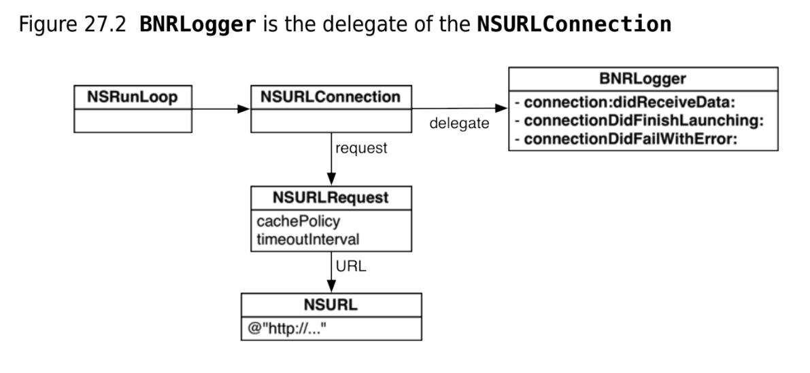

## Callback

A callback lets you write a piece of code and then associate that code with a particular event.

Four forms

1. `target-action`: whenever this event happens, send `action message/selector` to `target object`. fit. A lot of simple user interface controls, like buttons and sliders, use the target-action mechanism.
2. `helper objects` : delegates/data sources, when events related to a role occur, send message to helper object.
3. `Notifications`: When an event happens, a notification associated with that event will be posted in notification center. Objects can be interested in kinds of notification.
4. `Blocks` : Whenever an event happens, execute this block/lambda.


## RunLoop

There needs to be a looper/loop that waits for events/messages.
In OSX/iOS, this is called `NSRunLoop`.

Running the run loop, `run` method never returns:
```objc
[[NSRunLoop currentRunLoop] run];
```

## Target-action

`NSTimer` uses target-action mechanism.

You create a timer with time interval, target and an action.

Every two seconds, timer will send action message to target.

e.g.
```objc
BNRLogger* bnrlogger = [[BNRLogger alloc] init];

// send message/call method "updateLastTime" on target/object bnrlogger every 2s
NSTimer *timer = [NSTimer scheduledTimerWithTimeInterval:2 target:bnrlogger selector:@selector(updateLastTime:) userInfo:nil repeats:YES];
```


## Helper objects

Used for async stuff req/res stuff like `NSURLConnection` async.
To manage complex async connection, we must give helper object/delegate to NSURLConnection.

We can create a helper/delegate object which will implement callback methods like `didReceiveData`, `connectionDidFinishLaunching`, `connectionDidFailWithError`.



## Notifications

https://developer.apple.com/library/archive/documentation/Cocoa/Conceptual/Notifications/Introduction/introNotifications.html#//apple_ref/doc/uid/10000043-SW1

Similar to broadcast receiver on android, which is intended for system level interesting events that apps might want to react to.


### NSNotification class objects

**A notification encapsulates information about an event, such as a window gaining focus or a network connection closing.**

A notification is represented by an instance of the `NSNotification` class.

 A notification object contains several bits of state: 
1. a unique name, 
2. the posting object, and 
3. (optionally) a dictionary of supplementary information, called the `userInfo` dictionary.


### NSNotificationCenter

`Notification Centers` describes objects that manage the sending and receiving of notifications.


The centerpiece of the notification mechanism is a **per-process singleton object known as the notification center (NSNotificationCenter).** When an object posts a notification, it goes to the notification center, which acts as a kind of clearing house and broadcast center for notifications. (These are sync).
**This notification center handles notifications within a single process.** For communication between processes on the same machine, use a distributed notification center (see `NSDistributedNotificationCenter`)

Objects that need to know about an event elsewhere in the application register with the notification center to let it know they want to be notified when that event happens. 

Async notifications - Although the notification center delivers a notification to its observers synchronously, you can post notifications asynchronously using a notification queue (NSNotificationQueue).


`NSNotificationCenter.defaultCenter` - All system notifications sent to an app are posted to the defaultCenter notification center. You can also post your own notifications there.

Get it by `[NSNotificationCenter defaultCenter]`.

### Observing notifications

To observe a notification, 
1. obtain the singleton `NSNotificationCenter` instance and 
2. send it an `addObserver:selector:name:object:` message to register/add an observer. - object to invoke with given selector, only when it matches (optional name), and matches an (optional sender object).

Observer method signature:
```objc
- (void)myNotificationHandler:(NSNotification *)notif;
```

e.g.
```objc
// in main.m
[[NSNotificationCenter defaultCenter] addObserver:bnrlogger selector:@selector(zoneChange:) name:NSSystemTimeZoneDidChangeNotification object:nil];
```

In the delegate implementer:
```objc
// in BNRlogger.m
@interface BNRLogger ()
- (void) zoneChange:(NSNotification *)note;
@end

- (void)zoneChange:(NSNotification*)notif {
    NSLog(@"zone chang enotif : %@", [notif userInfo]);
}
```

To remove bserver use: `removeObserver:name:object:` on NSNotificationCenter.

### Posting Notifications

send a `postNotificationName:object:userInfo:` (or similar) message to the `singleton NSNotificationCenter `object. 
This method creates the notification object before it sends the notification to the notification center.


## Callbacks and object ownership

Callbacks add an inherent of **Strong reference cycle**.

**Often the object you create has a pointer to the object that is going to call back. And it has a pointer to the object you created.** If they each have strong references to each other, you end up with a strong reference cycle – neither of them will ever get deallocated.

### For notification observers

Notification centers do not own their observers.
observers will remove self on dealloc.

```objc
- (void) dealloc
{
    [[NSNotificationCenter defaultCenter] removeObserver: self];
}
```

### Objects do not own their delegates or data sources

If you create an object that is delegate or data source, your object should excuse itself in dealloc method.

```objc
- (void)dealloc {
    [windowThatBossesMeAround setDelegate: nil];
}
```

### Object do not own their targets

If you create an object that is a target, your object should zero/nil out target pointer in its dealloc method.

```objc
- (void) dealloc {
    [buttonThatKeepsSendingMeMessages setTarget: nil];
}
```


## Blocks/lambdas

A `Block` is a chunk of code.

Here is a block:
```objc
^{
NSLog(@"This is an instruction within a block.");
}
```


A block declaration: `void (^devowelizer)(id, NSUInteger, BOOL *);`

e.g.
```objc
// Declare the block variable
void (^devowelizer)(id, NSUInteger, BOOL *);

// Compose a block and assign it to the variable
devowelizer = ^(id string, NSUInteger i, BOOL *stop) {
    NSMutableString *newString = [NSMutableString stringWithString:string];
    // Iterate over the array of vowels, replacing occurrences of each
    // with an empty string
    for (NSString *s in vowels) {
        NSRange fullRange = NSMakeRange(0, [newString length]);
        [newString replaceOccurrencesOfString:s
        withString:@""
        options:NSCaseInsensitiveSearch
        range:fullRange];
    }
    [devowelizedStrings addObject:newString];
}; // End of block assignment


// API that makes use of blocks

[originalStrings enumerateObjectsUsingBlock:devowelizer];
```

### simplifying blocks using typedef

```objc
typedef void (^ArrayEnumerationBlock)(id, NSUInteger, BOOL *);

ArrayEnumerationBlock devowelizer;
```


### Anonymous blocks

An anonymous block is a block that you pass directly to a method without assigning it to a block
variable first.


### External variables/Variable capture by block

A block typically uses other variables (both primitive variables and pointers to objects) that were
created outside of the block. These are called `external variables`

. To make sure that they will be
available for as long as the block needs them, these variables are captured by the block.

**For primitive variables, the values are copied and stored as local variables within the block. For pointers, the block will keep a strong reference to the objects it references. This means that any objects referred to by the block are guaranteed to live as long as the block itself.**

### Using `self` in blocks

`self` in block refers to outer self.

One must take care to prevent memory leak and only refer to outer self via a weak reference.

```objc
__weak BNREmployee *weakSelf = self;
myBlock = ^{
    NSLog(@"Employee = %@", weakSelf); // block now holds outer self via a weak reference.
}
```
Problem: object that self points to could be deallocated while block is executing!

Solution is to have a **block local strong reference** - have strong reference at block level, but when block goes out of scope, things are fine.

```objc
__weak BNREmployee *weakSelf = self; // a weak reference
myBlock = ^{
    BNREmployee *innerSelf = weakSelf; // a block-local strong reference
    NSLog(@"Employee: %@", innerSelf);
};// strong local ref ends on block execution
```


If you use an instance variable directly within a block, the block will capture self instead of the
instance variable.

```objc
__weak BNREmployee *weakSelf = self;
myBlock = ^{
    BNREmployee *innerSelf = weakSelf; // a block-local strong reference
    NSLog(@"Employee: %@", innerSelf);
    NSLog(@"Employee ID: %d", _employeeID);
};
```

but compiler interprets it as:
```objc
__weak BNREmployee *weakSelf = self;
myBlock = ^{
    BNREmployee *innerSelf = weakSelf; // a block-local strong reference
    NSLog(@"Employee: %@", innerSelf);
    NSLog(@"Employee ID: %d", self -> _employeeID);
};
```

Solution: Its to use innerSelf instead of instance vars:

```objc
__weak BNREmployee *weakSelf = self;
myBlock = ^{
    BNREmployee *innerSelf = weakSelf; // a block-local strong reference
    NSLog(@"Employee: %@", innerSelf);
    NSLog(@"Employee ID: %d", innerSelf._employeeID);
};
```
