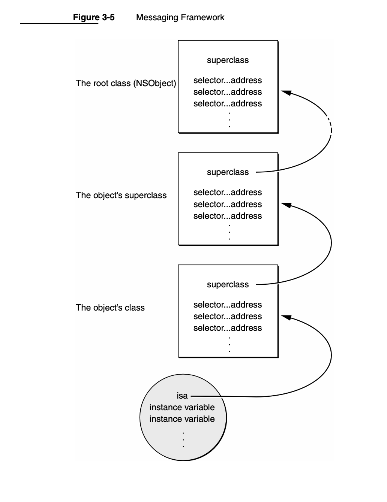

## Class Objects

A class definition contains various kinds of information, much of it about instances
of the class:
* The name of the class and its superclass
* A template describing a set of instance variables
* The names and types of instance methods
* Method implementations

**The compiler creates just one object, a class object, to represent the class**

Main role - Class objects are thus full-fledged objects that can be dynamically typed, receive
messages, and inherit methods from other classes. They’re special only in that
they’re created by the compiler, lack data structures (instance variables) of their
own other than those built from the class definition, and are the agents for
producing instances at runtime.

### +initialize available to class objects

The runtime system sends an `initialize` message to every class object before the
class receives any other messages. This gives the class a chance to set up its runtime
environment before it’s used. If no initialization is required, you don’t need to write
an initialize method to respond to the message; the NSObject class defines an
empty version that your class inherits.


## isa pointer

`isa` property is available in all objects that points to the corresponding class object.

## Type introspection

Instances can reveal their types at runtime. The `isMemberOfClass:` method, defined
in the NSObject class, checks whether the receiver is an instance of a particular class:
```objc
if ( [anObject isMemberOfClass:someClass] )
 . . .
```
The `isKindOfClass:` method, also defined in the NSObject class, checks more
generally whether the receiver inherits from or is a member of a particular class
(whether it has the class in its inheritance path):
```objc
if ( [anObject isKindOfClass:someClass] )
 . . .
```
The set of classes for which `isKindOfClass:` returns `YES` is the same set to which the
receiver can be statically typed.

## HOw messages are sent

In Objective-C, messages aren’t bound to method implementations until runtime. The compiler converts a message expression,
`[receiver message/selector]`
into a call on a messaging function, `objc_msgSend()`. 

The function takes the receiver and the selector as its two principal arguments:

Steps:
1. find the procedure in the receiver’s class - it first finds the procedure (method implementation) that the selector refers to. Since the same method can be implemented differently by different classes, the precise procedure that it finds depends on the class of the receiver.
2. It then calls the procedure, passing it the receiving object (a pointer to its data), along with any arguments that were specified for the method.
3. The procedure returns a value to the messaging function, which passes it along to the original caller.


### Class dispatch table

A class dispatch table. This table has entries that associate method selectors with the class-specific addresses of the methods they identify. The selector for the `setOrigin::` method is associated with the address of (the procedure that implements) `setOrigin::`, the selector for the display method is associated with display’s address, and so on.



When a message is sent to an object, the messaging function follows the object’s isa pointer to the class structure where it looks up the method selector in the dispatch table.

If it can’t find the selector there, objc_msgSend() follows the pointer to the superclass and tries to find the selector in its dispatch table. Successive failures cause objc_msgSend() to climb the class hierarchy until it reaches the NSObject class.

## Selectors

Unique Id for method representation - 
For efficiency, full ASCII names are not used as method selectors in compiled code. Instead, the compiler writes each method name into a table, then pairs the name with a unique identifier that will represent the method at runtime.

Compiled selectors are assigned to a special type, SEL, to distinguish them from other data

**NOte** - Compiled selectors identify method names, not method implementations. **Rectangle’s display method, for example, will have the same selector as display methods defined in other classes.**. If there were one selector per method implementation, a message would be no different than a function call. The selector is used to look up the method implementation in the class dispatch table.

### @selector() usage.
The `@selector()` directive lets Objective-C source code refer to the compiled selector, rather than to the full method name, and it returns a `SEL`.

```objc
SEL  setWidthHeight;
setWidthHeight = @selector(setWidth:height:);
```

Converting from string to selector and vice versa:
in some cases, a program may need to convert a character string to a selector at runtime. This can be done with the 
`NSSelectorFromString()` function:
```objc
setWidthHeight = NSSelectorFromString(aBuffer);
```
Conversion in the opposite direction is also possible. The `NSStringFromSelector()`
function returns a method name for a selector:
```objc
NSString *method;
method = NSStringFromSelector(setWidthHeight);
```

### performselector for function calls

The `performSelector:`, `performSelector:withObject:`, and `performSelector:withObject:withObject:` methods, defined in the NSObject protocol, take `SEL` identifiers as their initial arguments. All three methods map directly into the messaging function. For example,
`[friend performSelector:@selector(gossipAbout:) withObject:aNeighbor];`
is equivalent to:
`[friend gossipAbout:aNeighbor];`

Example of dynamic receiver and selector:
```objc
id   helper = getTheReceiver();
SEL  request = getTheSelector();
[helper performSelector:request];
```

### objc_msgsend

The meat-and-potatoes of the Objective-C runtime is objc_msgSend, the C function responsible for sending a message to an object. When you write the following line of Objective-C code:
```objc
[tableView cellForRowAtIndexPath:indexPath];
```
The compiler actually translates it down into the following C function call:
```objc
objc_msgSend(tableView, @selector(cellForRowAtIndexPath:), indexPath);
```
`objc_msgSend_stret` is an alternate version of objc_msgSend that exists solely to return a struct value (the ‘stret’ stands for for struct return). It’s used in the same way as objc_msgSend, but it’s used when the method returns a struct value. 