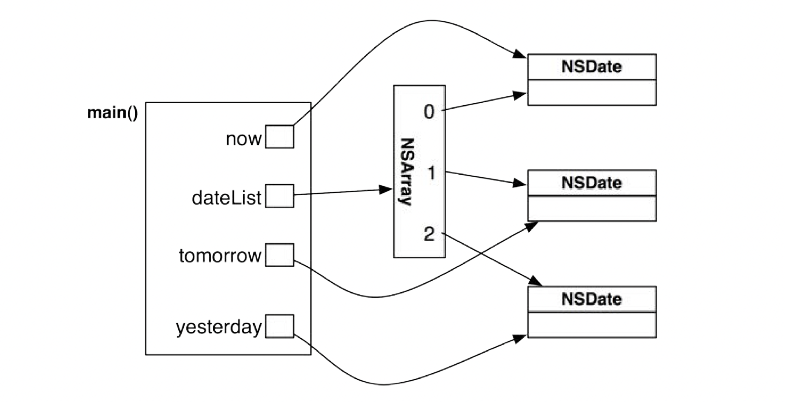

## Equality

The class NSObject defines a method
called `isEqual:`. To check if two objects are equal, you use the `isEqual:` method.

Default implementation by `NSObject` is reference check:
```objc
NSObject has a simple implementation of isEqual:. It looks like this:
- (BOOL)isEqual:(id)other
{
return (self == other);
}
```

## Selectors

A selector is the name used to select a method to execute for an object.

```objc
SEL aSelector = @selector(run);
[aDog performSelector:aSelector];
[anAthlete performSelector:aSelector];
[aComputerSimulation performSelector:aSelector];
```

## Circular dependency in headers

Circular dependency in headers can lead to problems like:
1. `Expected a type`

Solving circular dependency issue, let the complex interface/implementation include a simple/basic/util header, and in the simple/basic header, use a forward class declaration e.g. `@class Complex` instead of `#include Complex.h`.

### Quotes vs angle brackets in headers

Quotes indicate that the header is in your project directory. 

Angle brackets indicate that the header is in one of the standard locations that the preprocessor knows about.


### #define

`#define` means replace in the preprocessor step, i.e. before compiler sees it.
e.g. `#define MAX(A,B) ((A) > (B) ? (A) : (B))`

## Sending messages to `nil` does not produce error

```objc
Dog *fido = nil;
[fido goGetTheNewspaper]; // cool!
```

Important thing #1: If you are sending messages and nothing is happening, make sure you are not
sending messages to a pointer that has been set to `nil`.

Important thing #2: If you send a message to `nil`, the return value is meaningless and should be
disregarded.

**Sending a message to nil reliably returns nil as a pointer, zero as an integer or floating-point value, structs initialized to 0, and _Complex values equal to {0, 0}.**


## id for generic pointer (like auto)

## Create Arrays using `NSArray` (Immutable by default)

**Once created, cannot be modified, i.e. no element addition/deletion allowed**

```objc
// Create three NSDate objects
NSDate *now = [NSDate date];
NSDate *tomorrow = [now dateByAddingTimeInterval:24.0 * 60.0 * 60.0];
NSDate *yesterday = [now dateByAddingTimeInterval:-24.0 * 60.0 * 60.0];
// Create an array containing all three
NSArray *dateList = @[now, tomorrow, yesterday];
```



Access and length
```objc
int len = [dateList count]; // count instead of length
NSDate* now = dateList[0]; // index by num
```

## Mutable/Changeable arrays using NSMutableArray

```objc
// Create an empty mutable array
NSMutableArray *dateList = [NSMutableArray array];
// Add two dates to the array
[dateList addObject:now];
[dateList addObject:tomorrow];
// Add yesterday at the beginning of the list
[dateList insertObject:yesterday atIndex:0];
// Iterate over the array
for (NSDate *d in dateList) {
NSLog(@"Here is a date: %@", d);
}
// Remove yesterday
[dateList removeObjectAtIndex:0];
NSLog(@"Now the first date is %@", dateList[0]);
```


## self

Inside any method, you have access to the implicit local variable self. **self is a pointer to the object
that is running the method. It is used when an object wants to send a message to itself.**


## What is an umbrella header of a framework?

An umbrella header is named by framework name usually(`<FrameworkName>.h`) 

##

You include framework header files in your code using the #include directive. If you are working in Objective-C, you may use the #import directive instead of the #include directive. The two directives have the same basic results. but the #import directive guarantees that the same header file is never included more than once. There are two ways for including framework headers:

```objc
#include <Framework_name/Header_filename.h>
#import <Framework_name/Header_filename.h>
```


https://gist.github.com/bgromov/f4327343ad67a5f7216262ccbe99c376

## `.m` vs `.mm` file

`.m` - 	Objective-C implementation file
`.mm` - 	Objective-C++ implementation file

##

All instance variables for a newly allocated object are initialized to 0 

## Identify Designated initializer

Identify Designated Initializer
Clearly identify your designated initializer.

It is important for those who might be subclassing your class that the designated initializer be clearly identified. That way, they only need to override a single initializer (of potentially several) to guarantee the initializer of their subclass is called. It also helps those debugging your class in the future understand the flow of initialization code if they need to step through it. Identify the designated initializer using comments or the NS_DESIGNATED_INITIALIZER macro. If you use NS_DESIGNATED_INITIALIZER, mark unsupported initializers with NS_UNAVAILABLE.

## Instance variables in headers should be @protected or @private

**Instance variables should typically be declared in implementation files (which are private by default) or auto-synthesized by properties **

When ivars are declared in a header file, they should be marked @protected or @private.

## Header Imports are recursive replace of code

e.g. 
if programin imprts `Employee.h` and `EMployee.h` imports `Person.h`, then `Person` class is automatically in scope, i.e. headers are recursively preprocessed.

## isa  pointer (similar to instanceof)

Each NSObject contains a field called `isa`, which is a pointer to the class that the object is an instance of (that's how the object and Objective-C runtime knows what kind of object it is).

`isa` is used for method name/message name searching:

When you send a message to an object, you kick off a search for a method of that name. The search
follows the object’s `isa` pointer to start looking for the method in the object’s class. If there is no
method of that name there, then it is on to the superclass. The hunt stops when the method is found or
when the top of the hierarchy (NSObject) is reached.

**The first implementation that is found is the one that gets executed.**

Use with `super`: When you use the super directive, you are sending a message to the current object but saying, **Run a method with this name, but start the search for its implementation at your superclass.**

## Description method on NSString


Override to provide string debugability to an object.

The description method returns a string that is a useful description of an instance of the class. It is
an NSObject method, so every object implements it. `The default NSObject implementation returns the object’s address in memory as a string.`

```objc
- (NSString *)description
{
return [NSString stringWithFormat:@"<Employee %d>", self.employeeID];
}
```


## Important things to know about collections and ownership

two other important things to know about collections and ownership (ARC based):

* When an object is added to the collection, the collection establishes a pointer to the object,
and the object gains an owner.
* When an object is removed from a collection, the collection gets rid of its pointer to the object,
and the object loses an owner.

## General rule of preventing strong reference cycles

the general rule for preventing this type of strong reference cycle is the
parent owns the child, but the child should not own the parent. instead child should have weak pointer to parent.

**When the object that a weak reference points to is deallocated, the pointer variable is zeroed, or set to nil.**

Thus instance variables and properties that are marked as weak are pointing at
objects that might go away. If this happens, that instance variable or property will be set to nil, instead
of continuing to point to where the object used to live.

## Error Handling

Methods like wrting to file can go wrong in many ways e.g. no permissions or disk full.

**In these cases methods need a way to return a description of what went wrong in additiont to the boolean value of success or failure**

### NSError

For error handling, many methods take an `NSError` pointer by reference.

**We only have to declare one, not initialize it, and pass it to relevant method. An Error object will only be created if there is, infact an error, and method should retrun success/failure depending whether error did not occur/occur**

Only access NSError object, if return value was not success.

e.g
```objc
NSError *err;

BOOL success = [str writeToFile:@"/too/darned/bad/tmp/cool.txt" atomically:YES encoding:NSUTF8StringEncoding error:&err];

if(success) {
    NSLog(@"successfully wrote file");
} else {
    NSLog(@" error writing file : ", [err localizedDescription]);
}
```


## BLock signature typedefs are pretty common

e.g.
```objc
typedef double (^Operation)(double first, double second);

// now use Operation type for a function/lambda type that takes two doubles and returns a double
```
The type can be used for the parameter of a method:
```objc
- (double)doWithOperation:(Operation)operation 
                    first:(double)first 
                   second:(double)second;
```
or as a variable type:
```objc
Operation addition = ^double(double first, double second){
    return first + second;
};

// Returns 3.0
[self doWithOperation:addition
                first:1.0
               second:2.0];
```