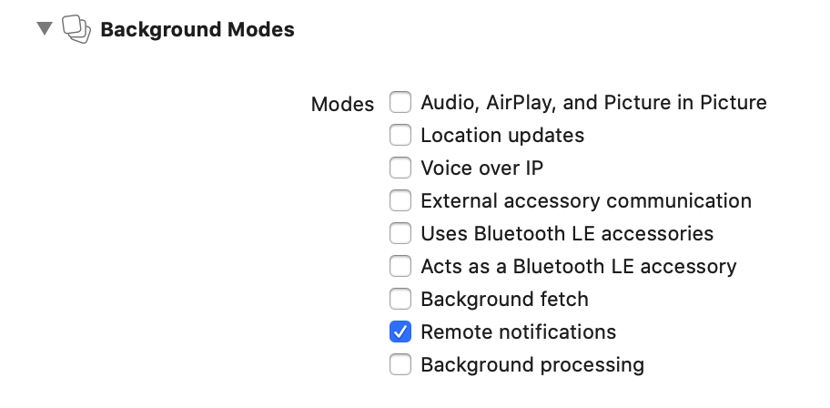

A background notification is a remote notification that **doesn’t display an alert, play a sound, or badge your app’s icon.** It wakes your app in the background and gives it time to initiate downloads from your server and update its content.

**In essence Background notifications are same as silent notifications**

Note - The system treats background notifications as **low priority**: you can use them to refresh your app’s content, but the **system doesn’t guarantee their delivery**. In addition, the system may throttle the delivery of background notifications if the total number becomes excessive.

## Remote Notifications capability/mode needs to be enabled

