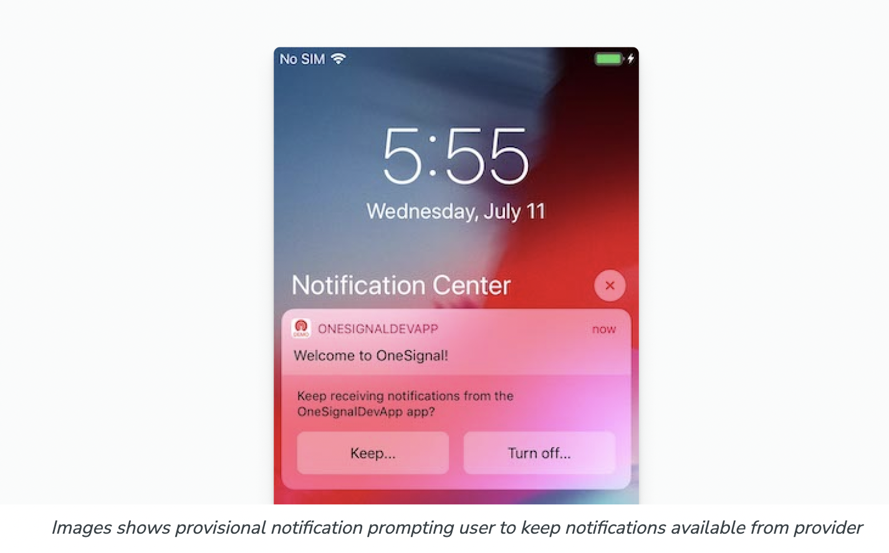
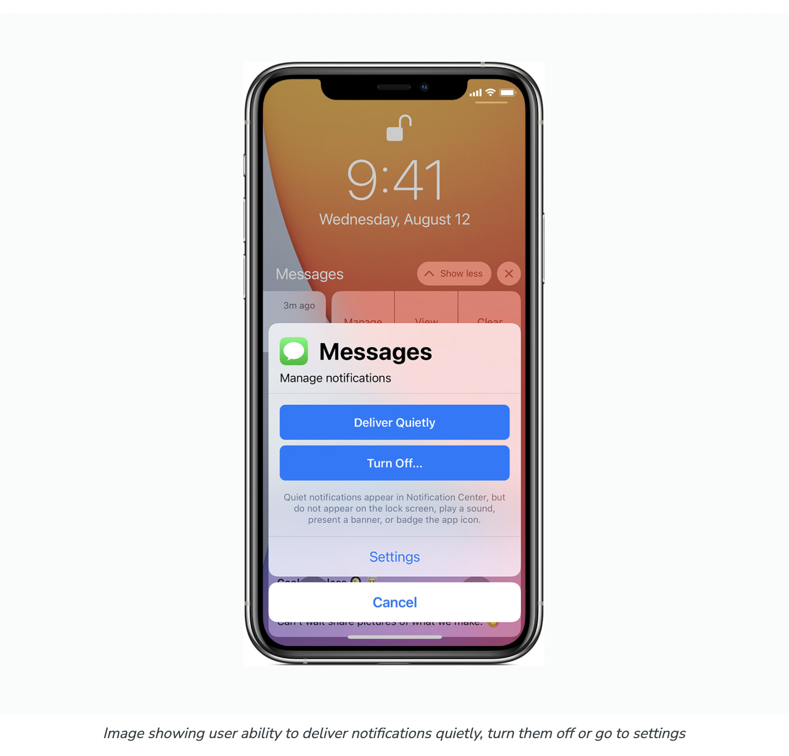

https://documentation.onesignal.com/docs/ios-provisional-push-notifications

## what are provisional push notifications?

**Provisional Notifications can be sent to users without needing to first request notification permissions.**

The are **Direct-To-History** push notification. 
This means that instead of having to prompt the user for permission to send them push notifications, your app can request provisional authorization. Some details about these push notifications:

1. they will not show a banner
2. they will not play a sound
3. they will not alert the subscriber, they will be directly sent to the Notification Center/History

## The authorization process happens directly in Notification center via Keep/Turn Off

1. If the user selects Keep... in response, then they have the options:

**Deliver Quietly**: Subscribes the user to quiet push notifications. It keeps push notifications silent and only shows on Notification Center. Additionally, it removes the options to "Keep..." or "Turn off..."
2. Turn Off: Unsubscribes the user from notifications.

**You can still prompt the user to subscribe normally to push even with these turned on or turned off.**

KEep provisional Push Notifications flow:

