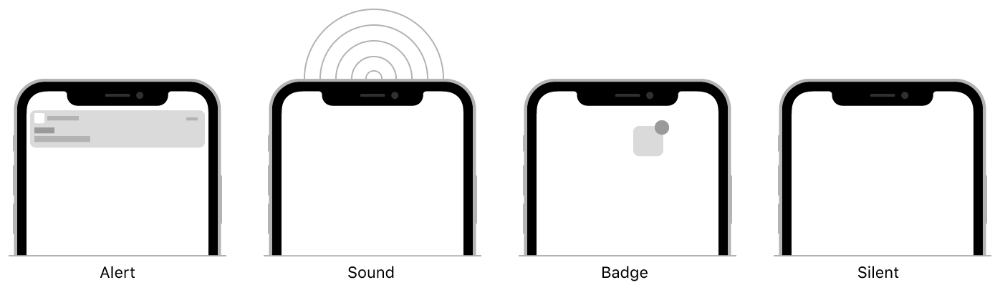

Notifications coming from the server are known as "Remote Notifications"

Remote notifications convey important information to the user in the form of a JSON payload. 

The payload specifies the types of user interactions (alert, sound, or badge) that you want performed, and includes any custom data your app needs to respond to the notification.

Remote notification can be categorized in to two types:
1. Alert Notification (have some UI like banner etc)
2. Silent Notification [here](./SilentNotifications.md)

