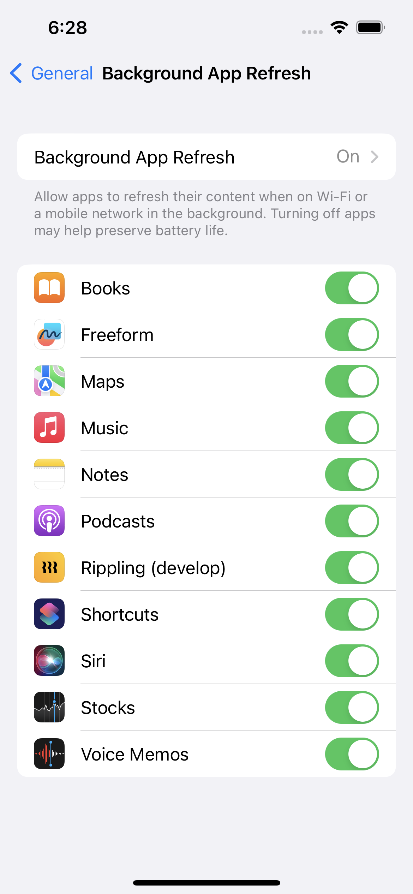

Silent notifications are kind of remote notifications, that do not have any UI/Sound.
They are meant to directly wake up app to do some important processing.

**Silent notifications are enabled by default, they do not need user approval/permission, because they are not interruptive - do not make sound,banner UI etc.**

They can be disabled by turning of `Background app refresh` setting:



## Restrictions

The payload's aps dictionary must include the `content-available` key with a value of `1` and don’t include the `alert`, `badge`, or `sound` keys in your payload.

e.g. following APNS payload
```json
{
    "aps" : {
        "content-available" : 1
    },
    "acme1" : "bar",
    "acme2" : 42
}
```