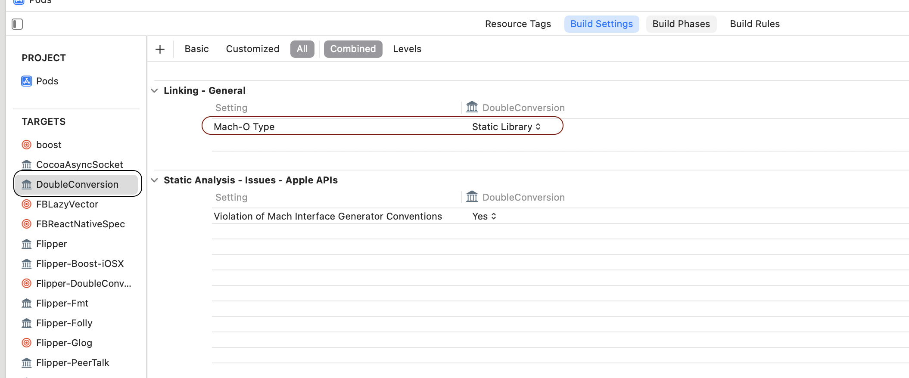

## What is target?

**A target specifies a product to build and contains the instructions for building the product from a set of files in a project or workspace.** A target defines a single product; it organizes the inputs into the build system—the source files and instructions for processing those source files—required to build that product. Projects can contain one or more targets, each of which produces one product.

### How is target built?

The instructions for building a product take the form of build settings and build phases, which you can examine and edit in the Xcode project editor. A target inherits the project build settings, but you can override any of the project settings by specifying different settings at the target level. There can be only one active target at a time; the Xcode scheme specifies the active target.

### Relationship between targets

A target and the product it creates can be related to another target. If a target requires the output of another target in order to build, the first target is said to depend upon the second. **If both targets are in the same workspace, Xcode can discover the dependency, in which case it builds the products in the required order. Such a relationship is referred to as an implicit dependency.** 

You can also specify explicit target dependencies in your build settings, and you can specify that two targets that Xcode might expect to have an implicit dependency are actually not dependent.

For example, you might build both a library and an application that links against that library in the same workspace. Xcode can discover this relationship and automatically build the library first. However, if you actually want to link against a version of the library other than the one built in the workspace, you can create an explicit dependency in your build settings, which overrides this implicit dependency.

## Target Integration methods

### Target is a include source-code as is (i.e no compilation)

1. If `SKIP_INSTALL` is set to true, and 
2. `Mach-O` type is not set,  
3. **No Compile sources** step inside the Build phases of the target. 
the source code of the target is added as it is.

### Target is a source-code as a static library

1. `Mach-O` type is set to `Static Library`
2. **Complie sources** step inside the Build phases of the target.

### Dynamic framework target

1. `Mach-O` type is set to `Dynamic Library`
2. Some public headers or some public exports set in build phases.
3. (Optional) Something in `Compile Sources` and `Resources` step.