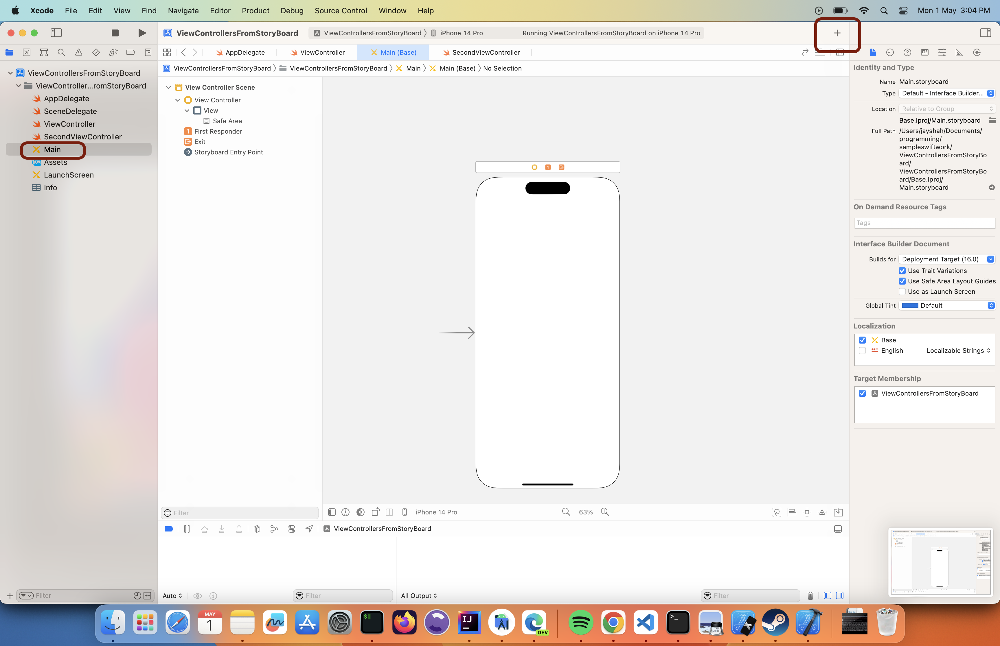

## Has the application main method

### Loads the main storyboard and initializes the rootViewController with it.

### Adding UI elements to storyboard - single vie wcontroller 

Click on "+" Button on top right - stands for library.

Now select button element from Libary of components

