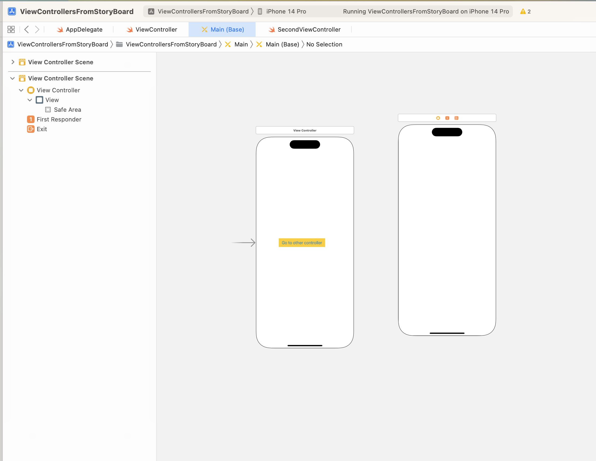

## How to add a new view controller to the storyboard?

Click on "+" button on top right of storyboard that stands for library.
You can filter the options with "ViewController" and you should see options that show ViewController.


By default this newly created view controller will not have a connection with existing view controllers




## How to connect a custom UIViewController class in code, to a ViewController created in Storyboard?

Click the top of ViewController UI in story board.
On the right panel, you should be able to see many options with many tabs.
Select the one with Identity Inspector, that will have an option to set `Custom Class`.


## How to create a viewController instance(that was designed in storyboard)?

We already have specified `Custom class` in our new ViewController within storyboard.

We can give an `identifier` to the ViewController shown in storyboard.

### Instantiation via storyboard reference of a Viewcontroller identifier

All viewcontrollers have a built-in reference to storyboard.

TO instantiate by referring a viewcontroller in storyboard, we will use `storyboard` refrence along with specifying the identifier of the viewcontroller to load.

```swift
class ViewController: UIViewController {
    override func viewDidLoad() {
        super.viewDidLoad()
        // Do any additional setup after loading the view.
        view.backgroundColor = .link
    }
    
    @IBAction func didTapButton() {
        print("did tap button!")
        // "second" is the id of another viewcontroller in storyboard
        if let vc2 = storyboard?.instantiateViewController(withIdentifier: "second") as? SecondViewController {
            present(vc2, animated: true)
        }
    }
}
```

### Direct instantiation programmatically

```swift
let vc = UIViewController()
vc.view.backgroundColor = UIColor.systemPink
present(vc, animated: true)
```

## How to connect code IBOutlet with storyboard

First add the `IBAction` in viewcontroller code:
```
class ViewController: UIViewController {

    override func viewDidLoad() {
        super.viewDidLoad()
        // Do any additional setup after loading the view.
        view.backgroundColor = .link
        
    }
    
    @IBAction func didTapButton() {
        print("did tap button!")
    }
}
```

Connect the button in story board by right-click on first menu-item in viewcontroller UI,
and drag and drop from received actions to the actual UI button.


## How to show another viewcontroller?

A `viewcontroller` can `present` another viewcontroller.

`vc.present(vc2, animated: true)`


## How to access UIView shown by the viewcontroller?

Use `.view` property on the viewcontroller.

## How to dismiss ?

`vc.dismiss` or `dismiss` in the vc itself.


## Presenting vs showing a Viewcontroller

### Showing a view controller

**These methods let the presenting view controller decide how best to handle the presentation of the new view controller.**. This makes most sense for container view controllers. For example, a container view controller might incorporate the view controller as a child instead of presenting it modally. The default behavior presents the view controller modally.

Use method swift: -> `func show(_ vc: UIViewController,sender: Any?)`
or Use method in objc -> `- (void)showViewController:(UIViewController *)vc sender:(id)sender;` to show a viewcontroller.

A navigation controller overrides this method and uses it to push vc onto its navigation stack. 

You can override this method in custom view controllers to display vc yourself. Use this method to display vc in a primary context. For example, a container view controller might use this method to replace its primary child view controller with a new child.

Default implementation: The default implementation of this method calls the `targetViewControllerForAction:sender:` method to locate an object in the view controller hierarchy that overrides this method. 

It then calls the method on that target object, which displays the view controller in an appropriate way. If the `targetViewControllerForAction:sender:` method returns nil, this method uses the window’s root view controller to present vc modally.

To show a viewcontroller in secondary/detail context use: `func showDetailViewController(_ vc: UIViewController,sender: Any?)` which Presents a view controller in a secondary (or detail) context.

### Presenting a view controller

Presentation is always modally done.
