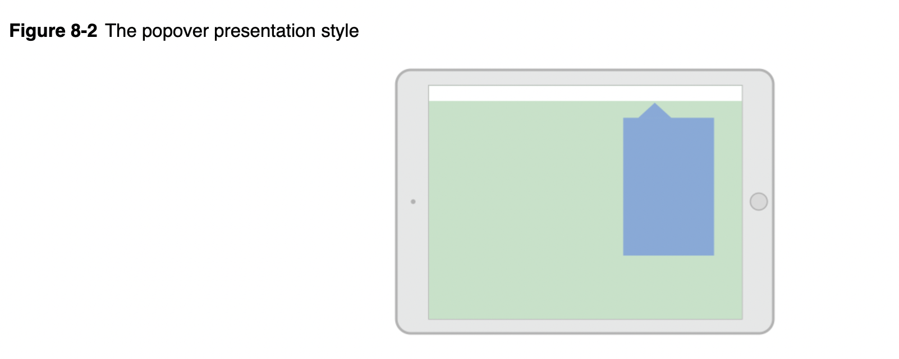

## Different ways to show/present a viewcontroller

1. Use a `segue` to present the view controller automatically. The segue instantiates and presents the view controller using the information you specified in Interface Builder. For more information on how to configure segues, see Using Segues.

2. Use the `showViewController:sender:` or `showDetailViewController:sender:` method to display the view controller. In custom container view controllers, you can change the behavior of these methods to something more suitable for your view controller.

3. Call the `presentViewController:animated:completion:` method to present the view controller modally.

## Presentation process

There are two ways to display a view controller onscreen:
1. embed it in a container view controller or
2. or present it (when you want to implement modal interfaces)

Presenting a view controller creates a relationship between the original view controller, known as the presenting view controller, and the new view controller to be displayed, known as the presented view controller. 
 
 This relationship forms part of the view controller hierarchy and remains in place until the presented view controller is dismissed

## Presentation styles

The presentation style of a view controller governs its appearance onscreen.

When designing your app, choose the presentation style that makes the most sense for what you are trying to do and assign the appropriate constant to the `modalPresentationStyle` property of the view controller you want to present

## Fullscreen presentation style

Full screen presentation styles cover the entire screen, preventing interactions with the underlying content until the presented view controller is dismissed.

## Popovers

The `UIModalPresentationPopover` style displays the view controller in a popover view. 

Popovers are useful for displaying additional information or a list of items related to a focused or selected object.

A tap outside the popover view dismiss the popover automatically.

