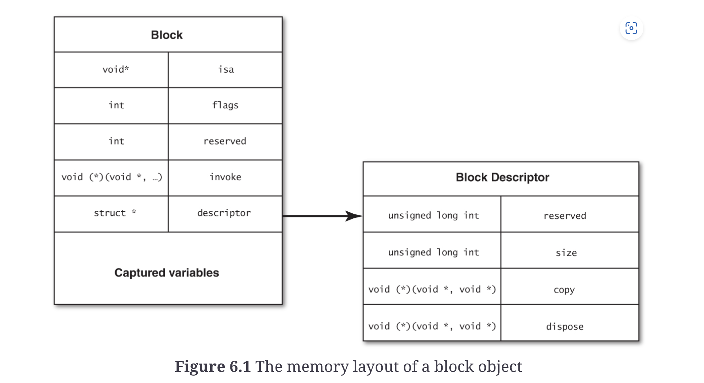

Blocks provide lexical closures to C, C++, and Objective-C and are incredibly useful, mainly because they provide a mechanism to pass around code as if it were an object, to be run in a different context.

The structure of the block type syntax is as follows:
**Declaration**
```objc
// declaration of anonymous lambda/block into a variable with function type
return_type (^block_name)(parameters) = ^(parameters) {
    // body
}
// e.g.
int (^sum)(int a, int b);
```

**Anonymous lambda rhs** example:
```objc
int (^sum)(int a, int b) = ^(int a, int b) {
    return a + 2;
};
```

**Separate declaration and assignment for block variable**
```objc
- void someMethod() {
    void (^block)();
    if ( true ) {
        block = ^{
            NSLog(@"Block A");
        };
    } else {
        block = ^{
            NSLog(@"Block B");
        };
    }
    block();
}
```

**any variable captured by the block cannot be modified by the block, i.e captures should be treated immutable**

## captured variables can be declared as mutable by __block modifier

```objc
NSArray *array = @[@0, @1, @2, @3, @4, @5];
__block NSInteger count = 0; // ok to modify in block
[array enumerateObjectsUsingBlock:
    ^(NSNumber *number, NSUInteger idx, BOOL *stop){
        if ([number compare:@2] == NSOrderedAscending) {
            count++;
        }
    }];
// count = 2
```

## Capturing a variable of object ttype will implicitly retain it

Captured variable will only be released when block is released.

Capturing of `self` is done if we read/write instance variables in class method.

e.g. of **Instance variable capture**

```objc

@interface EOCClass
- (void)anInstanceMethod {
    // ...
    void (^someBlock)() = ^{
        _anInstanceVariable = @"Something"; // self captured here!
        NSLog(@"_anInstanceVariable = %@", _anInstanceVariable);
    };
    // ...
}

@end
```

## Memory layout of block

The block itself is a object.

**A block contains copy of all variables (i.e scalars and variable reference pointers) it captures**

**When blocks are defined, they occupy memory on stack, so it is scope restricted**



1. `invoke` : function pointer to where the block implementation resides
2. `copy`: moves block from stack to heap

**copy usage** - blocks can be moved to heap by sending `copy` message to the block, moving to the heap, where it becomes ref counted object. 
```objc
void (^block)();
if ( /* some condition */ ) {
    block = [^{
        NSLog(@"Block A");
    } copy];
} else {
    block = [^{
        NSLog(@"Block B");
    } copy];
}
block();
```

blocks which do not capture any variables/state, can be global singletons.

### Using typedefs for block signatures

**A block-variable definition is different from other types in that the variable name is in the middle of the type rather than on the right**

The function type of a variable holding a function/block is `return_type (^block_name)(parameters)`
Here `block_name` is the variable name, which makes it hard to read cause it is in the middle.

`typedef` allows us to create an easy to use type alias.

```objc
typedef int (^EOCSomeBlock)(int a, NSString* b);// defining type alias for block function type

// easily use function/block type
EOCSomeBlock ss = ^(int a, NSString* b) {
    // implementation!
}
```

`Note`: use Capital first letter for type alias.

Here is another example of API simplification by using type alias for function type:
```objc
- (void)startWithCompletionHandler:
            (void(^)(NSData *data, NSError *error))completion;

// instead prefer below
typedef (void)(^EOCCompletionHandler)(NSData *data, NSError* error);
// new method definition
- (void)startWithCompletionHandler:(EOCCompletionHandler) completionHandler;
```

**Using a type definition is also useful if you ever need to refactor to change the block’s type signature.**

`Note`: declare more than one types even if structure is same for better type checking.
```objc

typedef void(^ACAccountStoreSaveCompletionHandler)
                                (BOOL success, NSError *error);
typedef void(^ACAccountStoreRequestAccessCompletionHandler)
                                (BOOL granted, NSError *error);
```

**Don’t be afraid to define multiple types for the same block signature. You may want to refactor one place that uses a certain block type by changing the block signature but not another.**

## Handler blocks pattern

Handler blocks as callbacks can serve as an alternative to callback pattern.

With delegate pattern: 
```objc
#import <Foundation/Foundation.h>

@class EOCNetworkFetcher;
@protocol EOCNetworkFetcherDelegate <NSObject>
- (void)networkFetcher:(EOCNetworkFetcher*)networkFetcher
     didFinishWithData:(NSData*)data;
@end

@interface EOCNetworkFetcher : NSObject
@property (nonatomic, weak)
                      id <EOCNetworkFetcherDelegate> delegate;
- (id)initWithURL:(NSURL*)url;
- (void)start;
@end

// usage
- (void)fetchFooData {
    NSURL *url = [[NSURL alloc] initWithString:
                  @"http://www.example.com/foo.dat"];
    EOCNetworkFetcher *fetcher =
        [[EOCNetworkFetcher alloc] initWithURL:url];
    fetcher.delegate = self;
    [fetcher start];
}
```

Smaller implementation using blocks instead of having anonymous protocol object
```objc
#import <Foundation/Foundation.h>

typedef void(^EOCNetworkFetcherCompletionHandler)(NSData *data);

@interface EOCNetworkFetcher : NSObject
- (id)initWithURL:(NSURL*)url;
- (void)startWithCompletionHandler:
            (EOCNetworkFetcherCompletionHandler)handler;
@end


// usage
- (void)fetchFooData {
    NSURL *url = [[NSURL alloc] initWithString:
                  @"http://www.example.com/foo.dat"];
    EOCNetworkFetcher *fetcher =
        [[EOCNetworkFetcher alloc] initWithURL:url];
    [fetcher startWithCompletionHandler:^(NSData *data){
        _fetchedFooData = data;
    }];
}
```
**This is very similar to using a delegate protocol but has an added bonus that the completion handler can be defined inline with the start method call, which greatly improves the readability of code using the network fetcher.**

scope access - because the block is declared in the same scope as the network fetcher is created, you have access to all the variables that are available in that scope.

One more advantage compared to delegate approach - for delegate approach, one might need to switch between delegates for various requests, here each business logic is inline with the request.

e.g.
```objc
- (void)fetchFooData {
    NSURL *url = [[NSURL alloc] initWithString:
                  @"http://www.example.com/foo.dat"];
    _fooFetcher = [[EOCNetworkFetcher alloc] initWithURL:url];
    _fooFetcher.delegate = self;
    [_fooFetcher start];
}

- (void)fetchBarData {
    NSURL *url = [[NSURL alloc] initWithString:
                  @"http://www.example.com/bar.dat"];
    _barFetcher = [[EOCNetworkFetcher alloc] initWithURL:url];
    _barFetcher.delegate = self;
    [_barFetcher start];
}

- (void)networkFetcher:(EOCNetworkFetcher*)networkFetcher
     didFinishWithData:(NSData*)data
{
    if (networkFetcher == _fooFetcher) { // depending on fetcher, select the handler, can get complex very quickly!
        _fetchedFooData = data;
        _fooFetcher = nil;
    } else if (networkFetcher == _barFetcher) {
        _fetchedBarData = data;
        _barFetcher = nil;
    }
    // etc.
}
```

Simplified with blocks:
```objc
- (void)fetchFooData {
    NSURL *url = [[NSURL alloc] initWithString:
                  @"http://www.example.com/foo.dat"];
    EOCNetworkFetcher *fetcher =
        [[EOCNetworkFetcher alloc] initWithURL:url];
    [fetcher startWithCompletionHandler:^(NSData *data){
        _fetchedFooData = data;
    }];
}

- (void)fetchBarData {
    NSURL *url = [[NSURL alloc] initWithString:
                  @"http://www.example.com/bar.dat"];
    EOCNetworkFetcher *fetcher =
        [[EOCNetworkFetcher alloc] initWithURL:url];
    [fetcher startWithCompletionHandler:^(NSData *data){
        _fetchedBarData = data;
    }];
}
```

I suggest using a single handler block for success and failure, which is also the approach that Apple seems to be taking in its APIs.


## Executing blocks on certain queues

Typically block executors can also take as parameters some queue on which to execute the block.
e.g. NSNOtification center will take a queue on which to execute the block, or by default run it on thread that posted the block.

```objc
- (id)addObserverForName:(NSString*)name
                  object:(id)object
                   queue:(NSOperationQueue*)queue
              usingBlock:(void(^)(NSNotification*))block
```

**When designing an API that uses handler blocks, consider passing a queue as a parameter, to designate the queue on which the block should be enqueued**

## Retain cycles introduced due to blocks

Blocks can easily introduce retain cycles if not considered carefully.

## Barrier blocks

**A barrier is executed exclusively with respect to all other blocks on that queue.**

Api:
```objc
void dispatch_barrier_async(dispatch_queue_t queue,
                            dispatch_block_t block);
void dispatch_barrier_sync(dispatch_queue_t queue,
                           dispatch_block_t block);
```