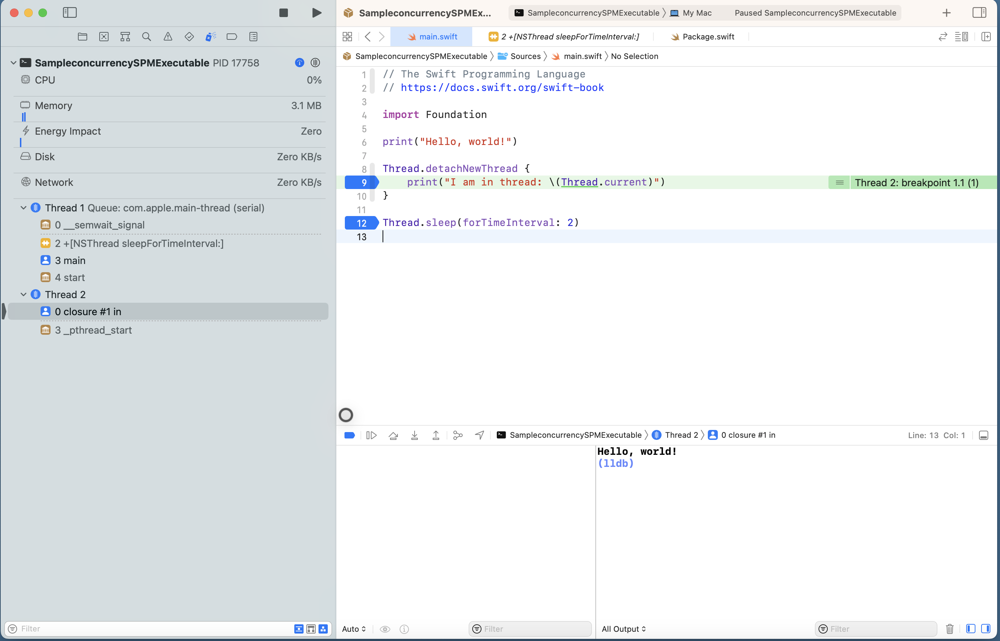

## Thread.detatchThread to kickoff thread

Does not hold the main thread.

```swift
import Foundation
print("Hello, world!")

// does not get printed, because main thread does not wait for detached threads
Thread.detachNewThread {
    print("I am in thread: \(Thread.current)")
}
```

## Thread.current prints current thread

## Thread.sleep(forTimeInterval: 2) to sleep the current thread

## Debugging thread execution with breakpoints



## Co-operative cancellation with `Thread.isCancelled`

**By default, it only sets a flag state of the receiver to indicate that it should exit. Will not actually cancel!**

```swift
import Foundation

// get handle to thread
let t = Thread {
    Thread.sleep(forTimeInterval: 1) // sleep for 1s

    // without this, we would be doing incomplete work
    guard !Thread.current.isCancelled
    else {
        // clean up resources because cancelled
        print("returning becoz thread was cancelled")
        return;
    }
    print("doing important work in bg thread!")
}

t.start()
Thread.sleep(forTimeInterval: 0.01) // give t a window to execute

// we try to cancel thread while it is sleeping for 1s
t.cancel() // only sets a flag on the thread obj, doesn't actually cancel, needs co-operation of the thread runnable to actually cancel.

// give others chance to execute
Thread.sleep(forTimeInterval: 5)
```