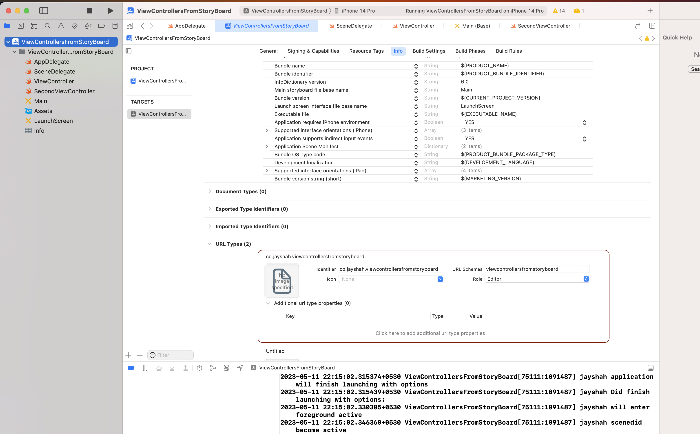

## Custom URL Scheme

Custom URL schemes provide a way to reference resources inside your app.

Users tapping a custom URL in an email, for example, launch your app in a specified context. Other apps can also trigger your app to launch with specific context data; for example, a photo library app might display a specified image.

They will usually have a **Entity_ID** that they directly want to show after opening the app.

### Universal links

While custom URL schemes are an acceptable form of deep linking, universal links are strongly recommended.

## Testing

When testing your URL-handling code, make sure your test cases include improperly formatted URLs.

## Adding custom URL Scheme

To support a custom URL scheme:

1. Define the format for your app’s URLs.
2. Register your scheme so that the system directs appropriate URLs to your app.
3. Handle the URLs that your app receives.


### Example Custom URL Scheme

See following example: `myphotoapp:albumname?name="albumname"`

### Opening custom URL Schemes via UIApplication.open(url)

```swift
let url = URL(string: "myphotoapp:Vacation?index=1")

UIApplication.shared.open(url!) { (result) in
    if result {
       // The URL was delivered successfully!
    }
}
```


### Register custom URL Scheme

1. In the URL Schemes box, specify the prefix you use for your URLs.

2. Choose a role for your app: either an editor role for URL schemes you define, or a viewer role for schemes your app adopts but doesn’t define.

3. Specify an identifier for your app.



#### Identifier

The identifier you supply with your scheme distinguishes your app from others that declare support for the same scheme. To ensure uniqueness, specify a reverse DNS string that incorporates your company’s domain and app name,

If multiple apps register the same scheme, the app the system targets is undefined. There’s no mechanism to change the app or to change the order apps appear in a Share sheet.


## test custom url deeplinks from simulator

```
xcrun simctl openurl booted <url>
```

## handle deeplinks via application.open


```swift
func application(_ application: UIApplication,
                 open url: URL,
                 options: [UIApplicationOpenURLOptionsKey : Any] = [:] ) -> Bool {

    // Determine who sent the URL.
    let sendingAppID = options[.sourceApplication]
    print("source application = \(sendingAppID ?? "Unknown")")

    // Process the URL.
    guard let components = NSURLComponents(url: url, resolvingAgainstBaseURL: true),
        let albumPath = components.path,
        let params = components.queryItems else {
            print("Invalid URL or album path missing")
            return false
    }

    if let photoIndex = params.first(where: { $0.name == "index" })?.value {
        print("albumPath = \(albumPath)")
        print("photoIndex = \(photoIndex)")
        return true
    } else {
        print("Photo index missing")
        return false
    }
}
```