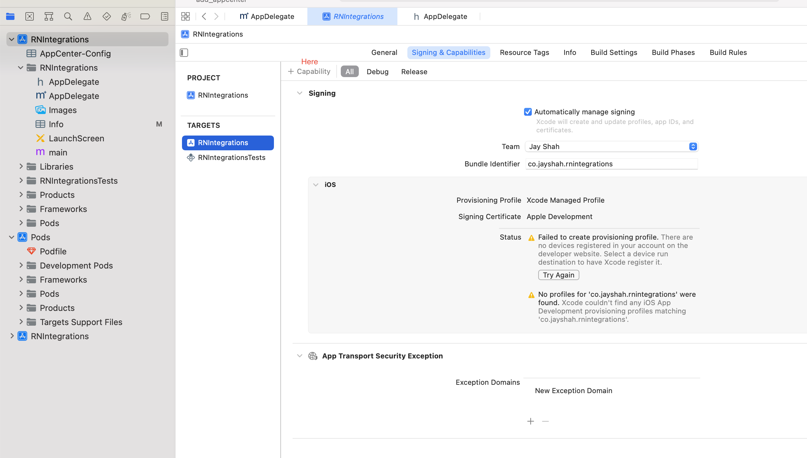
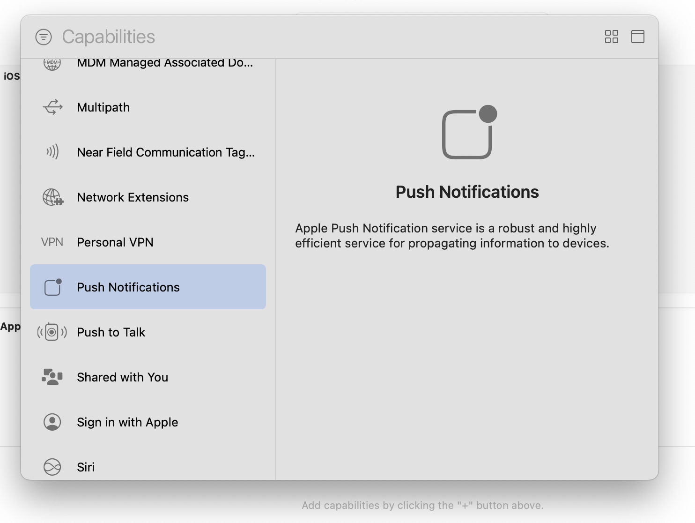
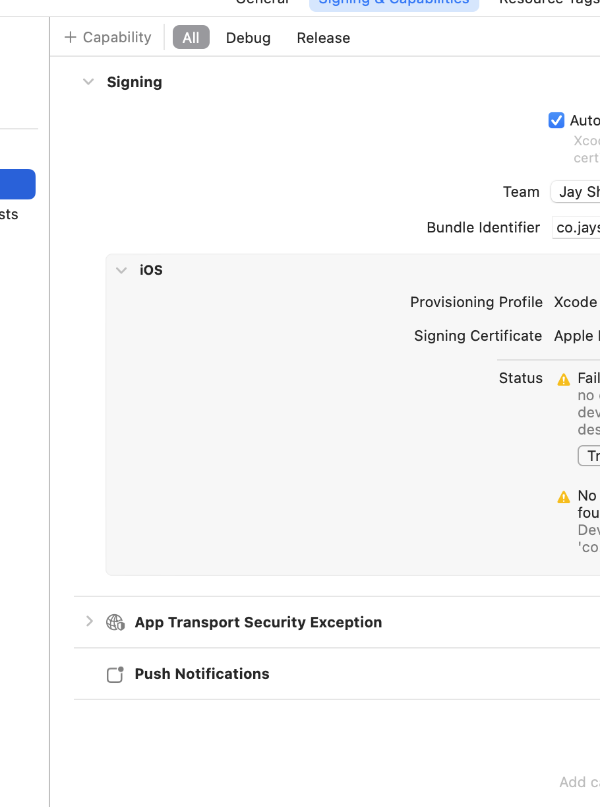
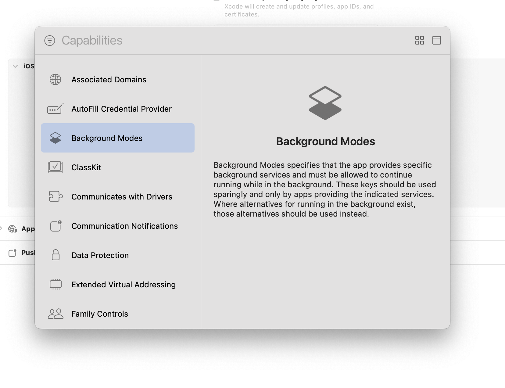
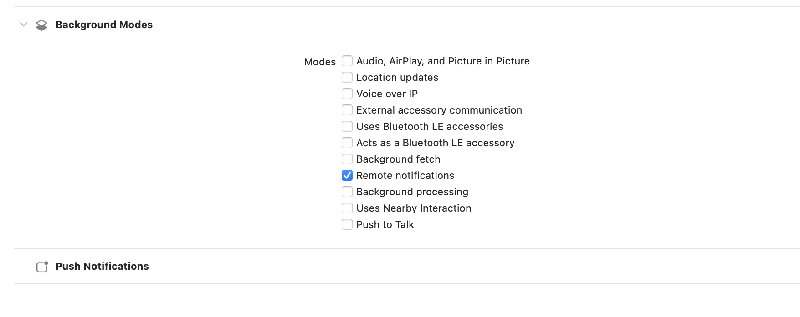
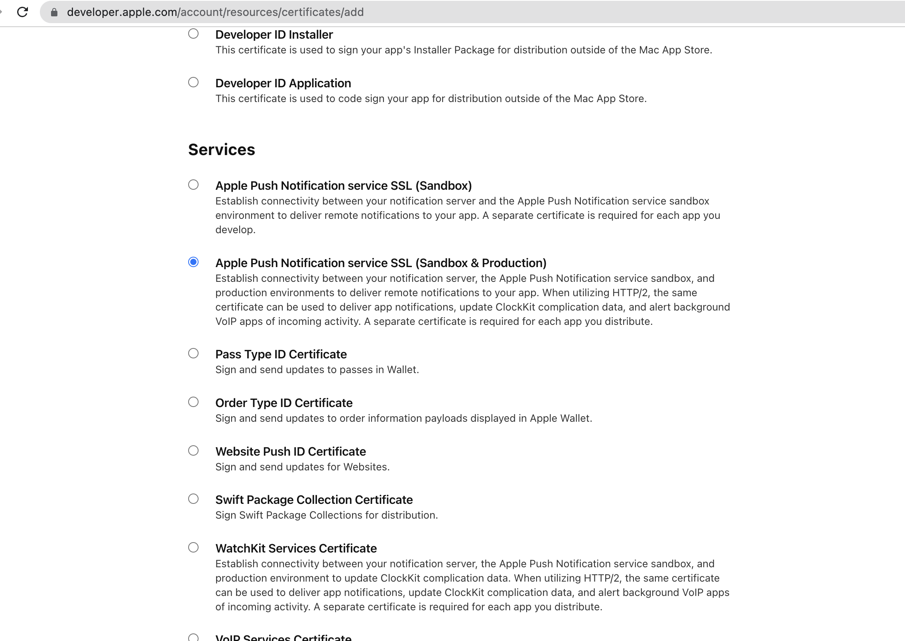
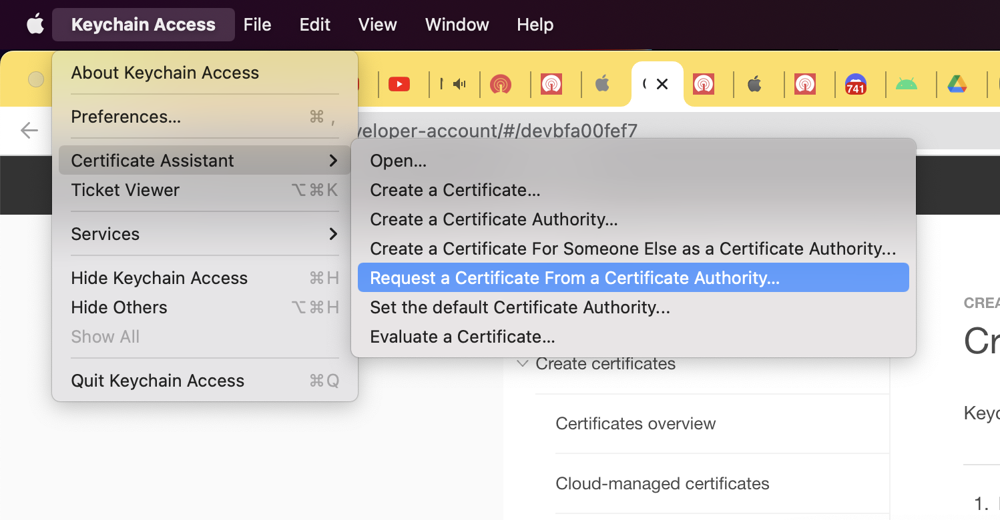
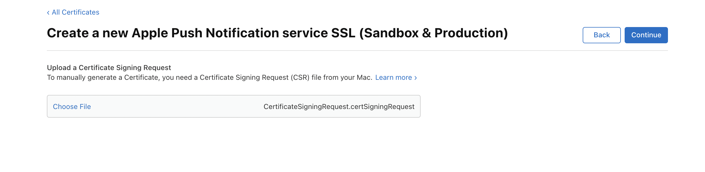
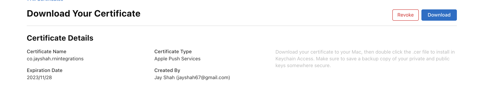
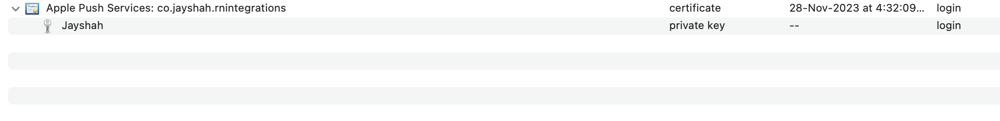

An iOS **Push Certificate is required** for push notification delivery to all iOS mobile apps.

## Capabilities and entitlements

### Adding Push notification capability

A capability grants your app access to an app service that Apple provides, such as CloudKit, Game Center, or In-App Purchase. To use some app services, you must provision your app, adding a capability with Xcode’s project editor that configures the app service correctly for you.

Selecting capability from list of capabilities:

All capabilities list:

### Adding background modes - remote notifications capability (different from Push Notifications capability)

After adding background modes capability, select "Remote Notifications"

## Registering with APNs

https://developer.apple.com/documentation/usernotifications/registering_your_app_with_apns

## Creating a Push notification certificate from Web UI

Click on "+" button on "Certificates" tab in: "Certificates, Identifiers and profile" Page.

You will see below screen:

* Then generate Cert Signing request using "Keychain"

* Save "CSR - cert signing request" to disk

* Upload CSR to create final "Push Certificate"

* Download and install "Push Certificate" - contains both private & public key.

