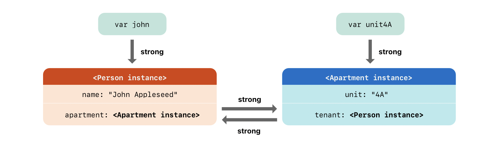
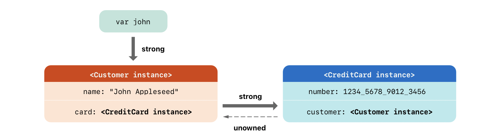

**Reference counting applies only to instances of classes.**
Structures and enumerations are value types, not reference types, and aren’t stored and passed by reference.


## How ARC works

if ARC were to deallocate an instance that was still in use, it would no longer be possible to access that instance’s properties, or call that instance’s methods. Indeed, if you tried to access the instance, your app would most likely crash.

ARC tracks how many properties, constants, and variables are currently referring to each class instance. 

ARC will not deallocate an instance as long as at least one active reference to that instance still exists.

**Strong Reference** - whenever you assign a class instance to a property, constant, or variable, that property, constant, or variable makes a strong reference to the instance. The reference is called a “strong” reference because it keeps a firm hold on that instance, and doesn’t allow it to be deallocated for as long as that strong reference remains.

### Strong reference cycles

if two class instances hold a strong reference to each other, such that each instance keeps the other alive. This is known as a strong reference cycle.

Here is how strong ref cycle is created, basically in the object graph, create a cycle via object reference


```swift
class Person {
    let name: String
    init(name: String) { self.name = name }
    var apartment: Apartment?
    deinit { print("\(name) is being deinitialized") }
}

class Apartment {
    let unit: String
    init(unit: String) { self.unit = unit }
    var tenant: Person?
    deinit { print("Apartment \(unit) is being deinitialized") }
}

var john: Person?
var unit4A: Apartment?

john = Person(name: "John Appleseed")
unit4A = Apartment(unit: "4A")
// creating a cycle
john!.apartment = unit4A
unit4A!.tenant = john
```

How strong ref cycle looks like:


NO deallocation happens when we set top level variables to nil due to strong retain cycle
```swift
john = nil
unit4A = nil
// No dealloc happens, since both instances are held by strong references.
```

## Weak references

A weak reference is a reference that doesn’t keep a strong hold on the instance it refers to, and so doesn’t stop ARC from disposing of the referenced instance. 

This behavior prevents the reference from becoming part of a strong reference cycle. You indicate a weak reference by placing the weak keyword before a property or variable declaration.

it’s possible for that instance to be deallocated while the weak reference is still referring to it.

**ARC automatically sets a weak reference to nil when the instance that it refers to is deallocated.**

**Weak References always declared as variables of an optional type, since they can be nil or instance, i.e. `weak var myinst`**

e.g.
```swift
class Apartment {
    let unit: String
    init(unit: String) { self.unit = unit }
    weak var tenant: Person? // weak var means weakly held Person instance
    deinit { print("Apartment \(unit) is being deinitialized") }
}
```

**Note** - with ARC, values are deallocated as soon as their last strong reference is removed.

So, if you simply try to create a weakreference, with no backlinks via strong references, instances will be immediately allocated and deallocated.
e.g.
```swift
class Myclass {
    weak var k: Person?
    init() {
        k = Person() // instance will be immediately deallocated!, Person instance must participate in object graph via atleast one strong reference
    }
}
```

**Note** Using `weak self` will make `self` as a `var` instead of a constant, and hence all uses of `self` inside a closure having a `weak self`, must put appropriate nullability checks in place.

Using `weak self` in a closure will help prevent memory leaks in cases, where closure access the enclosing instances via `self`, to know more, refer [here](Methods.md)

## Unowned references

Like a weak reference, an unowned reference doesn’t keep a strong hold on the instance it refers to. 

Unlike a weak reference, however, 
**an unowned reference is used when the other instance has the same lifetime or a longer lifetime.**

The whole idea is ownership should form a tree (which allows for recursive reference counting cleanup), and not have cycles, or prevent cycles/backward edges of strong references by making them `unowned`.

an unowned reference is expected to always have a value, so it is not optional, and ARC never sets an unowned reference’s value to nil.
so the usage is `unowned let someInstance`

Use an unowned reference only when you are sure that the reference always refers to an instance that hasn’t been deallocated.

If you try to access the value of an unowned reference after that instance has been deallocated, you’ll get a runtime error.

```swift
class Customer {
    let name: String
    var card: CreditCard? // by default a reference relationship is of ownership.
    init(name: String) {
        self.name = name
    }
    deinit { print("\(name) is being deinitialized") }
}

class CreditCard {
    let number: UInt64
    unowned let customer: Customer // Customer instance lives longer, and is not owned by credit card
    init(number: UInt64, customer: Customer) {
        self.number = number
        self.customer = customer
    }
    deinit { print("Card #\(number) is being deinitialized") }
}

var john: Customer?
john = Customer(name: "John Appleseed")
john!.card = CreditCard(number: 1234_5678_9012_3456, customer: john!)


// var removes strong reference, and recursively strong references are eliminated from owners
john = nil
// Prints "John Appleseed is being deinitialized"
// Prints "Card #1234567890123456 is being deinitialized"
```

Here is how it looks:


Once the var points to `nil`, there are no strong references to `Customer instance`,
so Customer instance will be deallocated, once customer instance is deallocated, there are no strong references to `CreditCard instance`, so `CreditCard instance` will be deallocated. 

### unowned optional references (via unowned var someInst: InstType?)

Even though with `unowned var`, type can be `Inst` or `Inst?` i.e. non-optional or optional.
an unowned optional reference and a weak reference can both be used in the same contexts. The difference is that when you use an unowned optional reference, 
you’re responsible for making sure it always refers to a valid object or is set to nil.


### weak vs unowned refernces

Another solution to retain cycles is an unowned reference. Like a weak reference, an unowned reference does not increment or decrement the reference count of an object. However, **unlike a weak reference, the program guarantees to the Swift compiler that an unowned reference will not be nil when it is accessed.**

