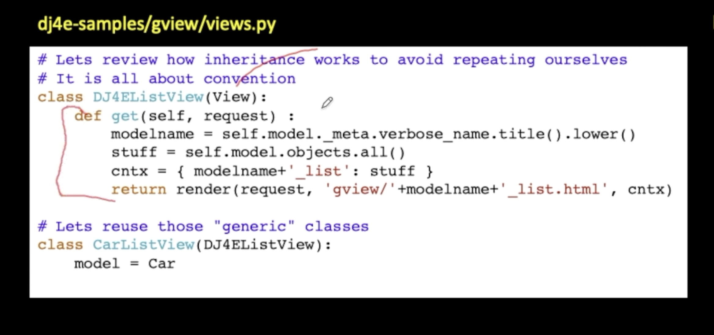

https://docs.djangoproject.com/en/4.1/ref/class-based-views/generic-display/

##

The `DetailView` generic view expects the primary key value captured from the URL to be called `pk`, so we’ve changed `question_id` to `pk` for the generic views.

## An example of how a generic ListView might work:



As you can see it does following:
1. get model name
2. pull all objects for that model
3. put the list of objects in a context
4. call template with that list to render.


### Generic Display views

**Designed to display data**

https://docs.djangoproject.com/en/4.1/ref/class-based-views/generic-display/

1. `generic.list.ListView` - A page representing a list of objects. While this view is executing, self.object_list will contain the list of objects (usually, but not necessarily a queryset) that the view is operating upon.
2. `generic.detail.DetailView` - The `DetailView` generic view expects the primary key value captured from the URL to be called `pk`, so we’ve changed question_id to pk for the generic views.

`DetailView` - Generic detail view DetailView must be called with either an object `pk` or a slug in the URLconf.

To configure generic views, we typically use:
1. `model`
2. `template_name`
3. `context_object_name` - optional
4. `override get_queryset()` - optional

e.g.

```py
class IndexView(generic.ListView):
    template_name = 'polls/index.html'
    context_object_name = 'latest_question_list'

    def get_queryset(self):
        return Question.objects.order_by('-pub_date')


class DetailView(generic.DetailView):
    model = Question
    template_name = 'polls/detail.html'


class ResultsView(generic.DetailView):
    model = Question
    template_name = 'polls/results.html'
```

### DetailView

By default, the `DetailView` generic view uses a template called `<app name>/<model name>_detail.html`. In our case, it would use the template `polls/question_detail.html`. The template_name attribute is used to tell Django to use a specific template name instead of the autogenerated default template name. We also specify the `template_name` for the results list view – this ensures that the results view and the detail view have a different appearance when rendered, even though they’re both a `DetailView` behind the scenes.


### ListView

Similarly, the `ListView` generic view uses a default template called `<app name>/<model name>_list.html`; we use template_name to tell ListView to use our existing `polls/index.html` template.

In previous parts of the tutorial, the templates have been provided with a context that contains the question and `latest_question_list` context variables. For DetailView the question variable is provided automatically – since we’re using a Django model (Question), Django is able to determine an appropriate name for the context variable. 

However, for ListView, the **automatically generated context variable is `question_list`**. To override this we provide the `context_object_name` attribute, specifying that we want to use `latest_question_list` instead. As an alternative approach, you could change your templates to match the new default context variables – but it’s a lot easier to tell Django to use the variable you want.


### Generic Editing Views

https://docs.djangoproject.com/en/4.1/ref/class-based-views/generic-editing/

1. `generic.edit.FormView` - A view that displays a form. On error, redisplays the form with validation errors; on success, redirects to a new URL.
2. `generic.edit.CreateView`
3. `generic.edit.UpdateView`
4. `generic.edit.DeleteView`


## Common Mixins

### SingleObjectMixin

Provides a mechanism for looking up an object associated with the current HTTP request.

Methods and Attributes

**model**¶
The model that this view will display data for. Specifying model = Foo is effectively the same as specifying queryset = Foo.objects.all(), where objects stands for Foo’s default manager.

**queryset¶**
A QuerySet that represents the objects. If provided, the value of queryset supersedes the value provided for model.

**context_object_name¶**
Designates the name of the variable to use in the context.

**get_object(queryset=None)¶**
Returns the single object that this view will display. If queryset is provided, that queryset will be used as the source of objects; otherwise, get_queryset() will be used. get_object() looks for a pk_url_kwarg argument in the arguments to the view; if this argument is found, this method performs a primary-key based lookup using that value. If this argument is not found, it looks for a slug_url_kwarg argument, and performs a slug lookup using the slug_field.

When query_pk_and_slug is True, get_object() will perform its lookup using both the primary key and the slug.

**get_queryset()¶**
Returns the queryset that will be used to retrieve the object that this view will display. By default, get_queryset() returns the value of the queryset attribute if it is set, otherwise it constructs a QuerySet by calling the all() method on the model attribute’s default manager.

**get_context_data(**kwargs)¶**
Returns context data for displaying the object.

The base implementation of this method requires that the self.object attribute be set by the view (even if None). Be sure to do this if you are using this mixin without one of the built-in views that does so.

It returns a dictionary with these contents:

`object`: The object that this view is displaying (self.object).
`context_object_name`: `self.object` will also be stored under the name returned by `get_context_object_name()`, which defaults to the lowercased version of the model name.

### views.generic.base.TemplateResponseMixin

Provides a mechanism to construct a **TemplateResponse**, given suitable context. The template to use is configurable and can be further customized by subclasses.

Attributes:

**template_name¶** 

The full name of a template to use as defined by a string. Not defining a template_name will raise a django.core.exceptions.ImproperlyConfigured exception.

**response_class¶**

The response class to be returned by render_to_response method. Default is TemplateResponse. The template and context of TemplateResponse instances can be altered later (e.g. in template response middleware).

If you need custom template loading or custom context object instantiation, create a TemplateResponse subclass and assign it to response_class.

Methods:

**render_to_response(context, **response_kwargs)¶**

Returns a `self.response_class` instance.

If any keyword arguments are provided, they will be passed to the constructor of the response class.

Calls `get_template_names()` to obtain the list of template names that will be searched looking for an existent template.

**get_template_names()¶**
Returns a list of template names to search for when rendering the template. The first template that is found will be used.

The default implementation will return a list containing `template_name` (if it is specified).

### ContentMixin
Attributes:

`extra_context` - A dictionary to include in the context. This is a convenient way of specifying some context in as_view(). Example usage:
```py
from django.views.generic import TemplateView
TemplateView.as_view(extra_context={'title': 'Custom Title'})
```

Methods:

**get_context_data(**kwargs)¶**
Returns a dictionary representing the template context

### MupltipleObjectMixin extends ContentMixin

A mixin that can be used to display a list of objects.

Attributes & Methods:
1. `allow_empty`
2. `model`
3. `queryset`
4. `paginate_by`
5. `get_queryset()`
6. `get_context_data()`
7. 