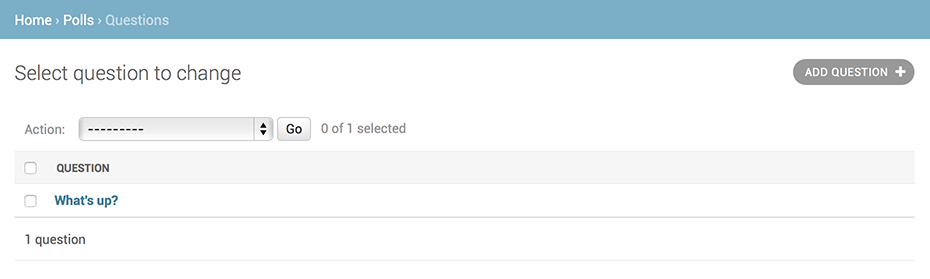

## Core classes

Django apps are “pluggable”: You can use an app in multiple projects, and you can distribute apps, because they don’t have to be tied to a given Django installation.

## How to play around with DJango APIs

Open shell using following:
```
python manage.py shell
```

Then try things like following:
```sh
>>> from polls.models import Choice, Question  # Import the model classes we just wrote.

# No questions are in the system yet.
>>> Question.objects.all()
<QuerySet []>

# Create a new Question.
# Support for time zones is enabled in the default settings file, so
# Django expects a datetime with tzinfo for pub_date. Use timezone.now()
# instead of datetime.datetime.now() and it will do the right thing.
>>> from django.utils import timezone
>>> q = Question(question_text="What's new?", pub_date=timezone.now())

# Save the object into the database. You have to call save() explicitly.
>>> q.save()

# Now it has an ID.
>>> q.id
1

# Access model field values via Python attributes.
>>> q.question_text
```

### HTTPResponse

Part of `django.http` module.
https://docs.djangoproject.com/en/4.1/ref/request-response/

## URL Management

To design URLs for an app, you create a Python module informally called a `URLconf` (URL configuration). This module is pure Python code and is a **mapping between URL path expressions to Python functions (your views)**.

https://docs.djangoproject.com/en/4.1/topics/http/urls/#url-dispatcher

### HOw django processes a request

When a user requests a page from your Django-powered site, this is the algorithm the system follows to determine which Python code to execute:

1. Django determines the root `URLconf` module to use. Ordinarily, this is the value of the `ROOT_URLCONF` setting, but if the incoming HttpRequest object has a urlconf attribute (set by middleware), its value will be used in place of the `ROOT_URLCONF` setting.
2. Django loads that Python module and looks for the variable **urlpatterns**. This should be a sequence of `django.urls.path()` and/or `django.urls.re_path()` instances.
3. Django runs through each URL pattern, in order, and stops at the first one that matches the requested URL, matching against path_info.
4. Once one of the URL patterns matches, Django imports and calls the given view, which is a Python function (or a class-based view). The view gets passed the following arguments:
   1. An instance of `HttpRequest`.
   2. If the matched URL pattern contained no named groups, then the matches from the regular expression are provided as positional arguments.
   3. The keyword arguments are made up of any named parts matched by the path expression that are provided, overridden by any arguments specified in the optional kwargs argument to django.urls.path() or django.urls.re_path().
5. If no URL pattern matches, or if an exception is raised during any point in this process, Django invokes an appropriate error-handling view. See Error handling below.


## URL ROuting with `urls.path`

Use `path(route, view, kwargs=None, name=None)` which return URLResolver.

like following:
```py
from django.urls import include, path

urlpatterns = [
    path('index/', views.index, name='main-view'),
    path('bio/<username>/', views.bio, name='bio'),
    path('articles/<slug:title>/', views.article, name='article-detail'),
    path('articles/<slug:title>/<int:section>/', views.section, name='article-section'),
    path('blog/', include('blog.urls')),
    ...
]
```

### usage of include

The `include()` function allows referencing other URLconfs. Whenever Django encounters `include()`, it chops off whatever part of the URL matched up to that point and sends the remaining string to the included URLconf for further processing.


`include` helps us include/nest an array of path<->view mappings.
Thus help us create a tree of `path<->view` mappings by allowing nested paths.

```py
from django.urls import include, path

urlpatterns = [
    # ... snip ...
    path('community/', include('aggregator.urls')), # nest in another array of aggregator urls/paths at /community/
    path('contact/', include('contact.urls')),
    # ... snip ...
]
```

## Models

model code gives Django a lot of information. With it, Django is able to:

* Create a database schema (CREATE TABLE statements) for this app.
* Create a Python database-access API for accessing Question and Choice objects

```py
from django.db import models

# Create your models here.
class Question(models.Model):
    question_text = models.CharField(max_length=200)
    pub_date = models.DateTimeField('date published')

    def __str__(self):
        return self.question_text

class Choice(models.Model):
    question = models.ForeignKey(Question, on_delete=CASCADE)
    choice_text = models.CharField(max_length=200)
    votes = models.IntegerField(default=0)

    def __str__(self):
        return "q:"+self.question.question_text+" choice:"+self.choice_text
```

`ModelName.objects` returns a Model Manager, which has methods like `.all()` etc which return a `QuerySet`.

### Methods on the `ModelName.objects` manager

```
>>> Question.objects.
Question.objects.aaggregate(           Question.objects.defer(
Question.objects.abulk_create(         Question.objects.difference(
Question.objects.abulk_update(         Question.objects.distinct(
Question.objects.acontains(            Question.objects.earliest(
Question.objects.acount(               Question.objects.exclude(
Question.objects.acreate(              Question.objects.exists(
Question.objects.aearliest(            Question.objects.explain(
Question.objects.aexists(              Question.objects.extra(
Question.objects.aexplain(             Question.objects.filter(
Question.objects.afirst(               Question.objects.first(
Question.objects.aget(                 Question.objects.from_queryset(
Question.objects.aget_or_create(       Question.objects.get(
Question.objects.aggregate(            Question.objects.get_or_create(
Question.objects.ain_bulk(             Question.objects.get_queryset()
Question.objects.aiterator(            Question.objects.in_bulk(
Question.objects.alast(                Question.objects.intersection(
Question.objects.alatest(              Question.objects.iterator(
Question.objects.alias(                Question.objects.last(
Question.objects.all()                 Question.objects.latest(
Question.objects.annotate(             Question.objects.model(
Question.objects.aupdate(              Question.objects.name
Question.objects.aupdate_or_create(    Question.objects.none(
Question.objects.auto_created          Question.objects.only(
Question.objects.bulk_create(          Question.objects.order_by(
Question.objects.bulk_update(          Question.objects.prefetch_related(
Question.objects.check(                Question.objects.raw(
Question.objects.complex_filter(       Question.objects.reverse(
Question.objects.contains(             Question.objects.select_for_update(
Question.objects.contribute_to_class(  Question.objects.select_related(
Question.objects.count(                Question.objects.union(
Question.objects.create(               Question.objects.update(
Question.objects.creation_counter      Question.objects.update_or_create(
Question.objects.dates(                Question.objects.use_in_migrations
Question.objects.datetimes(            Question.objects.using(
Question.objects.db                    Question.objects.values(
Question.objects.db_manager(           Question.objects.values_list(
Question.objects.deconstruct()         
```

### Saving model with `ModelName.save()`

### QuerySet

Query set is just like a set of model instances, commonly returned by objects manager methods like `ModelName.objects.all()` or `ModelName.objects.filter()`


### Migrations

**migrations are entirely derived from your models file, and are essentially a history that Django can roll through to update your database schema to match your current models.**

Migrating a particular app `polls` (Nothing will happen unless you install the app in apps.py):
```
python manage.py makemigrations polls
```
As a result of this command, migration logic/files are auto generated in `appname/migrations/xyz_001.py`.

By running **makemigrations**, you’re telling Django that you’ve made some changes to your models (in this case, you’ve made new ones) and that you’d like the changes to be stored as a migration.

Migrations are how Django stores changes to your models (and thus your database schema) - they’re files on disk. You can read the migration for your new model if you like; it’s the file polls/migrations/0001_initial.py. Don’t worry, you’re not expected to read them every time Django makes one, but they’re designed to be human-editable in case you want to manually tweak how Django changes things.

`Note`: If you try to run `migrate` without running `makemigrations`, you will get following error:
```
  Your models in app(s): 'polls' have changes that are not yet reflected in a migration, and so won't be applied.
  Run 'manage.py makemigrations' to make new migrations, and then re-run 'manage.py migrate' to apply them.
```

### Admin UI interface generated from a model



1. The form is automatically generated from the Question model.
2. The different model field types (DateTimeField, CharField) correspond to the appropriate HTML input widget. Each type of field knows how to display itself in the Django admin.
3. Each DateTimeField gets free JavaScript shortcuts. Dates get a “Today” shortcut and calendar popup, and times get a “Now” shortcut and a convenient popup that lists commonly entered times.
The bottom part of the page gives you a couple of options:


1. Save – Saves changes and returns to the change-list page for this type of object.
2. Save and continue editing – Saves changes and reloads the admin page for this object.
3. Save and add another – Saves changes and loads a new, blank form for this type of object.
4. Delete – Displays a delete confirmation page.


## Inspecting SQL migration changes(dry run)

The `sqlmigrate` command doesn’t actually run the migration on your database - instead, it prints it to the screen so that you can see what SQL Django thinks is required. It’s useful for checking what Django is going to do or if you have database administrators who require SQL scripts for changes.

```
python manage.py sqlmigrate polls 0001
```

```SQL
BEGIN;
--
-- Create model Question
-- polls is the name of the app, question is the name of the table
CREATE TABLE "polls_question" ("id" integer NOT NULL PRIMARY KEY AUTOINCREMENT, "question_text" varchar(200) NOT NULL, "pub_date" datetime NOT NULL);
--
-- Create model Choice
-- polls is the name of app, choice is name of the table
CREATE TABLE "polls_choice" ("id" integer NOT NULL PRIMARY KEY AUTOINCREMENT, "choice_text" varchar(200) NOT NULL, "votes" integer NOT NULL, "question_id" bigint NOT NULL REFERENCES "polls_question" ("id") DEFERRABLE INITIALLY DEFERRED);
CREATE INDEX "polls_choice_question_id_c5b4b260" ON "polls_choice" ("question_id");
COMMIT;
```


### Applying migrations

```
(.venv) jayshah@jays-MacBook-Pro django_project % python manage.py migrate              
Operations to perform:
  Apply all migrations: admin, auth, contenttypes, polls, sessions
Running migrations:
  Applying polls.0001_initial... OK
```

Primary keys (IDs) are added automatically.
On observing closesly, we see tables generated with `appname_modelname` convention:
```SQL
BEGIN;
--
-- Create model Question
-- polls is the name of the app, question is the name of the table
CREATE TABLE "polls_question" ("id" integer NOT NULL PRIMARY KEY AUTOINCREMENT, "question_text" varchar(200) NOT NULL, "pub_date" datetime NOT NULL);
--
-- Create model Choice
-- polls is the name of app, choice is name of the table
CREATE TABLE "polls_choice" ("id" integer NOT NULL PRIMARY KEY AUTOINCREMENT, "choice_text" varchar(200) NOT NULL, "votes" integer NOT NULL, "question_id" bigint NOT NULL REFERENCES "polls_question" ("id") DEFERRABLE INITIALLY DEFERRED);
CREATE INDEX "polls_choice_question_id_c5b4b260" ON "polls_choice" ("question_id");
COMMIT;
```

### 3 step guide to model migration changes

the three-step guide to making model changes:

1. Change your models (in `models.py`).
2. Run `python manage.py makemigrations` to create migrations for those changes.
3. Run `python manage.py migrate` to apply those changes to the database.


## Default installed apps

`django.contrib.admin` – The admin site. You’ll use it shortly.
`django.contrib.auth` – An authentication system.
`django.contrib.contenttypes` – A framework for content types.
`django.contrib.sessions` – A session framework.
`django.contrib.messages` – A messaging framework.
`django.contrib.staticfiles` – A framework for managing static files.

