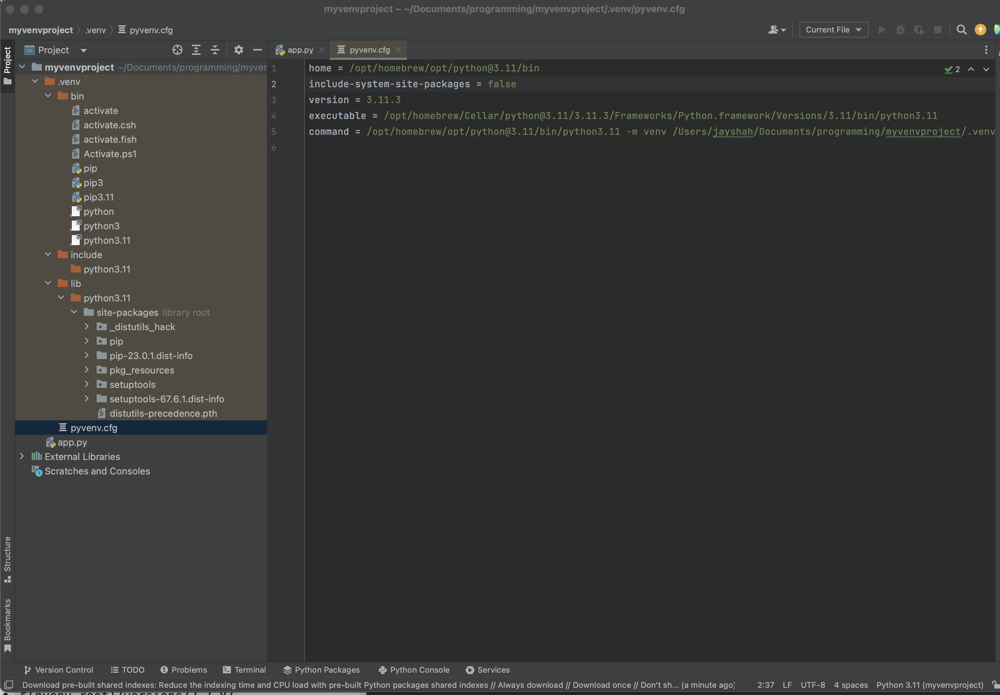

https://docs.python.org/3/tutorial/venv.html

https://docs.python-guide.org/dev/virtualenvs/


## What is a virtual environment?

A combination of python interpreter version + associated library packages.

## 

Python applications will often use packages and modules that don’t come as part of the standard library. Applications will sometimes need a specific version of a library, because the application may require that a particular bug has been fixed or the application may be written using an obsolete version of the library’s interface.

This means it may not be possible for one Python installation to meet the requirements of every application. If application A needs version 1.0 of a particular module but application B needs version 2.0, then the requirements are in conflict and installing either version 1.0 or 2.0 will leave one application unable to run.

**The solution for this problem is to create a virtual environment, a self-contained directory tree that contains a Python installation for a particular version of Python, plus a number of additional packages.**

Different applications can then use different virtual environments. To resolve the earlier example of conflicting requirements, application A can have its own virtual environment with version 1.0 installed while application B has another virtual environment with version 2.0. If application B requires a library be upgraded to version 3.0, this will not affect application A’s environment.

## Prerequisites

we need python3 or later to create a virtual env

## Create virtual environment

To create a virtual environment, decide upon a directory where you want to place it, and run the venv module as a script with the directory path:

**This will create the tutorial-env directory if it doesn’t exist, and also create directories inside it containing a copy of the Python interpreter and various supporting files**

```sh
python3 -m venv tutorial-env # a folder named tutorial-env gets created with virtual env info
```


Or a popular choice is `.venv` 
```sh
python3 -m venv .venv # a folder named .venv gets created with virtual env info
```

A common directory location for a virtual environment is `.venv`. This name keeps the directory typically hidden in your shell and thus out of the way while giving it a name that explains why the directory exists

## Activate virtual environment

On **Windows**, run:
```sh
tutorial-env\Scripts\activate.bat
```
On **Unix or MacOS**, run:
```sh
source tutorial-env/bin/activate
```
or 
```sh
source .venv/bin/activate
```

**Activating the virtual environment will change your shell’s prompt to show what virtual environment you’re using, and modify the environment so that running python will get you that particular version and installation of Python. For example**


## What is the structure of a virtual environment directory?

Virtual env dir shape: 

## How does virtual environment activation work?

**It works by shimming a path in front of your $PATH**. **This is what allows you to have project specific interpreter/libs**

E.g. PATH before environment activation:
```sh
$ echo $PATH
/Users/jayshah/.opam/default/bin:/Users/jayshah/.yarn/bin:/Users/jayshah/.config/yarn/global/node_modules/.bin:/Users/jayshah/.rbenv/shims:/Users/jayshah/opt/anaconda3/bin:/Users/jayshah/.gem/bin:/Users/jayshah/.rbenv/shims:/Users/jayshah/.nvm/versions/node/v16.13.1/bin:/opt/homebrew/bin:/opt/homebrew/sbin:/usr/local/bin:/System/Cryptexes/App/usr/bin:/usr/bin:/bin:/usr/sbin:/sbin:/Library/TeX/texbin:/usr/local/go/bin:/usr/local/MacGPG2/bin:/usr/local/share/dotnet:~/.dotnet/tools:/Library/Apple/usr/bin:/Library/Frameworks/Mono.framework/Versions/Current/Commands:/Applications/Wireshark.app/Contents/MacOS:/var/run/com.apple.security.cryptexd/codex.system/bootstrap/usr/local/bin:/var/run/com.apple.security.cryptexd/codex.system/bootstrap/usr/bin:/var/run/com.apple.security.cryptexd/codex.system/bootstrap/usr/appleinternal/bin:/Users/jayshah/.cargo/bin:/Users/jayshah/Library/Android/sdk/emulator:/Users/jayshah/Library/Android/sdk/tools:/Users/jayshah/Library/Android/sdk/tools/bin:/Users/jayshah/Library/Android/sdk/platform-tools:/Users/jayshah/Documents/depot_tools:/Users/jayshah/Documents/depot_tools
```

After doing `source .venv/bin/activate` inside `myproject`,
```sh
jayshah@192 myvenvproject % source .venv/bin/activate
(.venv) jayshah@192 myvenvproject % echo $PATH # notice below how .venv/bin is appended to front of $PATH
/Users/jayshah/Documents/programming/myvenvproject/.venv/bin:/Users/jayshah/.opam/default/bin:/Users/jayshah/.yarn/bin:/Users/jayshah/.config/yarn/global/node_modules/.bin:/Users/jayshah/.rbenv/shims:/Users/jayshah/opt/anaconda3/bin:/Users/jayshah/.gem/bin:/Users/jayshah/.rbenv/shims:/Users/jayshah/.nvm/versions/node/v16.13.1/bin:/opt/homebrew/bin:/opt/homebrew/sbin:/usr/local/bin:/System/Cryptexes/App/usr/bin:/usr/bin:/bin:/usr/sbin:/sbin:/Library/TeX/texbin:/usr/local/go/bin:/usr/local/MacGPG2/bin:/usr/local/share/dotnet:~/.dotnet/tools:/Library/Apple/usr/bin:/Library/Frameworks/Mono.framework/Versions/Current/Commands:/Applications/Wireshark.app/Contents/MacOS:/var/run/com.apple.security.cryptexd/codex.system/bootstrap/usr/local/bin:/var/run/com.apple.security.cryptexd/codex.system/bootstrap/usr/bin:/var/run/com.apple.security.cryptexd/codex.system/bootstrap/usr/appleinternal/bin:/Users/jayshah/.cargo/bin:/Users/jayshah/Library/Android/sdk/emulator:/Users/jayshah/Library/Android/sdk/tools:/Users/jayshah/Library/Android/sdk/tools/bin:/Users/jayshah/Library/Android/sdk/platform-tools:/Users/jayshah/Documents/depot_tools:/Users/jayshah/Documents/depot_tools
```
Similarly `deactivate` will remove this extra path from front of your `$PATH`.