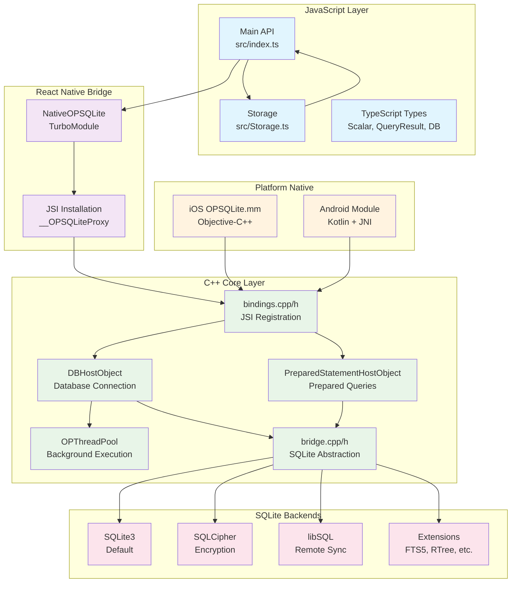
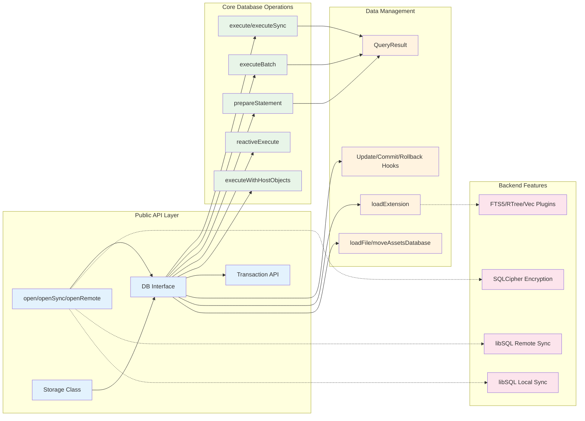
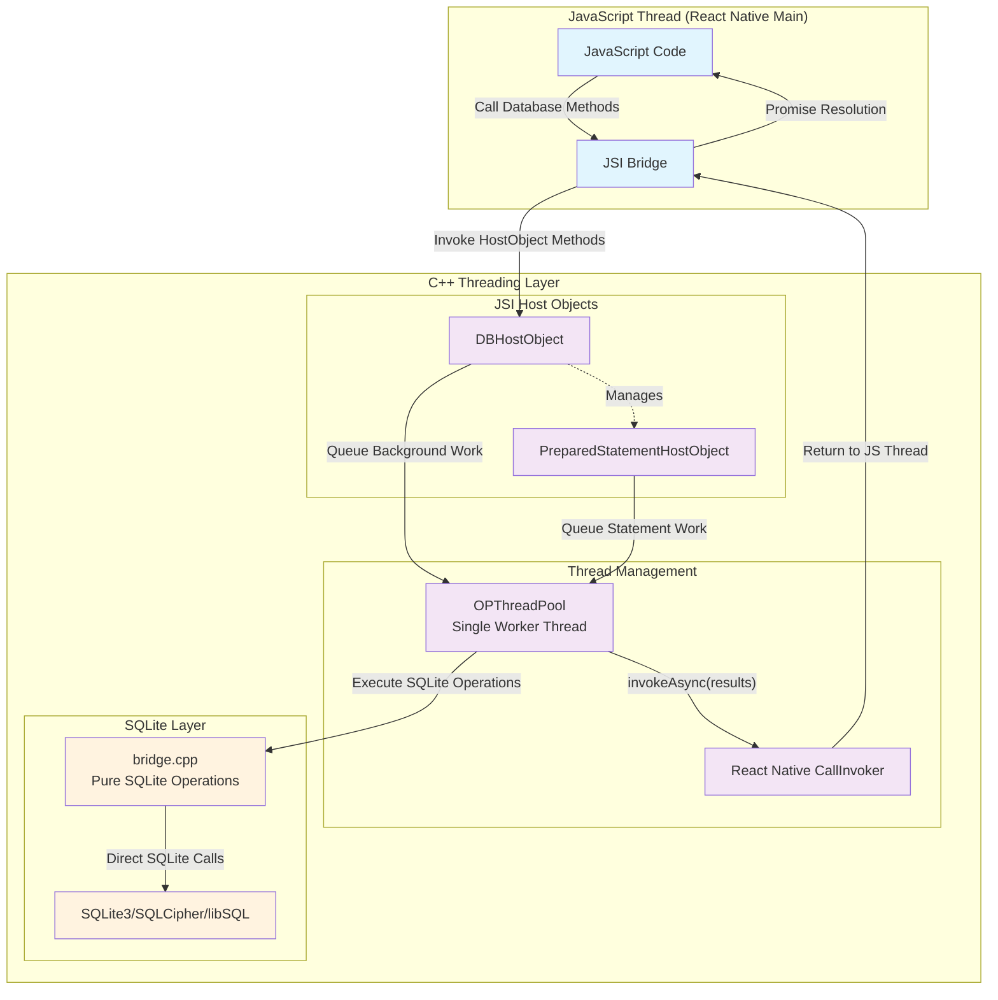

## op-sqlite Architecture Overview

### Arch 1



### arch 2




## Threading arch



### 📁 Folder Structure & Layered Architecture

```
op-sqlite/
├── src/                    # JavaScript/TypeScript API Layer
│   ├── index.ts           # Main public API exports
│   ├── Storage.ts         # AsyncStorage-compatible wrapper
│   └── NativeOPSQLite.ts  # TurboModule specification
├── cpp/                   # C++ Core Engine
│   ├── bindings.*         # JSI installation & global proxy
│   ├── DBHostObject.*     # Database connection management
│   ├── bridge.*           # SQLite operations abstraction
│   ├── OPThreadPool.*     # Background thread management
│   └── PreparedStatementHostObject.*  # Prepared queries
├── ios/                   # iOS Platform Layer
│   └── OPSQLite.mm        # Objective-C++ TurboModule
├── android/               # Android Platform Layer
│   ├── OPSQLiteModule.kt  # Kotlin TurboModule
│   └── cpp-adapter.cpp    # JNI bridge
├── c_sources/             # SQLite source variants
└── example/               # Demo application
```

### 🏗️ Architecture Layers

**Layer 1: JavaScript API** ([`src/index.ts`](file:///Users/jayshah/Documents/github/personal/clones/op-sqlite/src/index.ts))
- Public interfaces: `open()`, `openSync()`, `openRemote()`
- Database operations: `execute()`, `transaction()`, `executeBatch()`
- Type definitions: `DB`, `QueryResult`, `Transaction`
- Storage abstraction: AsyncStorage-compatible API

**Layer 2: React Native Bridge** ([`src/NativeOPSQLite.ts`](file:///Users/jayshah/Documents/github/personal/clones/op-sqlite/src/NativeOPSQLite.ts))
- TurboModule specification
- JSI installation via `__OPSQLiteProxy`
- Platform constants and utilities

**Layer 3: C++ Core Engine** (`cpp/`)
- JSI HostObjects for zero-copy data transfer
- Thread pool for non-blocking operations  
- Multiple SQLite backend support
- Prepared statement management

**Layer 4: Platform-Specific Native**
- iOS: Objective-C++ with framework support
- Android: Kotlin + JNI integration
- Platform-specific file paths and permissions

**Layer 5: SQLite Backends**
- Vanilla SQLite3 (default)
- SQLCipher (encryption)
- libSQL (remote sync with Turso)
- Extensions: FTS5, RTree, cr-sqlite, sqlite-vec

### 🔌 Public Interfaces & APIs

**Core Database Interface:**
```typescript
interface DB {
  // Query Operations
  execute(query: string, params?: Scalar[]): Promise<QueryResult>
  executeSync(query: string, params?: Scalar[]): QueryResult
  executeBatch(commands: SQLBatchTuple[]): Promise<BatchQueryResult>
  executeWithHostObjects(query: string, params?: Scalar[]): Promise<QueryResult>
  
  // Transaction Management
  transaction(fn: (tx: Transaction) => Promise<void>): Promise<void>
  
  // Prepared Statements
  prepareStatement(query: string): PreparedStatement
  
  // Database Management
  close(): void
  attach(params: {secondaryDbFileName: string, alias: string}): void
  loadExtension(path: string, entryPoint?: string): void
  
  // Reactive Queries
  reactiveExecute(params: ReactiveQueryParams): () => void
}
```

**Opening Databases:**
```typescript
// Local SQLite/SQLCipher
open({name: string, location?: string, encryptionKey?: string}): DB

// libSQL with sync capability
openSync({url: string, authToken: string, name: string}): DB

// Remote libSQL (Turso)
openRemote({url: string, authToken: string}): DB
```

**Storage API** ([`src/Storage.ts`](file:///Users/jayshah/Documents/github/personal/clones/op-sqlite/src/Storage.ts)):
```typescript
class Storage {
  getItem(key: string): Promise<string | undefined>
  setItem(key: string, value: string): Promise<void>
  removeItem(key: string): Promise<void>
  clear(): Promise<void>
  // + sync variants
}
```

### ⚠️ Edge Cases & Limitations

**Performance Considerations:**
- Default `execute()` duplicates data (rawRows → objects), use `executeWithHostObjects()` for large results
- `executeBatch()` and `loadFile()` bypass per-call JSI overhead
- Prepared statements only beneficial for repeated identical queries
- mmap sizing critical for large databases (default in Storage: 256MB)

**Thread Safety Issues:**
- Multiple queries on same DB run concurrently but SQLite serializes internally
- Transaction queue prevents write-write races within `transaction()` calls
- Manual `execute()` calls outside transactions can still race
- HostObject lifetime not protected - accessing closed DB causes crashes

**Cross-Platform Gotchas:**
- Extension loading disabled on libSQL and iOS embedded builds
- iOS requires `getDylibPath()` for extension loading
- Android asset database moves can fail silently without storage permissions
- Path handling differs (iOS: NSLibraryDirectory, Android: Context.getDatabasePath)

**Memory & Resource Limits:**
- Large result sets create memory spikes with default marshalling
- Reactive query rowids > 2^53 lose precision in JavaScript
- ArrayBuffer parameter sanitization limited to 2 nesting levels
- No automatic cleanup of abandoned HostObjects

**Build Configuration Risks:**
- Runtime feature detection (`isSQLCipher()`, `isLibsql()`) must match build flags
- SQLite threading mode assumptions (expects THREADSAFE=2)
- Extension compatibility varies by build variant

**Recommended Mitigations:**
- Use `executeRaw()` or HostObjects for large data sets
- Implement proper error handling for installation failures
- Add cleanup logic for long-lived database connections
- Validate build configuration matches runtime expectations
- Monitor memory usage with large result sets or reactive queries

The architecture provides excellent performance through JSI and thread pooling, but requires careful consideration of these edge cases for production deployments.