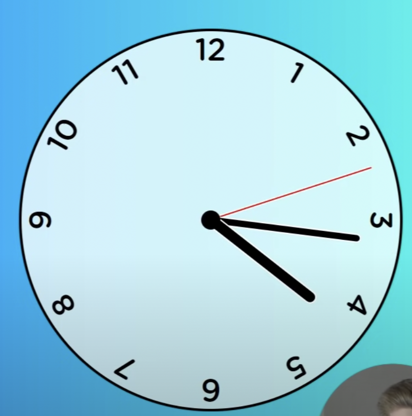

## How to design/render hands of analog clock?

Ans - **any hand can be made using `div` element**

Also separate div for each number represented on clock - 1 to 12.

separate css classes for hour/min/seconds hand.

**Everything inside the clock is positioned absolute.**

## Main clock container

can have fixed height/width fixed e.g. 300px x 300px.

making it circle: use `border-radius: 50%`

## How to position numbers?

Clock must have position relative, so that numbers inside can have position absolute

Furthermore introduce a variable per number, and use it to calculate rotate degree per num

Also each number has to be absolute positioned with `text-align: center` and full height width of clock.

```css
.clock {
    height: 400px;
    width: 400px;
    background-color: aliceblue;
    margin: 0 auto;
    border-radius: 50%;
    border: 2px solid black;
    position: relative;
}

.clock .number {
    position: absolute;
    width: 100%;
    height: 100%;
    text-align: center;
    transform: rotate(calc(30deg * var(--idx)))
}

.number:nth-child(1) {
    --idx: 1
}
.number:nth-child(2) {
    --idx: 2
}
.number:nth-child(3) {
    --idx: 3
}
.number:nth-child(4) {
    --idx: 4
}
.number:nth-child(5) {
    --idx: 5
}
.number:nth-child(6) {
    --idx: 6
}
.number:nth-child(7) {
    --idx: 7
}
.number:nth-child(8) {
    --idx: 8
}
.number:nth-child(9) {
    --idx: 9
}
.number:nth-child(10) {
    --idx: 10
}
.number:nth-child(11) {
    --idx: 11
}
.number:nth-child(12) {
    --idx: 12
}
```

## Styling the hands

Hour hand is usually fatter and shorter in length.
Minute hand is slightly thinner but longer in length.
Seconds hand is the thinnest but the longest in length (almost touches the numbers).

absolute position fixed end of the hand: 
```css
.hand {
    position: absolute;
    bottom: 50%;
    left: 50%;
    width: 8px;
    height: 50%;
    background-color: black;
    transform-origin: bottom left;
}
```

## How does hand position update every second?

Css will use a variable for rotation amount, which will actually be controlled from javascript.

**Note**- usually rotation pivot will be center of the hand
which must be changed to the fixed end of the hand.

There is a technique to set css variable value from js, which must be run every 1s.

```js
root.style.setProperty("--hour-rotation", hourRotation);
root.style.setProperty("--minute-rotation", minsRotation);
root.style.setProperty("--seconds-rotation", secsRotation);
```

And on the css side:
```css
.hour {
    height: 25%;
    transform: translateX(-50%) rotate(calc(1deg * var(--hour-rotation)))
}

.minute {
    height: 35%;
    width: 5px;
    background-color: blue;
    transform: translateX(-50%) rotate(calc(1deg * var(--minute-rotation)))
}

.second {
    height: 50%;
    background-color: blueviolet;
    width: 2px;
    transform: translateX(-50%) rotate(calc(1deg * var(--seconds-rotation)))
}
```

## How does it look like?



